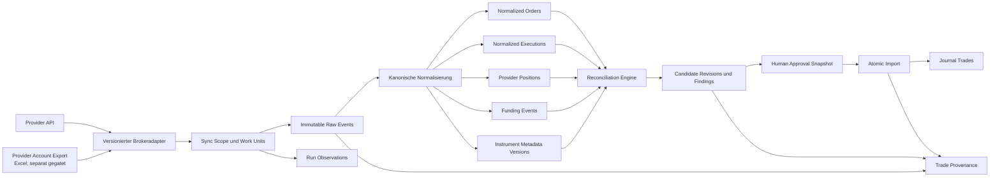

# Equora v57.61.0 – Providerneutrales Brokerimport-ERD

## 0. Dokumentkontrolle

| Feld | Wert |
|---|---|
| Designstatus | `DESIGN_ACCEPTED v15 – G1 Egress/permit-expiry/cross-layer/v1-core hardening incorporated; G0 DESIGN ONLY` |
| Implementierungsstatus | `G1 IN PROGRESS – NO-GO`; lokale Capture-Control-, Lane-/Gap-/Health-, Activation-/Request-Authority- und inaktive Scheduler-/Lease-Control-Teildeltas vorhanden, produktive Runtime und Gesamtimplementierung offen |
| Providerevidenzstatus | über Providervertrag; globale Vollständigkeit bleibt unbelegt, prospektive Coverage wird scopegenau und fail-closed modelliert |
| Gate G0 | `GO – DESIGN ONLY`; Schema-/DB-Evidenz folgt G5/G6 |
| Stand | 2026-08-08, Europe/Berlin |
| Scope | Providerneutraler Brokerimport-Kern; MEXC v57.61.0 prospektiver API-Adapter; Excel-Export als separat gegatete Dateiquelle |
| Owner | A2 |
| Pflichtreviews | A5, A4, A3 |
| SQL-Wirkung | Keine; dieses Dokument ist kein Migrationsskript |

## 1. Modellierungsziele

Das Modell muss gleichzeitig sicherstellen:

- spätere Brokeradapter ohne Kopieren des MEXC-Datenmodells;
- unveränderte, idempotente Raw-Events plus wiederholte Observations;
- resumable Sync über begrenzte Work Units;
- klare Order-, Execution-, Position- und Funding-Grains;
- mengenanteilige Allocations bei Teilfills und Reversals;
- versionierte Contract-/Instrumentmetadaten und Normalisierungsregeln;
- unveränderliche Kandidatenrevisionen und single-use Human Approval;
- atomaren, tenantgebundenen und batchübergreifend idempotenten Import;
- vollständige Provenienz von Journal-Trade bis Raw Event;
- kontrollierten Revert, Retention und Erasure ohne stillen Reimport;
- RLS, Least Privilege und zusammengesetzte Parent-/Tenant-Integrität.
- ausschließlich lesenden Brokerzugriff ohne Order-, Positions-, Transfer- oder
  sonstiges Broker-Mutationsmodell.
- explizite Aktivierungsgrenze, automatische Read-Sync-Lanes, Health-/Gap-
  Ledger und Carry-in-Positionen ohne erfundene Historie;
- getrennte Provenienz für Provider-API-Beobachtung und manuell ausgewählte,
  versionierte Provider-Exportdateien.

Das bestehende einzelne `broker_raw_events.trade_id` ist dafür nicht
ausreichend. Eine Raw Execution kann anteilig mehreren Position Cycles dienen,
und ein Journal-Trade entsteht regelmäßig aus mehreren Raw Events.

## 2. Logische Systemkarte



## 3. Logisches ERD

```mermaid
erDiagram
    BROKER_PROVIDER ||--o{ BROKER_CONNECTION : supports
    BROKER_PROVIDER ||--o{ BROKER_ACCOUNT : identifies
    BROKER_ACCOUNT ||--o{ BROKER_ACCOUNT_IDENTITY : identified_by
    BROKER_CONNECTION ||--o{ BROKER_CONNECTION_ACCOUNT : reaches
    BROKER_ACCOUNT ||--o{ BROKER_CONNECTION_ACCOUNT : reached_by
    BROKER_CONNECTION ||--o{ BROKER_CREDENTIAL : authenticates_with
    BROKER_CONNECTION_ACCOUNT ||--o{ SYNC_ACTIVATION_SERIES : groups
    SYNC_ACTIVATION_SERIES ||--o{ SYNC_ACTIVATION : generations
    SYNC_ACTIVATION ||--o{ SYNC_LANE_REQUIREMENT : requires
    SYNC_LANE_REQUIREMENT ||--o{ SYNC_LANE_STATE : realizes
    BROKER_ACCOUNT ||--o{ SYNC_SCOPE : owns
    SYNC_ACTIVATION ||--o{ SYNC_SCOPE : bounds
    SYNC_LANE_STATE ||--o{ SYNC_SCOPE : schedules
    SYNC_SCOPE ||--o{ SYNC_RUN : executes
    SYNC_SCOPE ||--o{ SYNC_GAP : records
    SYNC_LANE_STATE ||--o{ SYNC_GAP : detects
    SYNC_RUN ||--o{ SYNC_WORK_UNIT : contains
    SYNC_WORK_UNIT ||--o{ PROVIDER_REQUEST_RESULT : records
    BROKER_ACCOUNT ||--o{ SOURCE_ARTIFACT : owns
    SOURCE_ARTIFACT ||--o{ FILE_PARSE_RESULT : parsed_as
    SYNC_WORK_UNIT ||--o{ FILE_PARSE_RESULT : records
    PROVIDER_REQUEST_RESULT ||--o{ RAW_EVENT_OBSERVATION : observes
    FILE_PARSE_RESULT ||--o{ RAW_EVENT_OBSERVATION : observes
    BROKER_ACCOUNT ||--o{ RAW_EVENT : owns
    RAW_EVENT ||--o{ RAW_EVENT_OBSERVATION : observed_as
    BROKER_PROVIDER ||--o{ INSTRUMENT_METADATA_VERSION : defines
    RAW_EVENT ||--o{ NORMALIZED_ORDER_REVISION : normalizes
    RAW_EVENT ||--o{ NORMALIZED_EXECUTION : normalizes
    RAW_EVENT ||--o{ PROVIDER_POSITION_REVISION : normalizes
    RAW_EVENT ||--o{ FUNDING_EVENT : normalizes
    RAW_EVENT ||--o{ ACCOUNT_FINANCIAL_EVENT : normalizes
    INSTRUMENT_METADATA_VERSION ||--o{ EVENT_CONTRACT_AUTHORITY : supports
    NORMALIZED_EXECUTION ||--o{ EVENT_CONTRACT_AUTHORITY : classified_by
    FUNDING_EVENT ||--o{ EVENT_CONTRACT_AUTHORITY : classified_by
    ACCOUNT_FINANCIAL_EVENT ||--o{ EVENT_CONTRACT_AUTHORITY : classified_by
    PROVIDER_POSITION_REVISION ||--o{ EVENT_CONTRACT_AUTHORITY : classified_by_reference
    NORMALIZED_ORDER_REVISION ||--o{ NORMALIZED_EXECUTION : contextualizes
    BROKER_ACCOUNT ||--o{ IMPORT_CANDIDATE : reconciles
    IMPORT_CANDIDATE ||--o{ CANDIDATE_REVISION : versions
    CANDIDATE_REVISION ||--o{ CANDIDATE_EXECUTION_ALLOCATION : allocates
    NORMALIZED_EXECUTION ||--o{ CANDIDATE_EXECUTION_ALLOCATION : allocated_to
    CANDIDATE_REVISION ||--o{ CANDIDATE_FUNDING_ALLOCATION : attributes
    FUNDING_EVENT ||--o{ CANDIDATE_FUNDING_ALLOCATION : allocated_to
    CANDIDATE_REVISION ||--o{ FUNDING_SETTLEMENT_EXPECTATION_EVIDENCE : resolves
    CANDIDATE_FUNDING_ALLOCATION ||--o{ FUNDING_SETTLEMENT_EXPECTATION_EVIDENCE : booked_by
    CANDIDATE_REVISION ||--o{ CANDIDATE_POSITION_EVIDENCE : evidenced_by
    PROVIDER_POSITION_REVISION ||--o{ CANDIDATE_POSITION_EVIDENCE : supports
    CANDIDATE_REVISION ||--o{ CANDIDATE_ORDER_EVIDENCE : contextualized_by
    NORMALIZED_ORDER_REVISION ||--o{ CANDIDATE_ORDER_EVIDENCE : supports
    CANDIDATE_REVISION ||--o{ CANDIDATE_METADATA_EVIDENCE : valued_by
    EVENT_CONTRACT_AUTHORITY ||--o{ CANDIDATE_METADATA_EVIDENCE : supports
    CANDIDATE_REVISION ||--o{ CANDIDATE_ACCOUNT_FINANCIAL_ALLOCATION : attributes
    ACCOUNT_FINANCIAL_EVENT ||--o{ CANDIDATE_ACCOUNT_FINANCIAL_ALLOCATION : allocated_to
    CANDIDATE_REVISION ||--o{ FINANCIAL_COMPONENT : calculates
    FINANCIAL_COMPONENT ||--|{ FINANCIAL_SOURCE_LINK : sourced_by
    CANDIDATE_EXECUTION_ALLOCATION ||--o{ FINANCIAL_SOURCE_LINK : execution_input
    CANDIDATE_FUNDING_ALLOCATION ||--o{ FINANCIAL_SOURCE_LINK : funding_input
    CANDIDATE_POSITION_EVIDENCE ||--o{ FINANCIAL_SOURCE_LINK : position_reference
    CANDIDATE_ORDER_EVIDENCE ||--o{ FINANCIAL_SOURCE_LINK : order_reference
    CANDIDATE_METADATA_EVIDENCE ||--o{ FINANCIAL_SOURCE_LINK : metadata_input
    CANDIDATE_ACCOUNT_FINANCIAL_ALLOCATION ||--o{ FINANCIAL_SOURCE_LINK : account_input
    CANDIDATE_REVISION ||--o{ RECONCILIATION_FINDING : has
    CANDIDATE_REVISION ||--o{ APPROVAL_ITEM : selected_as
    APPROVAL ||--o{ APPROVAL_ITEM : contains
    APPROVAL ||--o| BROKER_IMPORT : consumed_by
    BROKER_IMPORT ||--o{ BROKER_IMPORT_ITEM : contains
    CANDIDATE_REVISION ||--o| BROKER_IMPORT_ITEM : imports
    JOURNAL_TRADE ||--o{ BROKER_IMPORT_ITEM : linked_by
    JOURNAL_TRADE ||--o{ TRADE_PROVENANCE : proven_by
    RAW_EVENT ||--o{ TRADE_PROVENANCE : source_of
    CANDIDATE_REVISION ||--o{ TRADE_PROVENANCE : revision_of
    CANDIDATE_EXECUTION_ALLOCATION ||--o{ TRADE_PROVENANCE : execution_proof
    CANDIDATE_FUNDING_ALLOCATION ||--o{ TRADE_PROVENANCE : funding_proof
    CANDIDATE_POSITION_EVIDENCE ||--o{ TRADE_PROVENANCE : position_proof
    CANDIDATE_METADATA_EVIDENCE ||--o{ TRADE_PROVENANCE : metadata_proof
    FINANCIAL_SOURCE_LINK ||--o{ TRADE_PROVENANCE : financial_proof
    BROKER_ACCOUNT ||--o{ ERASURE_TOMBSTONE : records
```



Die Namen sind logische Arbeitsnamen. Physische Tabellen- und Constraintnamen
werden erst im Migrationsdesign festgelegt und getestet.

## 4. Identitäts- und Tenantvertrag

### 4.1 Gemeinsame Schlüssel

Alle benutzerbezogenen Entitäten besitzen oder erben über zusammengesetzte
Parentschlüssel:

- interne UUID `id`;
- `user_id` als nicht nullable Tenant-ID;
- `provider_code` oder einen über Parent ableitbaren Provider;
- `broker_account_id` oder einen über Parent ableitbaren Account-Scope;
- `created_at`; bei revisionierten Objekten zusätzlich `observed_at` und
  `valid_from`/`valid_to`, soweit belegbar.

Parent-/Child-Beziehungen erzwingen den gleichen Tenant und bei
brokerbezogenen Daten den gleichen Account-Scope. Die physische Migration
benötigt dafür Parent-Unique-Constraints und zusammengesetzte FKs, zum Beispiel
logisch:

```text
(connection_id, user_id) -> broker_connection(id, user_id)
(run_id, user_id, broker_account_id)
    -> sync_run(id, user_id, broker_account_id)
(raw_event_id, user_id, broker_account_id)
    -> raw_event(id, user_id, broker_account_id)
```

Eine einfache UUID-FK ohne Tenant-/Accountbindung reicht nicht. RLS ergänzt
Constraints, ersetzt sie aber nicht; Service Role kann RLS umgehen.

Globale Providerdefinitionen und öffentliche Instrumentmetadaten sind keine
Tenantobjekte. Sie werden in getrennten, serverseitig gepflegten Strukturen mit
explizitem `scope_kind` geführt und dürfen nicht über nullable `user_id` eine
scheinbare Tenantgrenze erzeugen. Accountbezogene Metadatenobservations tragen
dagegen den vollständigen Tenant-/Account-Scope.

### 4.2 Providerkonto

`BROKER_ACCOUNT` ist die wirtschaftliche Importgrenze. Es enthält:

- `provider_code`;
- Status der verfügbaren Providerkontoidentität;
- Account-/Subkonto-Typ, soweit offiziell belegt;
- Umgebung;
- Capability-Profil und Vertragsversion;
- Status und Lösch-/Retentionzustand.

Ein frei änderbares `account_label` ist nur Anzeige, niemals Identität.
Existiert keine belastbare Providerkonto-ID, bleibt der Scope an die Connection
gebunden. Automatisches Zusammenführen nach Label, Symbol oder API-Key ist
verboten.

Connection und Providerkonto sind keine 1:1-Beziehung. Die zeitlich
versionierte Relation `BROKER_CONNECTION_ACCOUNT` erlaubt Reconnects und
Provider mit mehreren Subkonten, ohne die wirtschaftliche Kontoidentität an
ein Credential zu koppeln. Ohne belegte Provideridentität entsteht pro
Connection ein eigener Account-Scope; ein späteres Merge ist eine explizite,
auditierbare Operation und niemals automatische Heuristik. Eine reine
Nutzerattestierung darf nur einen `user_attested_display_link` erzeugen und
keine wirtschaftliche Historie, Deduplizierung oder Importidentität verbinden.

Eine wirtschaftliche Aliaszuordnung ist ausschließlich für
`provider_verified_identity` oder `cryptographic_identity_rotation` zulässig.
Sie verlangt gleiche Nutzer-, Provider- und Environmentgrenze, einen atomaren
Collision-/Count-/Digest-Preflight und eine versionierte serverseitige
Entscheidung. Raw Events, Sources, Candidate Revisions, Approvals, Provenienz
und wirtschaftliche Importkeys bleiben immutable; die Aliasrelation erweitert
nur zukünftige Equivalence-/Dedupe-Lookups. Abweichende Provideridentity,
identische externe ID mit anderem Content-/Source-Digest, ungeklärte Überlappung
oder Importkeykollision blockiert als `identity_collision`.

#### BROKER_ACCOUNT_IDENTITY

**Grain:** ein versionierter, serverseitiger Identitätsalias eines
Providerkontos.

Pflichtattribute:

- `id`, `user_id`, `broker_account_id`, `provider_code`, Umgebung;
- Identitätstyp, versionierter HMAC-Digest und HMAC-Key-Version;
- Evidenzquelle, `valid_from`, optional `retired_at` und Status;
- keine rohe Providerkonto-ID im Browser- oder Standardlogpfad.

Der Identitätstyp ist geschlossen auf `provider_verified_identity`,
`cryptographic_identity_rotation`, `user_attested_display_link` oder
`conflicting_or_insufficient`. Nur die ersten beiden dürfen eine wirtschaftliche
Account-Aliasrelation tragen; Displaylinks sind strukturell aus Importkey-,
Candidate-, Approval- und Dedupequeries ausgeschlossen.

Mehrere Digestversionen dürfen während einer HMAC-Key-Rotation auf dasselbe
Brokerkonto zeigen. Die neue Version wird vollständig angelegt und auf
Eindeutigkeit geprüft, bevor die alte Version ausläuft; Rotation darf keinen
zweiten wirtschaftlichen Account erzeugen.

### 4.3 Externe Identitäten

Es werden getrennt behandelt:

- Provider-ID eines Raw Events;
- Content Hash des unveränderten Payloads;
- Providerrevision beziehungsweise Observation;
- kanonischer `source_key` einer fachlichen Quelle;
- wirtschaftlicher Importkey;
- Kandidatenrevision;
- Algorithmusversion.

Ein Fallback nur aus Symbol und Zeit ist nicht importfähig. Events ohne
belastbare Provideridentität können gespeichert und angezeigt werden, bleiben
aber `blocked_identity`.

### 4.4 Deterministischer Digest- und Kanonisierungsvertrag

Alle Digests tragen `digest_algorithm`, `digest_contract_version` und eine
Domain. Unversionierte Stringkonkatenation ist verboten. Normativ ist
`equora-tcj-v1` (Typed Canonical JSON v1) mit SHA-256.

**SHA-256-Input v1**

```text
ASCII("equora-digest") || 0x00 ||
ASCII(domain)          || 0x00 ||
ASCII("equora-tcj-v1") || 0x00 ||
TCJ(value)
```

`domain` entspricht `^[a-z][a-z0-9_]{0,62}$`. Ausgabe ist 64-stelliges
Lowercase-Hex. Für niedrig-entropische personenbezogene
Providerkontoidentitäten und Erasure-Tombstones gilt stattdessen:

```text
HMAC-SHA-256(key_version_key,
  ASCII("equora-hmac") || 0x00 ||
  ASCII(purpose)       || 0x00 ||
  ASCII("equora-tcj-v1") || 0x00 ||
  ASCII(key_version)   || 0x00 ||
  TCJ(value))
```

`purpose` ist keine freie Runtimeangabe. `equora-tcj-v1` kennt ausschließlich
folgende fest versionierte Purpose-/Keyring-Zuordnung:

| Purpose-ID | Zulässiger Inhalt | Verpflichtender Keyring |
|---|---|---|
| `broker_account_identity_v1` | providergebundene, niedrig-entropische Konto-/Subkontoidentität | `broker_account_identity_hmac` |
| `broker_erasure_reimport_tombstone_v1` | Erasure-/Reimportidentität ohne Raw-Payload oder rohe Provider-ID | `broker_erasure_tombstone_hmac` |

Der Encoder nimmt einen Purpose-Enum entgegen und löst den Keyring serverseitig
aus dieser konstanten Tabelle auf. Unbekannte Purpose-ID, frei übergebener
Keyring oder Cross-Purpose-Keyversion sind fail-closed. Beide Keyrings besitzen
verschiedenes Keymaterial. Falls ein gemeinsamer KMS/HSM-Root technisch genutzt
wird, werden die HMAC-Keys mit HKDF-SHA-256 und den unveränderlichen, getrennten
`info`-Werten `equora/broker-account-identity-hmac/v1` beziehungsweise
`equora/broker-erasure-tombstone-hmac/v1` abgeleitet; die abgeleiteten Keys
dürfen bytegleich weder untereinander noch mit einem anderen Anwendungsschlüssel
sein. Der Credential-Verschlüsselungs-Master-Key und Credential-DEKs dürfen
niemals als HMAC-Root, HMAC-Key oder Ableitungsinput dienen.

Jeder Keyring führt einen eigenen `key_version`-Namensraum, eigene aktive und
lesbare Altversionen sowie getrennte Rotation, Retention, Deaktivierung und
Recovery. Die Deaktivierung eines Tombstone-Keys darf die Accountidentität nicht
ändern; die Rotation eines Account-Identity-Keys darf keinen Tombstone wieder
identifizierbar machen. `key_version` folgt dem ASCII-Pattern der Domain und ist
nur innerhalb des zum Purpose fest zugeordneten Keyrings gültig. Normale SHA-
und HMAC-Domains sind dadurch bytegenau getrennt. Keymaterial ist niemals Teil
des Payloads oder Outputs.

**TCJ-Grammatik v1**

TCJ ist UTF-8 ohne BOM und ohne Whitespace außerhalb von Strings. Jeder Wert
ist ein JSON-Array mit einem einstelligen reservierten Typcode; Anwendungsdaten
können die Tags nicht kollidieren, weil auch Nutzerarrays und -strings selbst
getaggt sind:

```text
null             := ["n"]
boolean false    := ["b",false]
boolean true     := ["b",true]
string           := ["s",<json_string>]
integer          := ["i",<json_string_of_canonical_integer>]
decimal          := ["d",<json_string_of_canonical_decimal>]
instant          := ["t",<json_string_of_signed_unix_microseconds>]
enum             := ["e",<json_string_of_canonical_enum_code>]
bytes            := ["x",<lowercase_even_length_hex_string>]
generic_json_num := ["j",<json_string_of_exact_canonical_decimal>]
ordered_array    := ["a",[<TCJ(value)>...]]
unordered_set    := ["u",[<TCJ(value)>...]]
object           := ["o",[[<json_string_key>,<TCJ(value)>]...]]
```

Die Feld-/Domainspezifikation bestimmt den Typ; der Encoder rät ihn nie aus
dem Laufzeitwert. Providerzahlen werden vor jeder Typisierung aus dem exakten
JSON-Lexem gelesen. Unbekannte Raw-Extension-Zahlen dürfen als `j` erhalten
werden; importkritische Felder müssen ihren Oracletyp erfüllen.

**Normative String- und Containerregeln**

- Vor Encoding werden Strings und Objektschlüssel nach Unicode NFC
  normalisiert; ungültige Surrogate werden abgelehnt.
- JSON-Strings verwenden `"`; `"` und `\` werden mit Backslash escaped.
  U+0000 bis U+001F werden ausschließlich als sechs ASCII-Bytes `\u00xx` mit
  lowercase Hex kodiert. Es gibt keine Kurzescapes wie `\n`. `/`, U+2028,
  U+2029 und alle übrigen Zeichen werden unescaped als UTF-8 ausgegeben.
- Ein Inputparser muss doppelte Objektschlüssel bereits im Raw-JSON vor
  Objektkonstruktion fail-closed ablehnen. Nach NFC ebenfalls kollidierende
  Schlüssel werden abgelehnt.
- Object-Paare werden nach den UTF-8-Bytes des normalisierten unescaped
  Schlüssels unsigned lexikografisch sortiert. Jeder Schlüssel kommt exakt
  einmal vor.
- Ordered Arrays bewahren die vom Domain-/Schemavertrag festgelegte
  Reihenfolge.
- Unordered Sets werden nach der vollständigen TCJ-Bytefolge jedes Elements
  unsigned lexikografisch sortiert. Byteidentische Duplikate sind im Set
  ungültig; Multisets müssen als geordnetes Array expliziter
  `[element,count]`-Objekte modelliert werden. Ein Hashkollisions-Tie-Breaker
  wird nicht benötigt, weil nach vollständigen Bytes und nicht nach Digest
  sortiert wird.
- Fehlende Objektfelder werden ausgelassen; ein vorhandenes `null` wird
  exakt `["n"]`. Leeres Objekt ist
  exakt `["o",[]]`, leeres Ordered Array `["a",[]]`, leeres Set `["u",[]]`
  und leerer String `["s",""]`.
- Maximale Verschachtelung ist 64 TCJ-Containerlevel; maximale kanonische
  Payloadgröße 8.388.608 Bytes oder das strengere Capabilitylimit. Überschritt
  ist fail-closed, nie partiell gehasht.

**Normative Zahl-/Zeitregeln**

- Integer: optional `-`, danach `0` oder Ziffer `1..9` plus Ziffern; kein `+`,
  keine führenden Nullen; `-0` wird `0`.
- Decimal/generic JSON number: exakt in Basis 10 aufgelöst, kein Exponent im
  Output; optional `-`; Integerteil wie oben; Fraction nur wenn ungleich null,
  ohne nachgestellte Nullen. `1`, `1.0` und `1e0` kanonisieren numerisch zu
  `1`; `-0.000` zu `0`. Schemabezogene Maximalpräzision/-skala wird vor TCJ
  geprüft.
- Instant: signed Unix-Mikrosekunden als kanonischer Integerstring. Eine
  Provider-Millisekunde wird exakt mit 1000 multipliziert; Parse über
  Gleitkomma ist verboten.
- Enumcode ist der im kanonischen Schema definierte ASCII-Code, nie ein
  lokalisiertes Label.

**Raw-Body-Grenze**

`raw_response_body` bezeichnet exakt die dekomprimierten HTTP-Entity-Bodybytes
nach Content-Encoding-Verarbeitung, aber vor UTF-8-Decoding, JSON-Parsing oder
Zeilenendeänderung. `Content-Encoding`, dekomprimierte Bytezahl und – nur wenn
der zentrale Transport sie zuverlässig vor Dekompression exponiert – ein
optionaler `wire_entity_bytes`-Digest werden separat beobachtet.
`wire_entity_bytes` ist niemals Idempotenz- oder Fachdigest. Kann die Runtime
dekomprimierte Bytes und das Dekompressionslimit nicht deterministisch
kontrollieren, ist die Capability blockiert. Transfer-Encoding-Frames/Header
sind nicht Teil beider Bodydigests.

**Digestdomains und Feldgrenzen**

| Domain | Enthält | Enthält ausdrücklich nicht |
|---|---|---|
| `raw_response_body` | dekomprimierte Entity-Bodybytes vor Decode/Parse | HTTP-/Transferheader, Parse-/Observation-Metadaten |
| `raw_event_content` | Provider, Contractversion, Endpoint, Eventtyp, Provider-ID/-Revision und vollständiges kanonisches Eventpayload | Run-ID, Fetchzeit, Pageposition |
| `stability_bucket_identity` | Provider-ID, tenantgebundenes Account-HMAC, `sync_activation_id`, `activation_generation`, Capability-ID, typisierter Instrument-/Accountscope, Providercontract-, Adapter-, Profil-ID/-Version, Boundary-Policy-Version, geschlossenes `bucket_start`/`bucket_end`, Digestversion | Lease, Runstart, Worker; jede Cross-Activation-/Cross-Profile-Wiederverwendung |
| `sync_scope` | vollständige `stability_bucket_identity`, Source Channel, Lane-ID, UTC-Abruffenster, Grenz-/Overlap-Policy und Scopegeneration | Lease, Runstart, Worker |
| `page_observation` | Scope-Digest, Requestparameter, Page-/Cursorevidenz, geordnete Eventidentity-/Content-Digests, Responseklassifikation | volatile Latenz, Worker-ID |
| `raw_event_observation` | vollständiger `page_observation`- und `raw_event_content`-Digest jeweils mit Algorithmus/Vertrag/Domain, typisierte opake Run- und Request-Result-Referenzen, Eventindex und First-/Repeated-Status | volatile Latenz, Worker-ID, UI-Sortierung |
| `normalized_source` | Raw-Event-Digest, Normalizer-/Metadata-/Valuationversion und alle kanonischen Fachfelder | UI-Label, Observationzeit ohne Fachwirkung |
| `event_contract_authority` | Economic-Event-ID/-Art/-Zeit, Account/Instrument, drei At-Event-Werte/-Authoritystatus, Evidence Type/Version, Valid-Time-/Immutable-Rule-Scope und typisierte Evidence-FKs | aktuelle Beobachtung ohne Gültigkeitsbeleg, UI-Label |
| `funding_expectation_evidence` | Candidate/Cycle, potenzieller Settlementzeitpunkt, Boundary-/Schedule-/Rule-Version, Funding-Scope/-Coverage-Digest, Resolutionstatus und typisierte Booking-/Null-/Nichtanwendbarkeitsevidenz | öffentliche Rate als Buchung, leere Page als Null |
| `financial_component` | Candidate Revision, Komponententyp, Betrag/Equity-Effekt, Coverage, Currency-Wert/Source/Rule/Authority, Authority Mode/Rule und Source-Digests | Anzeigeformat, lokale Zeit |
| `candidate_input` | vollständig sortierte typisierte Source-, Event-Contract-Authority-, Funding-Expectation- und Financial-Currency-Authority-Digests, Boundary-/Sequence-/Valuation-/Tolerance-/Algorithmusversion | Erstellungszeit, Reviewstatus |
| `candidate_snapshot` | alle dem Nutzer gezeigten und importierten Fachwerte, Source-/Findingstatus, vollständige Authority-/Funding-Resolution-Digestsets, Candidate-/Revision-ID und Input-Digest | UI-Sortierung, Anzeigeformat |
| `allocation` | Candidate Revision, typisierte Source-ID, Rolle, exakte Menge/Betrag/Währung, Inventory vor/nach, Regelversion | Erstellungszeit |
| `economic_import_key` | Tenant, Providerkonto, Candidate-Wirtschaftsidentität und Importvertragsversion | Batch-/Request-ID |
| `import_result` | Approval-/Snapshot-Digest, sortierte Importitems und wirtschaftliche Importkeys | Retryzeit, Clientrequest-ID |

Raw-Body-Digest und semantischer Digest sind getrennt. Unterschiedliche JSON-
Key-Reihenfolge kann den Raw-Byte-Digest ändern, muss aber bei identischer
Semantik denselben `raw_event_content`-Digest ergeben. Umgekehrt muss jede im
Domainvertrag relevante Feldänderung den zugehörigen Digest ändern.

Ein Digestversionswechsel wird additiv geführt. Alte Versionen werden nicht
still überschrieben; Cross-Version-Vergleiche benötigen eine explizite,
getestete Recompute-/Migrationpolicy und dürfen bestehende Approvals nicht
unbemerkt gültig lassen.

Golden Vectors werden als ASCII/UTF-8-Input, kanonische Bytes und erwarteter
Hexdigest versioniert und müssen in Node/TypeScript und Postgres identisch
laufen. Pflichtfälle: andere JSON-Key-Reihenfolge, fehlend versus `null`,
`1`/`1.0`/`"1.000"` gemäß Raw-/Semantic-Domain, äquivalente UTC-Darstellungen,
Unicode-NFC, unordered Source Set, relevante und irrelevante
Observation-Metadaten, Steuerzeichen-/Escapevarianten, Duplicate Keys vor und
nach NFC, leere Container, Depth-/Bytegrenze, Setduplikat, beide festen HMAC-
Purposes mit jeweils eigener Keyversion, Unknown-/Cross-Purpose-/Cross-Keyring-
Ablehnung, Credential-Key-Negativfall und Cross-Domain-Negativvergleich.

## 5. Entitätskatalog

### 5.1 Provider und Zugriff

#### BROKER_PROVIDER

**Grain:** eine unterstützte Providerfamilie, beispielsweise `mexc-futures`.

Pflichtattribute:

- `provider_code` als stabiler Primary/Business Key;
- aktuelle und erlaubte Contract-Versionen;
- Status `draft`, `verified`, `suspended`, `retired`;
- ausschließlich lesendes Capability-Schema; schreibende Capabilities sind
  `forbidden` und nicht aktivierbar;
- keine Credentials.

#### BROKER_CONNECTION

**Grain:** eine vom Nutzer eingerichtete technische Verbindung.

Pflichtattribute:

- `id`, `user_id`, `provider_code`;
- Anzeige-Label und Environment;
- ehrliche, getrennte Flags für erfolgreiche Endpoint-Lesetests und
  Nutzerattestierung deaktivierter Broker-Schreibrechte;
- Status und letzte sanitiserte Fehlerreferenz.

Die Verbindung behauptet nicht automatisch eine verifizierte
Providerkontoidentität oder ausschließliche Read-only-Rechte.

#### BROKER_CREDENTIAL

**Grain:** eine versionierte verschlüsselte Credential-Generation für genau
eine Connection, einen Nutzer und einen Provider.

Pflichtattribute:

- `id`, `user_id`, `connection_id`, `provider_code`;
- `encrypted_payload`;
- Envelope-/Algorithmusversion, `key_version`, Nonce/IV und Authentisierungstag;
- Erstellungs-/Rotationszeit;
- Widerrufs-/Löschstatus.

Kein Browser-SELECT und keine breite DML für `authenticated`. Zugriff nur über
eng begrenzte serverseitige Pfade. Connection und Credential werden über
Tenant und Provider gemeinsam gebunden.

Eine partielle Eindeutigkeitsregel erlaubt höchstens eine aktive Credential-
Generation je Connection; ältere Generationen sind nur während kontrollierter
Rotation beziehungsweise bis zur verifizierten Löschung lesbar.

#### BROKER_CONNECTION_ACCOUNT

**Grain:** eine zeitlich nachvollziehbare Zuordnung einer Connection zu einem
Providerkonto.

Pflichtattribute:

- `id`, `user_id`, `connection_id`, `broker_account_id`, `provider_code`;
- Zuordnungsquelle `provider_verified`, `connection_scoped` oder
  `explicit_reviewed`;
- `valid_from`, optional `valid_to`, Status und Audit-/Reviewreferenz;
- keine rohe Providerkonto-ID im Browserpfad.

Die zusammengesetzten FKs binden Connection und Account an denselben Nutzer,
Provider und dieselbe Umgebung. Überlappende aktive Zuordnungen sind nur
zulässig, wenn der Providervertrag Multi-Account beziehungsweise mehrere
Connections für dasselbe Konto ausdrücklich unterstützt.

### 5.2 Sync und Rohdaten

#### SYNC_ACTIVATION_SERIES

**Grain:** eine langlebige, tenant- und accountgebundene Generationsreihe für
genau eine Connection-Account-Zuordnung und den prospektiven Read-Capture-Scope.

Pflichtattribute:

- `id`, `user_id`, `connection_account_id`, `broker_account_id`;
- `current_sync_activation_id`, `current_activation_generation` und atomare
  `series_row_version`;
- Erstellungs-/Änderungszeit und aktuelle Series-Policyversion.

Der Current-Pointer referenziert über einen zusammengesetzten FK genau eine
`SYNC_ACTIVATION` derselben Series, desselben Tenants, Accounts und derselben
Generation. Vor der ersten Aktivierung darf er null sein; danach wird er nur in
der atomaren Generationswechseltransaktion geändert. Eine Activation ist nur
arbeitsfähig, wenn ihre ID und Generation exakt dem Current-Pointer entsprechen
und ihr eigener Zustand `active` ist. Nicht aktuelle Generationen können keine
Jobs, Retries, Catch-ups, Leases oder Eligibility mehr begründen.

#### SYNC_ACTIVATION

**Grain:** eine immutable Identitäts-/Pin-Generation innerhalb genau einer
`SYNC_ACTIVATION_SERIES`; Lifecycle- und Healthzustände bleiben separat
veränderbar.

Pflichtattribute:

- `id`, unveränderliche `activation_series_id`, positive unveränderliche
  `activation_generation`, `user_id`,
  `connection_account_id`, `broker_account_id`;
- `activation_cutover_at` und `activated_by`;
- optional `first_successful_capture_at` und letzter erfolgreicher Pflichtscope;
- Onboardingprofil `recent_28d_plus_current_utc_day_v1`;
- Schedulerziel sechs Stunden, Fast-Lane-Overlap 72 Stunden, Auditprofil und
  jeweilige Policyversion;
- `activation_state` `inactive`, `blocked_permission_evidence`, `pending`,
  `active`, `paused` oder `revoked`;
- ausschließlich abgeleitetes `capture_health` `pending`, `healthy`,
  `degraded`, `gap_requires_export`, `paused` oder `revoked`; keine zweite
  persistierte Health-Autorität neben `SYNC_LANE_STATE.health`;
- aktive Credentialgeneration sowie gepinnte Provider-, Adapter-, Profil- und
  Pflichtcapabilityversionen;
- versionierte offizielle View-/Read-Permissionzuordnung je Pflichtcapability;
- getrennte Nutzerattestierung der providerseitigen Read-only-Konfiguration;
- keine Journalimport- oder Approvalwirkung.

Eine Aktivierung darf nur neue read-only Sync Runs zulassen. Sie ist weder eine
Vorauswahl von Candidates noch eine Dauerfreigabe zum Erzeugen lokaler
Journal-Trades.

Die erste Aktivierung sperrt die Series-Zeile, erzeugt eine neue Aktivierungs-ID
mit Generation `1` und setzt den Current-Pointer atomar. Eine Reaktivierung nach
`inactive`/`revoked` oder nach Änderung einer gepinnten Credential-, Provider-,
Adapter-, Profil-, Capability- oder Boundarygeneration sperrt dieselbe Series,
erzeugt eine neue Aktivierungszeile mit neuer ID und `max(generation)+1`, setzt
eine zuvor current/arbeitsfähige Vorgängerzeile im selben Commit auf `inactive`,
  invalidiert deren Jobs, Retries, Catch-ups und Leases und verschiebt den Current-
  Pointer auf die Nachfolgegeneration. Die sofortige Autoritätsinvalidierung
  entsteht ausschließlich durch den atomaren Current-Pointer-/Lifecycle-Fence;
  alte Work Units verlieren damit ohne inversen `Series -> Work Unit`-Lock jede
  Claim-, Renew-, Commit- und Request-Autorität. Physische Status-/Tokenbereinigung
  ist nachgelagert, idempotent und niemals Autoritätsvoraussetzung. Ein bereits
  `revoked`er Vorgänger bleibt
`revoked`. ID, Series, Generation und Pins historischer Aktivierungszeilen
bleiben unveränderlich. Zwei parallele Generationswechsel werden durch Series-
Row-Lock plus `series_row_version` serialisiert; der Verlierer muss neu lesen und
darf weder Job noch Request erzeugen. Alte Buckets und Lane States sind niemals
als Evidenz der neuen Generation wiederverwendbar. Ein reines Resume aus
`paused` darf dieselbe Zeile und Generation nur beibehalten, wenn sie noch der
Current-Pointer ist und alle gepinnten Identitäten unverändert sind; offene Gaps
und Lane States bleiben erhalten und werden vor neuer Eligibility ausgewertet.

**Normative Activation-Invariante**

Fehlende oder widersprüchliche Permissionevidenz blockiert nicht das
secretfreie G0-Architekturreview oder synthetische Fixtures. Eine konkrete
MEXC-Sync-Aktivierung ist jedoch nur zulässig, wenn für jede Pflichtcapability
des gepinnten Profils eine versionierte offizielle View-/Read-
Permissionzuordnung vorliegt, die Nutzerattestierung aktuell ist und keine
technisch erkennbare Broker-Schreibpermission besteht. Eine ungeklärte
Pflichtcapability hält die Aktivierung in `blocked_permission_evidence`; ein
erfolgreicher Lesetest ersetzt weder diese Zuordnung noch eine
Gesamtrechteprüfung.

Vor dem Enqueue und erneut unmittelbar vor jedem Credential-Store-Zugriff
prüft der Worker atomar Connection-/Account-/Tenantbindung, dass
`sync_activation_id` und `activation_generation` exakt dem Current-Pointer der
gesperrten Series entsprechen, eine aktive Credentialgeneration, den aktuellen
Aktivierungsstatus, die gepinnten und nicht suspendierten Provider-/Adapter-/
Profil-/Capabilityversionen sowie den
zulässigen Trigger. `paused`, `revoked`, `blocked_permission_evidence`,
Credentialentfernung oder Contract-/Capability-Suspension invalidieren alle
noch nicht begonnenen Jobs, Retries und Startup-Catch-ups, widerrufen
vorhandene Leases und ergeben null Credential-Store-Zugriffe und null
Brokerrequests. Ein bereits entschlüsselnder Worker darf nach erkannter
Invalidierung keinen weiteren Request senden. Abgeleitetes
`capture_health=degraded` erlaubt nur
explizite Recovery-/Auditläufe; Approval bleibt gesperrt.

#### SYNC_SCOPE

**Grain:** ein definierter Abrufbereich für einen Providerendpoint.

Pflichtattribute:

- Provider-ID, tenantgebundenes Account-HMAC, `broker_account_id`,
  `sync_activation_id`, `activation_generation`, `provider_contract_version`
  und `adapter_version`;
- `source_channel` `provider_api_observation` oder `provider_export_file`;
- `profile_id` und `profile_version`;
- ausschließlich lesende Capability-/Endpoint-ID aus dem versionierten
  Providervertrag bei API-Sources; keine freie Methode oder URL;
- optional Instrument;
- UTC-Start/-Ende und Grenzsemantik; für Stabilität zusätzlich unveränderliche
  `bucket_start`/`bucket_end` eines geschlossenen UTC-Tagessegments;
- disjunkte `lane_id` `onboarding_once`, `incremental_fast_6h`,
  `rolling_audit_7d_daily`, `rolling_audit_28d_weekly`,
  `file_backfill_manual` oder `file_recovery_manual`;
- `boundary_policy_version`, Overlap-Policy und `digest_version`;
- getrennte `coverage_basis` `provider_observed` oder
  `provider_export_observed`;
- `scope_completeness` `complete_for_profile`, `partial`, `failed` oder
  `unverified`;
- `stability_status` `not_observed`, `observed_once`, `observed_stable` oder
  `invalidated`;
- optionaler, bei Scopeabschluss unveränderlicher `lane_health_snapshot`; kein
  veränderlicher oder autoritativer `sync_health` am Scope;
- Coverage Policy `provider_observed_best_effort` für MEXC v57.61.0 gemäß
  DEC-5761-024; `strict_export_verified` bleibt ein möglicher späterer
  providerneutraler Modus, `pending_user_policy` nur ein Pre-Decision-Zustand;
- Scope-Digest, Digest der kanonischen `stability_bucket_identity` und
  Stabilitätsgeneration. Der laufende UTC-Tag kann nicht `observed_stable`
  werden; Cross-Activation-, Cross-Profile-, Cross-Contract-, Cross-Adapter-,
  Cross-Boundary- oder Cross-Digest-Version-Wiederverwendung ist verboten.

`complete_for_profile` bedeutet ausschließlich, dass alle Work Units dieses
Profils für diesen Scope technisch erfolgreich gelesen wurden. Es beweist
weder Providerretention noch Abwesenheit einer stillen Provideromission.

#### SYNC_LANE_REQUIREMENT

**Grain:** eine eigenständige Sollanforderung für genau eine Capability und
einen typisierten Instrument-/Accountscope innerhalb einer Aktivierungsgeneration
und Policygeneration.

Pflichtattribute:

- exakte Aktivierungs-, Tenant- und Brokerkontobindung sowie Providercontract-,
  Adapter-, Profil- und Capabilityversion;
- `capability_id`, `instrument_scope_key`, `policy_generation` und
  `requirement_source` `activation_plan`, `instrument_discovery` oder
  `explicit_account_scope`;
- Current-Unique-Key je Aktivierungsgeneration, Capability,
  Instrument-/Accountscope und Profil; Supersession erhält die alte Zeile;
- eindeutiger Authority-Key, an den jede `SYNC_LANE_STATE`-Zeile per
  `lane_requirement_id` und allen fachlichen Identitätsfeldern gebunden ist.

Diese Entität ist bewusst unabhängig von bereits existierenden Lane States.
`derive_capture_health_v1` zählt die aktuellen Requirements als Soll-Grains und
erwartet je Grain exakt die drei MEXC-API-Pflichtlanes. Besitzt eine im
Aktivierungsprofil geforderte Capability noch keine aktuelle Requirement,
repräsentiert die Ableitung sie zusätzlich als einen fehlenden Capability-
Platzhalter mit drei fehlenden Lanes. Damit kann ein noch nie angelegtes zweites
Instrument nicht als vollständig gesund erscheinen.

#### SYNC_LANE_STATE

**Grain:** Health genau einer disjunkten Pflichtlane einer
`SYNC_LANE_REQUIREMENT` innerhalb Aktivierung, Capability, typisiertem
Instrument-/Accountscope und gepinnter Profil-/Policygeneration.

Pflichtattribute:

- exakter FK über `lane_requirement_id`, Activation, Account, Capability,
  Capabilityversion, Instrument-/Accountscope, Profil und Policygeneration;
- Current-Unique-Key `(sync_activation_id, activation_generation,
  broker_account_id, capability_id, instrument_scope_key, lane_id, profile_id,
  profile_version)`; historische Policygenerationen bleiben superseded erhalten;
- `lane_id` für den MEXC-API-Scope genau
  `incremental_fast_6h`, `rolling_audit_7d_daily` oder
  `rolling_audit_28d_weekly`; Onboarding- und manuelle File-Lanes besitzen
  eigene IDs und können keinen dieser Zustände überschreiben;
- `last_complete_at`, `next_due_at`, letzter vollständiger Scope-Digest;
- High-Watermark-Zeit, Tie-Breaker, Contractversion und kanonischer Digest über
  den gesamten Authority-Grain und letzten Complete-Scope. `not_observed`
  verbietet diese Felder; `healthy` verlangt sie vollständig. Monotone
  Fortschreibung/CAS erfolgt erst über einen späteren geschlossenen Server-RPC;
- Composite-FK von `last_complete_scope_id` plus
  `last_complete_scope_digest` auf die echte Scope-ID/-Digest-Kombination. Die
  read-only Health-Ableitung akzeptiert `healthy` nur bei exact-scoped,
  geschlossenem, `complete_for_profile`, stability-/source-/coverage-kompatiblem
  Scope und `last_complete_at >= closed_at`; sonst wird
  `invalidCompleteScopeLaneCount` erhöht und das Aggregat fail-closed
  `degraded`;
- letzter Fehler und optionale offene Gap-Referenz;
- autoritatives `health` `healthy`, `degraded`, `gap_requires_export` oder
  `paused`.

Eine erfolgreiche kurze Lane darf eine überfällige 7-/28-Tage-Lane nicht
maskieren. Recovery setzt nur die tatsächlich zuvor ausgefallene Lane nach
vollständigem Erfolg zurück. `SYNC_LANE_STATE.health` ist die einzige
persistierte Health-Wahrheit. `SYNC_ACTIVATION.capture_health` wird ausschließlich
als Aggregat über alle erforderlichen Lane Keys berechnet; ein Scope enthält nur
den unveränderlichen Abschluss-Snapshot.

Normative Funktion `derive_capture_health_v1`:

```text
if activation_state = revoked:
  capture_health = revoked
else if activation_state = paused:
  capture_health = paused
else if activation_state in (inactive, blocked_permission_evidence, pending):
  capture_health = pending
else if activation_state = active
     and (any effective requires-export/unsupported/invalid-reconciliation gap
       in this activation generation or any current lane health = gap_requires_export):
  capture_health = gap_requires_export
else if activation_state = active
     and any required lane key is absent/not_observed:
  capture_health = pending
else if activation_state = active
     and (any current required lane health = degraded
       or any required lane is overdue
       or any required lane has an open non-export gap
       or any persisted-healthy lane has invalid Complete-Scope evidence):
  capture_health = degraded
else if activation_state = active
     and every current required lane health = healthy
     and every current required lane has valid Complete-Scope evidence:
  capture_health = healthy
else:
  capture_health = pending
```

Bei aktiver Aktivierung maskiert ein gleichzeitig fehlender Lane Key keine
bereits bekannte Export-Recoverylage als bloßes `pending`. Die
Lebenszykluspräzedenz `revoked > paused` steuert, ob überhaupt gearbeitet
werden darf; sie löscht keine strengere darunterliegende Lane-/Gap-Evidenz. Nach
Resume wird die Funktion aus aktuellen Requirements, den dazugehörigen aktuellen
Lane States und sämtlichen Gaps derselben Aktivierungsgeneration neu berechnet,
sodass ein Gap einer superseded Policy weiterhin `gap_requires_export` ergibt.
Candidate, Auswahl, Approval, Import, Recovery und Lane-Healing lesen immer
`activation_state` plus diese Requirement-/Lane-/Gap-Authority und niemals einen
Run-/Scope-Snapshot als Autorität. Die JSON-Ableitung weist
`requiresExportGapCount`, `invalidReconciliationCount` und
`exportBlockedLaneCount` getrennt aus; sie darf Gap- und Lane-Befunde nicht als
eine vermeintliche Anzahl zusammenzählen.

#### SYNC_GAP

**Grain:** ein unbelegtes oder unvollständig gelesenes Zeitintervall innerhalb
einer Aktivierung und eines Capability-/Instrumentscopes.

Pflichtattribute:

- `sync_activation_id`, `broker_account_id`, Capability und optional
  Instrument;
- UTC-`gap_from`/`gap_to` oder explizit unbekannte linke/rechte Grenze;
- Ursache `scheduler_lapse`, `provider_error`, `permission`, `paging`,
  `unknown_boundary`, `schema_change` oder `manual_pause`;
- Status `open`, `degraded`, `requires_export`, `reconciled`, `unsupported`;
- `required_resolution_source` `complete_api_scope` oder
  `provider_export_scope`; unbekannte Grenzen sowie `requires_export` und
  `unsupported` verlangen `provider_export_scope`;
- Reason Code, darunter `gap_unproven`, falls ein Candidate einen bekannten
  unbelegten oder unprüfbaren Zeitraum schneidet;
- Entdeckungs-, letzte Prüf- und optionale Auflösungsreferenz, gebundener
  Resolution-Scope-Digest, Contractversion und kanonischer Evidence-Digest;
- ein Gap bleibt über Policy-/Lane-Supersession hinweg innerhalb derselben
  Aktivierungsgeneration wirksam;
- `reconciled` ist nur effektiv, wenn der referenzierte Scope exakt dieselbe
  Tenant-/Account-/Activation-/Capability-/Instrument-/Lane-/Profilidentität
  besitzt, geschlossen und `complete_for_profile` ist, beide bekannten
  Gapgrenzen abdeckt, die geforderte API-/Exportquelle erfüllt und sein echter
  Scope-Digest im kanonischen Resolution-Digest gebunden ist. Andernfalls wird
  der Befund fail-closed als `invalid_reconciliation` exportblockierend
  abgeleitet;
- keine erfundene „0 Events“-Auflösung und kein frei gewählter Digest. Der
  autoritative Reconciliation-Übergang bleibt bis zu einem geschlossenen
  serverseitigen Mutations-RPC offen.

#### SYNC_RUN

**Grain:** ein orchestrierter Lauf über einen oder mehrere Sync Scopes.

Pflichtattribute:

- `id`, `user_id`, `broker_account_id`;
- `status`: `pending`, `running`, `partial`, `completed`, `failed`,
  `cancelled`;
- Lane und Trigger `user`, `scheduler`, `startup_catchup`, `file_selection`;
- Lease-Token/-Ablauf und Algorithmus-/Adapterversion;
- Start/Ende;
- serverseitig abgeleitete Counts;
- bei terminalem Runabschluss einmal serverseitig aus aktuellen Lane States
  abgeleiteter, unveränderlicher und nicht autoritativer
  `lane_health_summary_snapshot_at_run_completion` plus Ableitungszeit/
  `derive_capture_health_v1`-Version und Coverage Summary ohne Raw Payload;
- Eventset-/Content-Digests und Stabilitätsgeneration je Scope.

Der Run-Snapshot ist reine Audit-/Anzeigeevidenz. Eligibility, Recovery,
Lane-Healing und Activation Health dürfen ihn niemals als State-Autorität lesen.

#### SYNC_WORK_UNIT

**Grain:** eine begrenzte, resumable Verarbeitungseinheit eines Scopes.

Pflichtattribute:

- Endpoint, Instrument, Zeitfenster;
- Provider-Page-/Cursorzustand;
- Low-/High-Watermark;
- Attempt, Status und Begrenzungen;
- Resume-Token/Digest;
- sanitiserte Fehlerklasse.

#### PROVIDER_REQUEST_RESULT

**Grain:** Ergebnis genau eines externen Requests.

Pflichtattribute:

- Work Unit, Endpoint-ID und Requestsequenz;
- festes, nichtmutierendes Transportprofil aus dem Providervertrag mit
  allowlisted Methode/Host/Pfad und Redirectstatus; für MEXC nur `GET`;
- Start/Ende, HTTP-/Providerstatusklasse;
- Resultcount und Bytes;
- Page-Metadaten, sofern belegt;
- Page-Hash;
- keine Signatur, Credentials oder vollständige Payloadkopie.

#### SOURCE_ARTIFACT

**Grain:** ein vom Nutzer lokal ausgewähltes, unverändertes Provider-
Exportartefakt für genau einen Nutzer, Provider und Account-Scope.

Pflichtattribute:

- `id`, `user_id`, `broker_account_id`, `provider_code`;
- Source Profile und Profilversion;
- Format-/Containerklasse, Bytezahl und Content-Digest;
- Requested-/Exported-Range und `generated_at`, soweit im Artefakt belegt;
- Storage Locator nur in privatem ownergebundenem Storage; kein Repositorypfad;
- Status `quarantined`, `rejected`, `verified_profile`, `parsed`, `erased`;
- Retention-/Erasurestatus, terminaler Inspect-/Parsezeitpunkt und spätestens
  sieben Kalendertage nach Auswahl fälliges Erasure. Bei `rejected` oder
  erfolgreichem terminalem Parse wird das Binärartefakt innerhalb von 24
  Stunden erasen; Nutzerlöschung wirkt sofort.

Originalfilename, lokale Pfade und frei zuordenbare Accountlabels sind keine
Business Keys und werden nicht in externe Logs übernommen.

#### FILE_PARSE_RESULT

**Grain:** Ergebnis eines bounded Parseschritts für genau ein Source Artifact,
File Profile, Sheet/Abschnitt und Chunk.

Pflichtattribute:

- Source Artifact, Sync Work Unit, File-Profile-Version;
- Sheet-/Abschnittsidentität, Header-Digest und Chunkbereich;
- Row-/Accepted-/Rejected-/Blocked-Counts;
- File-/Sheet-/Chunk-Digest und sanitiserte Fehlerklasse;
- Container-/Macro-/External-Link-/Formula-/Encryption-Prüfstatus;
- keine ausgeführte Formel, kein Makro und keine externe Datenverbindung;
- sanitiserte Metadaten ohne Filename, Pfad oder Zellinhalt; Regelfrist 180
  Kalendertage ab terminalem File Run, danach Löschung oder irreversible
  Aggregation.

`RAW_EVENT_OBSERVATION` referenziert über einen XOR-Constraint genau ein
`PROVIDER_REQUEST_RESULT` oder ein `FILE_PARSE_RESULT`. Dadurch bleibt die
Provenienz jeder Providerbeobachtung eindeutig, ohne API und Datei zu
vermischen.

#### RAW_EVENT

**Grain:** ein unverändertes Providerereignis auf Providergrain.

Pflichtattribute:

- Provider, Account, Eventtyp;
- `source_channel` und versioniertes Source Profile;
- stabile externe ID oder blockierter Identitätsstatus;
- Payload und Payloadhash;
- Provider-Occurred-At in UTC, wenn belegbar;
- Ingested-At;
- Providervertragsversion;
- Immutability-/Erasurestatus.

Eindeutigkeit mindestens über
`(user_id, broker_account_id, provider_code, event_type, external_event_id,
provider_revision_or_payload_hash)` nach endgültiger Providersemantik. Der
existierende Fingerprint kann ergänzen, ersetzt aber keine stabile
Provideridentität.

#### RAW_EVENT_OBSERVATION

**Grain:** Beobachtung eines Raw Events in genau einem API-Request oder
File-Parse-Result und genau einem Run.

Pflichtattribute:

- Raw Event, genau ein Request Result oder File Parse Result und Run;
- Observed-At;
- Page-/Cursorposition;
- First-/Repeated-Observation;
- unveränderlicher Observation-Digest.

Diese Relation löst den Konflikt, dass dasselbe Event in mehreren überlappenden
Läufen beobachtet wird, aber nur einmal als Raw Event existiert.

### 5.3 Normalisierte Providergrains

Alle Geld- und Mengenfelder verwenden exakte Decimalwerte; Zeitwerte sind UTC-
`timestamptz`. Providerstrings bleiben in der Raw-Schicht, kanonische Enums in
der Normalisierung. Unbekannte Werte erzeugen Findings statt Defaults.

#### INSTRUMENT_METADATA_VERSION

**Grain:** beobachtete Metadatenversion eines Providerinstruments.

Pflichtattribute:

- Provider und `scope_kind` `public` oder `account`;
- bei `account` vollständiger Nutzer-/Brokerkonto-Scope, bei `public` keine
  nullable Tenantattrappe;
- Instrument-Key;
- Base, Quote, Settlement;
- Contractfamilie `stablecoin_linear`, `coin_margined`, `inverse`, `quanto`
  oder `unknown` und Importsupportstatus;
- Contract Size, Multiplier-Einheit, Tick-/Volume-Units und Präzision;
- Valuation-Modell, PnL-Formelversion und Rundungsreihenfolge;
- Contracttyp und Status;
- Observed-At und Payloadhash;
- Gültigkeitsannahme und Evidenzstatus;
- optional `non_authoritative_same_bracket_from`/
  `non_authoritative_same_bracket_to`, wenn zwei
  fachlich identische Observations einen prospektiven Ereigniszeitpunkt
  einschließen. Dies ist ausdrücklich `non_authoritative_same_bracket` und darf
  keine Event-Authority-Relation erfüllen.

Für MEXC v57.61.0 ist nur `stablecoin_linear` mit eventzeitlich autoritativ
belegtem Settlement `USDT` oder `USDC` als importfähig geplant. Zulässig sind
nur ereigniseingebettete Klassifikation, Provider-Valid-Time/-Version oder eine
versionierte offizielle Regel, die Instrumentidentität unveränderlich an
Contractfamilie und Settlement bindet. Fehlt dies, sind
`contract_classification = unverified` und `import_eligibility = blocked`.
Andere Contractfamilien bleiben `unsupported`, können aber als typisiert
blockierte Raw-/Metadataevidenz gespeichert werden. Settlementkontext füllt
niemals eine fehlende Buchungswährung in Fee, PnL oder Funding.

#### EVENT_CONTRACT_AUTHORITY

**Grain:** ein unveränderlicher Authority-Nachweis für genau ein typisiertes
wirtschaftliches Event an genau dessen `economic_event_at`.

Pflichtattribute:

- Provider, Tenant-/Brokerkonto und Instrument-Key;
- `economic_event_kind` plus XOR-genau eine FK auf `NORMALIZED_EXECUTION`,
  `FUNDING_EVENT`, `ACCOUNT_FINANCIAL_EVENT` oder eine ausschließlich
  `reference_only` verwendete `PROVIDER_POSITION_REVISION`;
- konkrete Event-ID und `economic_event_at` aus demselben normalisierten Grain;
- `contract_family_at_event`, `settlement_asset_at_event` und
  `instrument_identity_at_event`;
- je Wert eigener Authoritystatus `authoritative`, `unverified`,
  `contradicted` oder `unsupported`;
- `authority_evidence_type` genau `event_embedded`,
  `provider_valid_time_version` oder `official_immutable_instrument_rule`;
- `authority_evidence_version` und entweder providerbelegtes
  `valid_from`/`valid_to` samt Grenzsemantik oder exakt gepinnter
  Immutable-Rule-Scope/-Version;
- typisierte FK auf Raw Event, Instrument Metadata Version beziehungsweise
  Provider Rule Evidence; Evidence Digest und Erstellungszeit.

Constraints erzwingen denselben Account-/Instrument-Scope und, bei Valid-Time-
Evidenz, `economic_event_at` innerhalb des belegten Intervalls. Eine immutable
Rule muss den exakten Instrument-Key einschließlich Provider-ID dauerhaft an
Contractfamilie und Settlement binden. Aktuelle Observation,
`non_authoritative_same_bracket`, Symbolgleichheit oder nachträgliche
Metadatenversion reichen niemals. Eine Relation darf nicht für ein anderes
Event oder außerhalb ihres Valid-Time-/Rule-Scopes wiederverwendet werden.

MEXC-v57.61.0-Eligibility verlangt für jedes im Candidate enthaltene
wirtschaftliche Event drei `authoritative` Werte, die konsistent
`stablecoin_linear` und Settlement `USDT`/`USDC` ergeben. Fehlt oder
widerspricht nur einer, bleibt der Candidate blockiert.

#### NORMALIZED_ORDER_REVISION

**Grain:** eine kanonische Revision einer Brokerorder.

Pflichtattribute:

- Order-Key, Providerorder-ID und Revision;
- Position-ID, Instrument, Position Mode;
- Side, Order State, Order Type;
- Order-/Deal-Mengen und Preise;
- Provider-Fee-/PnL-Felder mit Währungen;
- Created-/Updated-At;
- Raw-Event-Provenienz und Normalizer-Version.

#### NORMALIZED_EXECUTION

**Grain:** ein ausgeführter Fill.

Pflichtattribute:

- Execution-Key, Providerexecution-ID, Order-ID;
- optional Position-ID;
- Instrument, Side, Position Mode;
- native Contractmenge; Contract Size und Basismenge nur optional mit eigener
  Metadata-/Comparability-Evidenz;
- optionales Valuation-Modell, Authority Mode `provider_booked` oder
  `local_valuation` und optionale Formelversion; für MEXC bleibt
  `local_valuation` unsupported;
- Preis, Fee und Provider-PnL;
- für Fee und PnL jeweils komponentenspezifisch `currency_value |
  currency_unknown`, `currency_source`, `currency_rule_version` und
  `currency_authority_status`; Execution-`profit` startet mangels Currencyfeld
  als `currency_unknown` und darf nur durch eine eventzeitlich autoritative,
  versionierte Contract-/Buchungsregel promoviert werden;
- Executionzeit UTC;
- Raw-Event-, Metadata- und Normalizer-Provenienz;
- null oder mehr immutable `EVENT_CONTRACT_AUTHORITY`-Relationen; genau eine
  widerspruchsfreie autoritative Relation ist für Eligibility erforderlich,
  nicht aber für Raw-/Normalized-Persistenz.

#### PROVIDER_POSITION_REVISION

**Grain:** eine beobachtete Revision einer Providerposition.

Pflichtattribute:

- Position-ID, Instrument, Side und Mode;
- Status, Contract-/Close-Menge;
- Open-/Close-Average als `reference_only`, solange historische Semantik und
  Coverage nicht belegt sind;
- Provider-Closing-PnL, Funding, Fee und Total Fee mit komponentengenauem
  `unverified`-/`reference_only`-/Authoritystatus;
- für jede Komponente getrennt `currency_value | currency_unknown`,
  `currency_source`, `currency_rule_version` und `currency_authority_status`;
- Created-/Updated-At;
- Raw- und Adapterversion.

#### FUNDING_EVENT

**Grain:** eine kontobezogene Fundingbelastung oder -gutschrift.

Pflichtattribute:

- Funding-ID und optional Position-ID;
- Instrument/Position Side;
- Betrag, Rate und Position Value;
- `currency_value | currency_unknown`, `currency_source`,
  `currency_rule_version` und `currency_authority_status`; kein Symbol-/Settle-
  Coin-Default;
- Settlementzeit UTC;
- Raw-Provenienz.

Öffentliche Fundingraten sind getrennte Referenzdaten und dürfen nicht als
Kontobuchung modelliert werden.

#### ACCOUNT_FINANCIAL_EVENT

**Grain:** eine atomare, providerbelegte Kontobuchung, die weder Execution Fee
noch Funding Event ist, beispielsweise ein expliziter Fee Rebate oder eine
sonstige Brokerkorrektur.

Pflichtattribute:

- stabile Providerbuchungs-ID im Account-Scope;
- Buchungstyp, Rohbetrag/-vorzeichen, kanonischer Equity-Effekt und Währung;
- Occurred-/Settlementzeit UTC;
- optional belegte Order-, Execution- oder Positionreferenz;
- Coverage Scope und Raw-/Normalizer-/Providervertragsprovenienz.

Eine Rate, Konfiguration oder ein Order-/Positionsaggregat ist kein
`ACCOUNT_FINANCIAL_EVENT`. Fehlt ein stabiler atomarer Buchungsgrain, bleibt die
Capability `unsupported` oder `unverified`; sie wird nicht heuristisch erzeugt.

### 5.4 Reconciliation und Kandidaten

#### IMPORT_CANDIDATE

**Grain:** stabile wirtschaftliche Kandidatenidentität innerhalb eines
Providerkontos.

Pflichtattribute:

- `source_key`;
- Provideraccount und Instrument;
- Lifecycle-/Cycle-Identität;
- aktuelle Revision;
- Status `open`, `reviewable`, `blocked`, `blocked_boundary`,
  `blocked_left_boundary`, `blocked_unverified_coverage`,
  `unsupported_contract_family`, `gap_requires_export`, `imported`, `excluded`,
  `stale`, `needs_review`.

#### CANDIDATE_REVISION

**Grain:** unveränderliche Berechnungsversion eines Kandidaten.

Pflichtattribute:

- Candidate-ID und fortlaufende Revision;
- `input_digest`, `algorithm_version`, `provider_contract_version`;
- Position Side und Cyclegrenzen;
- Boundary-Evidenz für flat vor Entry und flat nach Exit beziehungsweise
  gleichwertige Provider-Lifecycle-Evidenz;
- getrennte `total_entry_contract_quantity`,
  `total_exit_contract_quantity`, `peak_open_contract_quantity` und
  `ending_open_contract_quantity`;
- entsprechende Basismengen nur, soweit das Contract-/Valuation-Modell die
  Umrechnung für den historischen Zeitpunkt belegt;
- Entry-/Exit-Value-Basen sowie formelversionsgebundene Average-Price-Werte nur
  optional. Für MEXC `provider_booked` sind native Fillmenge und -preis die
  Cycleinputs; lokale Value-/Average-Ableitungen bleiben ohne historische
  Valuationauthority `not_comparable` und sind keine Importvoraussetzung;
- Brutto-PnL, Fees, Funding, sonstige Kosten und Netto-PnL je Währung;
- kanonischer Equity-Effekt und rohe Providervorzeichen getrennt;
- Valuation-, Rundungs- und Toleranzversion;
- Reconciliationstatus;
- vollständiges sortiertes `event_contract_authority_digest_set`,
  `financial_component_currency_authority_digest_set` und
  `funding_expectation_evidence_digest_set`;
- Snapshot-Digest;
- Coverage Basis/Policy, `export_verification_status = not_export_verified |
  export_verified`, `silent_omission_risk`, alle abhängigen Scope-/Bucket- und
  Lane-Health-Digests sowie aktuelle Gap-Referenzen;
- Erstellungszeit.

Eine neue Quelle ändert keine bestehende Revision. Sie erzeugt eine neue
Revision und setzt bestehende Approvals auf `needs_review`.

Ein Candidate wird nur `reviewable`, wenn der serverseitige Predicate
gleichzeitig alle den Cycle schneidenden Pflichtbuckets `observed_stable`, alle
Pflichtcapabilities `complete_for_profile`, alle abhängigen Pflichtlanes
aktuell `healthy`, `activation_state=active`, keinen offenen Gap oder Partial-/
Failed-/Unverified-Source, belegte
linke und rechte Grenzen, eventzeitliche Contract-/Settlement-/Instrument-
Authority für jedes Economic Event, autoritative Currency für jede
Finanzkomponente, vollständige Auflösung jedes potenziellen Funding-
Settlementzeitpunkts sowie erfüllte Allocation- und Reconciliationregeln
bestätigt. Dieser Predicate wird bei Candidatebildung,
Einzel-/Sammelauswahl, Approval und Import erneut berechnet. Er beweist dennoch
keine unsichtbare Provideromission. Unter der gewählten Policy
`provider_observed_best_effort` darf der Candidate danach `reviewable` werden,
bleibt aber `not_export_verified` mit unveränderlichem
`silent_omission_risk=provider_may_omit_complete_matched_cycle`. Ein bekannter
Gap oder nicht erfüllter Predicate bleibt `blocked_unverified_coverage` oder ein
spezifischerer Blocker.

#### CANDIDATE_EXECUTION_ALLOCATION

**Grain:** mengenbezogene Zuordnung genau einer Normalized Execution zu einer
Kandidatenrevision.

Pflichtattribute:

- Candidate Revision und Normalized Execution mit demselben Tenant-, Account-,
  Instrument-, Mode- und Side-Scope;
- Rolle `entry_open`, `exit_close`, `reversal_close` oder `reversal_open`;
- zugeordnete Contractmenge und, nur bei belegter Umrechnung, Basismenge;
- signed Inventory State unmittelbar vor und nach der Allocation;
- technische Sequenzgruppe, belegte Economic-Sequence-Regel oder
  `ambiguous_sequence`;
- Entry-/Exit-Value-Anteil, Formel-/Rundungsversion und Allocation-Digest.

Für einen vollständigen Cycle gilt mindestens:

```text
sum(entry_open + reversal_open) = sum(exit_close + reversal_close)
ending_open_contract_quantity = 0
```

Kanonischer Inventoryvertrag:

```text
long inventory > 0
short inventory < 0
absolute allocation quantity >= 0
inventory_after = inventory_before + signed_execution_delta
abs(signed_execution_delta) = absolute allocation quantity
```

Für Long ist `entry_open` positiv und `exit_close` negativ; für Short ist
`entry_open` negativ und `exit_close` positiv. `reversal_close` führt exakt auf
null, `reversal_open` startet am Nullpunkt in Gegenrichtung. Eine einzelne
Allocation darf null nicht überschreiten; der Überschuss ist eine zweite
Allocation. Diese Regeln gelten auch für getrennte Hedge-Mode-Lanes.

Innerhalb des relevanten Account-/Instrument-/Mode-/Side-Scopes ist die
Executionmenge exakt einmal allokiert. Eine Overshoot-Reversal-Execution darf
zwei Mengenallocations besitzen; deren Summe entspricht exakt der
Executionmenge, `reversal_close` entspricht der vorher offenen Menge und nur
der Rest ist `reversal_open`. Die Execution selbst wird nicht dupliziert.

Provider-Fee-/Rebate-/PnL-Beträge der Execution werden dadurch nicht
automatisch dupliziert oder proportional geraten. Ihre finanzielle Aufteilung
erfolgt separat über `FINANCIAL_SOURCE_LINK` mit Quellbetrag,
Coverage-Menge/-Anteil und versionierter Splitregel. Ist die Coverage- oder
Splitsemantik nicht belegt, bleiben beide betroffenen Candidate Components
`not_comparable`; insbesondere erhält der eröffnende Reversalanteil nicht
stillschweigend realisiertes Closing-PnL.

#### CANDIDATE_FUNDING_ALLOCATION

**Grain:** Zuordnung genau eines kontobezogenen Funding Events zu einer
Kandidatenrevision.

Pflichtattribute:

- Candidate Revision und konkretes Funding Event;
- Betrag, Settlementzeit sowie rohe und kanonische Vorzeichen;
- identische `currency_value`, `currency_source`, `currency_rule_version` und
  `currency_authority_status` aus dem Funding Event;
- Position-ID und Side, soweit providerbelegt;
- Attribution Rule und Rule Version;
- Inclusionstatus `included`, `reference_only`, `ambiguous` oder `excluded`;
- Allocation-Digest.

Ein Funding Event wird nicht über eine Executionrelation modelliert. Fehlt bei
überlappenden Hedge-Cycles eine stabile Position-/Side-Zuordnung, ist Symbol-
plus-Zeit-Heuristik verboten und der Kandidat bleibt `not_comparable` oder
blockiert. Öffentliche Fundingraten können diese Relation niemals erfüllen.

Für die jeweils aktuellen, nicht superseded Candidate Revisions darf ein
wirtschaftliches Funding Event höchstens eine `included` Allocation besitzen.
Belegt der Provider ausnahmsweise eine Sammelbuchung über mehrere Cycles, sind
exakte Teilbeträge, Currency, Coverage und eine versionierte Splitregel Pflicht;
die Summe aller aktiven Teilbeträge muss exakt dem Funding-Quellbetrag
entsprechen. Alte Candidate Revisions bleiben historisch erhalten, sind aber
`superseded`/`stale` und nicht parallel approvable. Ambiguität führt zum
Blocker, nie zu Mehrfachzuordnung.

#### FUNDING_SETTLEMENT_EXPECTATION_EVIDENCE

**Grain:** genau ein potenzieller Funding-Settlementzeitpunkt oder ein
autoritativ belegter Nichtanwendungsfall innerhalb genau einer
Kandidatenrevision und eines Position-Lifecycles.

Pflichtattribute:

- Candidate Revision, Brokerkonto, Instrument, Position Mode, Side und
  Lifecycle-/Cycle-ID;
- `cycle_opened_at`, `cycle_closed_at`, potenzielles `expected_settlement_at`
  oder expliziter Nichtanwendungsgrund;
- versionierte `funding_boundary_rule_version`, welche die Inklusivität an
  Cycle-Start und -Ende providerbelegt festlegt; ohne belegte Grenzregel bleibt
  der Zustand `expectation_unverified`;
- Expectation Source, Schedule-/Rule-Version, Funding-Capability-Scope und
  dessen Coverage-/Stability-Digest;
- Status genau `booked_event_resolved`, `authoritative_zero_resolved`,
  `expectation_not_applicable`, `expectation_unverified`, `missing_booking` oder
  `ambiguous_attribution`;
- bei `booked_event_resolved` genau eine eingeschlossene
  `CANDIDATE_FUNDING_ALLOCATION` mit identischem Settlementzeitpunkt/
  Boundary-Match, Currency-Authority und belegter Attribution;
- bei `authoritative_zero_resolved` eine typisierte providerseitige Null-/
  Completeness-Evidence-ID, Rule Version und Digest;
- bei `expectation_not_applicable` eine autoritative Schedule-/Rule-Evidence,
  die belegt, dass im Cycleintervall kein Settlementzeitpunkt liegt;
- Evidence Digest und Erstellungszeit.

Eine öffentliche Funding-Schedule darf Erwartungszeitpunkte auslösen, ist aber
weder Kontobuchung noch allein autoritative Null-/Completeness-Evidenz. Eine
leere Fundingpage löst niemals `authoritative_zero_resolved` aus. Fehlt ein
belastbares Expectation-Oracle, gilt `expectation_unverified`, nicht „kein
Funding erwartet“. Für jeden nach der gepinnten Boundary Rule potenziellen
Settlementzeitpunkt muss genau eine Resolution existieren. `expectation_unverified`,
`missing_booking`, `ambiguous_attribution`, `currency_unknown` oder ungeklärte
Hedge-Zuordnung blockieren Candidate, Auswahl, Approval und Import. Fixtures
decken leere Page, fehlenden Oracle, autoritative Null, Belastung/Gutschrift,
Settlement exakt an beiden Cyclegrenzen und Hedge-Ambiguität ab.

#### CANDIDATE_POSITION_EVIDENCE

**Grain:** versionierte Evidenzfunktion einer konkreten Provider Position
Revision für eine Kandidatenrevision.

Pflichtattribute:

- Candidate Revision und Provider Position Revision;
- Evidenzfunktion `left_boundary`, `right_boundary`, `position_mode`,
  `lifecycle` oder `provider_reconciliation`;
- Evidenzstatus, Rule Version und Evidence Digest.

`boundary_complete` setzt konkrete linke und rechte Evidenz voraus. Ein
Freitextstatus ohne Position Revision oder gleichwertig typisierte Quelle ist
nicht ausreichend.

#### CANDIDATE_ORDER_EVIDENCE

**Grain:** eine konkrete Normalized Order Revision als Kontext- oder
Reconciliationevidenz einer Kandidatenrevision.

Pflichtattribute:

- Candidate Revision und Normalized Order Revision im gleichen Tenant-,
  Account-, Instrument- und Lifecycle-Scope;
- Evidenzfunktion `execution_context`, `state_reference`,
  `financial_aggregate_reference` oder `provider_reconciliation`;
- Status `reference_only`, `overlap` oder `excluded`;
- Rule Version und Evidence Digest.

Orderaggregate werden für MEXC nicht als gebuchte Finanzautorität verwendet.
Diese Relation ermöglicht ihre typisierte Reference-Provenienz bis zum Raw
Order Event, ohne Order und Execution doppelt zu buchen.

#### CANDIDATE_METADATA_EVIDENCE

**Grain:** genau ein konkret verwendeter Event-Contract-Authority- oder
sonstiger Metadata-Nachweis einer Kandidatenrevision für genau ein Economic
Event beziehungsweise einen exakt belegten Cycle-Teilzeitraum.

Pflichtattribute:

- Candidate Revision und typisierte FK auf genau eine
  `EVENT_CONTRACT_AUTHORITY`; optional deren Instrument Metadata Version;
- konkrete Economic-Event-ID/-Art, `economic_event_at` oder exakt belegtes
  `cycle_interval_from`/`cycle_interval_to` mit Grenzsemantik;
- Evidenzfunktion `instrument_identity`, `contract_family`, `settlement_asset`,
  `quantity_conversion`, `valuation`, `currency`, `precision` oder `rounding`;
- für die ersten drei Funktionen der autoritative Wert, Authoritystatus,
  Evidence Type/Version und belegtes Valid-Time-Intervall beziehungsweise
  Immutable-Rule-Scope;
- Valuation-/Formula-/Rule Version und Evidence Digest.

Fehlt belastbare zeitliche Gültigkeit, bleiben Umrechnung oder PnL
`not_comparable`; für `instrument_identity`, `contract_family` oder
`settlement_asset` bleibt der Candidate vollständig blockiert. Constraints
verbieten eine Verwendung außerhalb des belegten Valid-Time-/Rule-Scopes.
`non_authoritative_same_bracket` und aktuelle Metadata Observation allein sind
nie zulässige Authority. Jede im Candidate enthaltene Execution und sonstige
wirtschaftliche Source muss durch das vollständige sortierte Authority-
Evidence-Digestset abgedeckt sein; dieses Set fließt in Candidate-Input- und
Snapshot-Digest ein.

#### CANDIDATE_ACCOUNT_FINANCIAL_ALLOCATION

**Grain:** exakte Zuordnung eines atomaren Account Financial Events zu einer
Kandidatenrevision.

Pflichtattribute:

- Candidate Revision und Account Financial Event im gleichen Tenant-/Account-
  Scope;
- allokierter Rohbetrag, kanonischer Equity-Effekt und identische Currency;
- Coverage, Inclusionstatus und versionierte Attribution-/Splitregel;
- Allocation Digest.

Für aktuelle Candidate Revisions ist ein atomarer Eventbetrag entweder genau
einmal vollständig allokiert oder über belegte Teilbeträge summenerhaltend
gesplittet. Unzuordenbarer Rest bleibt sichtbar und blockiert; alte superseded
Revisions zählen nicht als zweite wirtschaftliche Buchung.

#### FINANCIAL_COMPONENT

**Grain:** eine kanonische Finanzkomponente einer Kandidatenrevision mit genau
einem expliziten Currency-Authorityzustand.

Pflichtattribute:

- Candidate Revision, Typ `gross_closing_pnl`, `trading_fee`, `fee_rebate`,
  `funding` oder versionierter sonstiger Typ;
- Rohbetrag, kanonischer Equity-Effekt und Coverage Scope/Intervall;
- verpflichtend `currency_value | currency_unknown`, `currency_source`,
  `currency_rule_version` und `currency_authority_status` `authoritative |
  unverified | contradicted | unsupported`;
- Status `booked`, `reference_only`, `mismatch` oder `not_comparable`;
- genau ein `authority_mode`: `provider_booked` oder `local_valuation`;
- eine versionierte Authority Rule sowie Normalisierungs-, Formel- und
  Rundungsversion;
- Component Digest einschließlich aller Currency-Authorityattribute.

Währungen werden weder still konvertiert noch addiert. `currency_unknown` darf
persistiert, aber niemals `booked`, `reviewable` oder approvable werden. Eine
Komponente darf nur dann in eine Kandidatensumme eingehen, wenn genau eine
Authority Rule und `currency_authority_status=authoritative` mit konkretem
`currency_value` belegt sind. Bei `provider_booked` erzwingen Constraints die
Identität dieser Currency mit jedem `provider_booked_source`-Link und dessen
normalisierter Source; Abweichung erzeugt `mismatch`. Currencystatus/-quelle/-
regelversion gehen in Component-, Candidate- und Approval-Digests ein.
`provider_booked` verlangt außerdem eine summenerhaltende Provider-Source-
Allocation. `local_valuation` darf mehrere typisierte Calculation Inputs
besitzen, aber nur eine belegte Formula-/Valuationversion; überlappende
Provider-PnL-Aggregate bleiben Reference.

#### FINANCIAL_SOURCE_LINK

**Grain:** ein typisierter Candidate-Source-Input beziehungsweise eine
finanzielle Teilallocation einer Financial Component.

Pflichtattribute:

- Financial Component und dieselbe Candidate Revision;
- Source Role `provider_booked_source`, `calculation_input`,
  `reference_only`, `overlap` oder `excluded`;
- Providerfeld, Rohwert/-vorzeichen und dokumentierte Quellsemantik;
- genau eine zusammengesetzte FK auf Candidate Execution Allocation,
  Candidate Funding Allocation, Candidate Position Evidence, Candidate Order
  Evidence, Candidate Metadata Evidence oder Candidate Account Financial
  Allocation; die FK enthält `candidate_revision_id`;
- bei `provider_booked_source`: autoritativer Quellbetrag, allokierter
  Rohbetrag, allokierter kanonischer Equity-Effekt, identische Währung,
  Source-`currency_value`, `currency_source`, `currency_rule_version` und
  `currency_authority_status`, Coverage-Menge/-Anteil, Restbetrag sowie
  Splitregel/-version;
- Normalisierungsregelversion und Source Digest.

Ein XOR-Constraint erzwingt genau eine gesetzte, zum `source_grain` passende
Candidate-Source-FK. Dadurch gilt strukturell:

```text
financial_component.candidate_revision_id
  = candidate_source.candidate_revision_id
```

Eine `provider_booked_source` muss in derselben Candidate Revision den Status
`included` beziehungsweise eine mengenmäßig enthaltene Execution Allocation
besitzen. Tenant, Brokerkonto, Instrument, Mode, Side und Raw-Provenienz müssen
über die zusammengesetzte FK übereinstimmen.

Über alle aktuellen, nicht superseded Candidate Revisions gilt je atomarer
Quelle, Providerfeld und Currency:

```text
sum(allocated_raw_amount) = authoritative_source_raw_amount
sum(allocated_equity_effect) = authoritative_source_equity_effect
```

Solange die vollständige Zuordnung nicht belegt ist, darf die Summe kleiner
sein, aber der Rest ist explizit und alle abhängigen Candidates bleiben
blockiert; größer ist immer Constraint-/Reconciliationfehler. Reference-only-
Links dürfen wiederholt werden, gehen aber in keine Kandidatensumme ein. Alte
superseded/stale Candidate Revisions zählen nicht erneut als wirtschaftliche
Buchung und sind nicht approvable.

Für `provider_booked` muss die Source-Allocation die Quellsummeninvariante
erfüllen. Für `local_valuation` sind alle Execution-/Metadata-
`calculation_input`-Links vollständig und dieselbe Formula Rule autoritativ;
es gibt keinen zusätzlichen Provider-Booked-PnL-Link. Überlappende Order- und
Positionsaggregate sind nur `reference_only`/`overlap`. Jede Quelle bleibt
über die typisierte Candidate Relation, den normalisierten Grain und genau das
Raw Event bis zum Providervertrag rückverfolgbar.

#### RECONCILIATION_FINDING

**Grain:** ein überprüfbarer Befund zu einer Kandidatenrevision.

Pflichtattribute entsprechen dem Repositorystandard: ID, Datum, genau ein
Owner, Status, Evidenz, Risiko, Schweregrad, Empfehlung, Akzeptanzkriterium und
Restrisiko.

### 5.5 Approval, Import und Provenienz

#### APPROVAL / APPROVAL_ITEM

**Grain Approval:** eine explizite Nutzerentscheidung über einen unveränderlichen
Kandidatensnapshot.

Pflichtattribute:

- Nutzer, Provideraccount, Run/Watermark;
- Snapshot-Digest, Regel-/Algorithmusversion;
- Coverage Basis/Policy, sichtbarer `silent_omission_risk`, exakter UTC-Scope,
  abhängige Capability-/Bucket-/Lane-Health-Snapshots, letzte erfolgreiche
  Pflichtscopes und Gap-/Carry-in-Referenzen;
- vollständige Event-Contract-Authority-, Financial-Currency-Authority- und
  Funding-Expectation-Resolution-Digestsets jeder ausgewählten Revision;
- für die gewählte MEXC-Best-effort-Policy die unveränderliche,
  versionsgebundene Nutzerbestätigung genau dieses Risikohinweises;
  DEC-5761-024 bindet die Policy und jeder Approval-Snapshot zeigt sie erneut;
- Selected Count und finanzielle Summen je Währung;
- Created-/Consumed-/Invalidated-At;
- Status `pending`, `consumed`, `expired`, `invalidated`.

`APPROVAL_ITEM` referenziert exakt Candidate-ID und Revision. Blockierte,
offene oder stale Revisionen können technisch nicht eingefügt werden. Jede
Änderung an Coverage Policy/Basis, Lane-/Scope-Health, Gap, Event-/Currency-
Authority, Funding-Expectation-Resolution oder Candidateinput invalidiert den
Snapshot.

#### BROKER_IMPORT / BROKER_IMPORT_ITEM

**Grain Import:** ein atomarer Importversuch einer freigegebenen Auswahl.

Pflichtattribute:

- Approval-ID und Single-Use-Token;
- Nutzer und Provideraccount;
- Status und serverseitig abgeleitete Counts;
- Import-/Recovery-Digest.

Jedes Import Item besitzt einen batchübergreifend eindeutigen wirtschaftlichen
Broker-Importkey. Eine neue Batch-ID oder ein paralleler Request darf kein
Duplikat erzeugen.

#### TRADE_PROVENANCE

**Grain:** Relation zwischen Journal-Trade, Kandidatenrevision, typisierter
Kandidatenquelle und Raw Event.

Pflichtattribute:

- Trade, Candidate Revision und Raw Event;
- Source Kind plus genau eine FK auf Execution Allocation, Funding Allocation,
  Position Evidence, Metadata Evidence oder Financial Source Link;
- Allocation-/Evidenzrolle und gegebenenfalls exakte Menge, Betrag und
  Währung;
- Provider-/Normalizer-/Algorithmusversion;
- über die immutable Candidate Revision dauerhaft abgeleitet:
  `coverage_basis`, `coverage_policy`, `export_verification_status` und
  `silent_omission_risk`;
- Import-ID und Erstellungszeit;
- Revert-/Tombstonestatus.

Ein XOR-Constraint erzwingt genau eine typisierte Quellenrelation. Deren
normalisierter Grain muss zum referenzierten Raw Event und demselben Tenant-/
Account-Scope führen. Provenienz ist nicht als einzelner nullable `trade_id` am
Raw Event modelliert.

Der dauerhafte Querypfad lautet:

```text
JOURNAL_TRADE
-> TRADE_PROVENANCE
-> immutable CANDIDATE_REVISION
-> coverage_basis / coverage_policy
-> export_verification_status / silent_omission_risk
```

Eine typisierte read-only Trade-Coverage-Projektion verwendet ausschließlich
diesen Pfad für Statistikcounts, Zusammensetzung und Filter. Sie darf
Best-effort- und exportverifizierte Trades gemeinsam darstellen, muss Counts,
Anteile und Filter aber sichtbar getrennt halten. Die Account-/Dashboard-
Projektion bindet denselben MEXC-Connection-Policyzustand unabhängig von
Candidate- oder Tradeanzahl; der Hinweis auf `not_export_verified` und
`provider_may_omit_complete_matched_cycle` bleibt deshalb auch bei null
Candidates und null Trades sichtbar.

#### ERASURE_TOMBSTONE

**Grain:** kontrollierter Nachweis einer Löschung/Anonymisierung oder eines
Import-Reverts.

Pflichtattribute:

- Scope und Aktionstyp;
- betroffene Counts;
- Export-/Freigabereferenz;
- zweckgebundene, versionierte HMAC-Identitätsinformation, soweit
  datenschutzrechtlich zulässig und für Reimportschutz erforderlich;
- Zeitpunkt, Owner und Ergebnis.

Tombstones enthalten keine gelöschten Raw-Payloads oder rohen Provider-IDs und
besitzen eine eigene Retention; sie gelten nicht automatisch als anonyme Daten.

## 6. Statusmaschinen

### 6.1 Sync Run

```text
pending -> running -> completed
                   -> partial
                   -> failed
                   -> cancelled
```

`partial` ist kein Importerfolg. Ein Run kann nach Resume neue Work Units
abschließen; die Vollständigkeit ergibt sich aus Pflichtscopes, nicht nur aus
dem Runstatus.

### 6.2 Kandidatenrevision

```text
open | blocked | blocked_boundary | blocked_left_boundary | blocked_unverified_coverage | unsupported_contract_family | gap_requires_export |
reviewable | excluded | imported | stale | needs_review
```

Nur `reviewable` kann in ein Approval Item aufgenommen werden. Neue Quellen,
Metadata, Scope-/Lane-Health, Gaps, Coverage Policy oder
Reconciliationresultate invalidieren die alte Revision für neue Imports.

### 6.3 Approval

```text
pending -> consumed
        -> invalidated
        -> expired
```

`consumed` ist endgültig single-use. Ein wiederholter Request liefert das
bereits bestehende Importresultat oder einen deterministischen Konflikt, nie
einen zweiten Import.

## 7. RLS- und Privilegienmodell

### 7.1 Grundsätze

- RLS auf allen benutzerbezogenen Broker-, Sync-, Raw-, Normalisierungs-,
  Kandidaten-, Approval-, Import- und Provenienztabellen.
- `(select auth.uid()) = user_id` für einfache ownergebundene Reads.
- Indizes auf allen RLS-Filterspalten.
- Keine breite Browser-DML auf Credentials, Sync Runs, Request Results, Raw
  Events, Observations, Normalisierungen, Kandidatenrevisionen oder Provenienz.
- `authenticated` erhält nur die tatsächlich erforderlichen SELECTs und eng
  begrenzte RPCs.
- Kritische Mutationen erfolgen in `security definer`-Funktionen mit leerem
  `search_path`, expliziter Schemaqualifizierung, Ownershipprüfung und engen
  Grants.
- Service Role wird nicht als Sicherheitsgrenze betrachtet; serverseitige RPCs
  prüfen Tenant-/Parentbeziehungen zusätzlich.
- Anonyme Rollen erhalten keinen Zugriff.

### 7.2 Sichtbare Projektionen

Der Browser benötigt nicht jedes Raw-Payloadfeld. Für Vorschau und Support sind
minimierte Views/DTOs vorzusehen:

- keine Credentials oder Signaturen;
- keine rohe Providerkonto-ID;
- keine vollständigen Raw-Payloads in Standardlisten;
- sanitiserte Fehlerklasse und Supportreferenz;
- nachvollziehbare, aber minimierte Provenienzzusammenfassung.

## 8. Constraint- und Indexplan

Physische Details werden erst nach Query-/Migrationsreview festgelegt. Logisch
sind mindestens erforderlich:

- Composite Unique Keys auf Parentobjekten für Tenant-/Account-FKs;
- Indizes auf jeder FK-Spaltenfolge;
- Unique aktive Connection-/Account-Assoziation nach dem belegten
  Provider-Capability-Modell;
- Unique Account-Identity-Digest je Nutzer, Provider, Umgebung,
  Identitätstyp und HMAC-Key-Version;
- höchstens eine aktive Credential-Generation je Connection;
- Unique Series je Tenant, Connection-Account-Zuordnung, Brokerkonto und
  prospektivem Capture-Scope;
- Unique `activation_generation` je `activation_series_id`; die nächste
  Generation wird unter Series-Row-Lock atomar als neue `SYNC_ACTIVATION`-Zeile
  mit neuer ID angelegt, während Series, Generation und Pins historischer Zeilen
  unveränderlich bleiben;
- zusammengesetzter Current-Pointer-FK der Series auf exakt eine Child-ID/
  Generation desselben Tenant-/Accountscopes; höchstens eine aktuelle
  arbeitsfähige Generation, Vorgänger-Deaktivierung und Job-/Lease-
  Invalidierung im selben Commit;
- Unique Raw-Event-Key je Nutzer, Providerkonto, Eventtyp, Provider-ID und
  Revision/Hash;
- Unique Observation je Request Result und Raw Event;
- Unique Candidate Revision je Candidate und Revisionsnummer;
- Unique Allocation-Digest je Candidate Revision und typisierter Execution-
  beziehungsweise Fundingallocation;
- XOR-Check je Financial Source Link: genau eine zum Source Grain passende
  Candidate-Source-FK einschließlich derselben Candidate Revision;
- Authority-Mode-Checks: `provider_booked` nur mit summenerhaltender
  `provider_booked_source`; `local_valuation` nur mit vollständigen
  Calculation Inputs und einer Formula Rule;
- transaktional gesperrte Summeninvariante je atomarer Source/Providerfeld/
  Currency über alle aktuellen Candidate Revisions; kein doppeltes Funding-
  oder Execution-Fee-/PnL-Booking, Rest explizit blockierend;
- höchstens eine aktive `included` Funding Allocation je ungeteilter
  wirtschaftlicher Funding Source; Splits nur summenerhaltend und versioniert;
- signed Inventory-/Delta-Checks je Execution Allocation und exakte
  Reversal-Close-/Open-Summen;
- zusammengesetzte Tenant-/Account-/Instrument-/Mode-/Side-FKs für
  Execution-, Funding-, Account-Finanz-, Order- und Positionsevidenz;
- Provider-/Instrument-/Zeitvertrags-Constraints für Metadata Evidence;
- Unique/XOR je Economic Event und Authorityfunktion: genau eine aktive
  `EVENT_CONTRACT_AUTHORITY` mit genau einer typisierten Eventquelle; Eventzeit,
  Account und Instrument müssen im belegten Valid-Time-/Immutable-Rule-Scope
  liegen;
- Unique/XOR je Candidate Revision, Position Lifecycle und potenziellem Funding-
  Settlement: genau eine Resolution oder ein exklusiver autoritativer
  Nichtanwendungsfall; statusabhängig ist genau die passende Booked-Event-,
  Zero-Completeness- oder Non-Applicability-Evidence-FK verpflichtend;
- Currencyidentität und autoritativer Currencystatus zwischen
  `FINANCIAL_COMPONENT`, jedem `FINANCIAL_SOURCE_LINK` und der normalisierten
  Providerquelle; `currency_unknown`, Widerspruch oder fehlende Rule-Version
  blockiert `booked`/`reviewable`/Approval;
- Unique Approval Item je Approval, Candidate und Revision;
- Unique wirtschaftlicher Importkey über Batchgrenzen;
- Indizes für `(user_id, broker_account_id, status, created_at)`;
- Indizes für Work-Unit-Lease/-Status und Runvollständigkeit;
- Keyset-Indizes mit Equality-Spalten zuerst und Zeit/ID als Range/Tie-Breaker;
- keine unindexierten Composite FKs.

Partial-Indizes können für aktive Leases, offene Work Units und unvollständige
Findings sinnvoll sein, dürfen aber keine volatile Zeitbedingung wie
`expires_at > now()` als Indexprädikat voraussetzen.

## 9. Bestehendes Schema: kontrollierte Abweichungen

| Bestehender Stand | Zielmodell | Wirkung |
|---|---|---|
| `broker_connections` ohne separates Providerkonto-Grain | Connection, Broker Account und zeitliche Connection-Account-Assoziation | Reconnect/Multi-Account sauber trennen |
| einfache FKs nur auf IDs | zusammengesetzte Tenant-/Account-FKs | Service-Role-Missbrauch und Cross-Tenant-Mismatch verhindern |
| `broker_sync_runs.summary` als unspezifisches JSON | Scope, Work Unit und Request Result | Resume und Vollständigkeit auditierbar machen |
| keine explizite prospektive Aktivierungs-/Gapstruktur | Sync Activation, versionierte Scheduler-/Audit-Lanes und Sync Gap | Onboardingrand, versäumte Läufe und Export-Recovery sichtbar statt stiller Datenlücke |
| bestehender generischer CSV-Import ohne Providerfilevertrag | Source Artifact und File Parse Result mit versioniertem Providerprofil | MEXC-Excel kann später dieselbe Normalisierung speisen, ohne CSV-Heuristiken oder Formatverlust zu übernehmen |
| Raw Event verweist auf einen Sync Run | Observation-N:M zwischen Runs und Raw Events | Overlap ohne Doppelspeicherung |
| `broker_raw_events.trade_id` | eigene Allocation- und Provenienzrelation | Reversal und Many-to-many-Provenienz |
| keine Normalisierungsgrains | Orders, Executions, Positions, Funding | gemischte Granularität verhindern |
| keine Candidate Revision | immutable Reconciliationversion | Late Arrivals und Approval-Invalidierung |
| keine Approval-Entität | Snapshot-/Single-Use-Approval | Human Approval technisch erzwingen |

## 10. Multi-Broker-Erweiterungsregeln

Ein neuer Broker darf:

- neue Adapter- und Providervertragsversionen liefern;
- providererweiternde Raw Event Types hinzufügen;
- adaptereigene Raw Extensions speichern;
- Capabilities explizit als unterstützt oder nicht unterstützt deklarieren.

Ein neuer Broker darf nicht:

- Kernentitäten mit providergebundenen Pflichtfeldern verunreinigen;
- seine Orders als Journal-Trade-Grain definieren, wenn der Kern Position
  Cycles verwendet;
- Tenant-, Approval-, Importkey- oder Provenienzregeln umgehen;
- fehlende Funding-/Fee-/Positiondaten still mit null oder Presets ersetzen;
- Trading- oder Transferoperationen in den Importadapter einbringen.
- API- und Dateiquellen ohne getrennte Source-Profile, Artefaktdigests und
  Provenienz zusammenführen.

Providererweiterungen gehören in versionierte Extension-Payloads oder klar
benannte Adaptertabellen. Fachlich relevante Werte müssen dennoch in
kanonische, typisierte Felder überführt oder als blockiert ausgewiesen werden.

Es existiert bewusst keine Kernentität für Broker-Order-Intent, Execution-
Command, Cancel, Position Command, Transfer oder Withdrawal. Historische
`NORMALIZED_ORDER_REVISION` und `NORMALIZED_EXECUTION` sind gelesene
Beobachtungen, keine Befehle. Ein lokaler `BROKER_IMPORT` mutiert ausschließlich
das Equora-Journal und besitzt keine ausgehende Brokerbeziehung.

## 11. Review- und Gatekriterien

Der G0-Designstatus des ERD kann `REVIEWED` werden, wenn:

1. A5 alle Grains, Allocations, Position-Cycle- und PnL-Beziehungen freigibt.
2. A4 Tenantbindung, RLS, Privilegien, Retention und Erasure freigibt.
3. A3 jede P1-Anforderung auf Entitäten, Constraints und spätere Tests
   zurückverfolgt.
4. Querypfade und Indizes für Pagination, RLS, Import und Provenienz benannt
   sind.
5. Der Migrationsvertrag für vorhandene v57.60.1-Rohereignisse verlustfrei und
   kompatibel entworfen ist; der ausgeführte Nachweis folgt G5/G6.
6. Keine importkritische Entität auf eine schwache Provideridentität vertraut.
7. Position Cycles ohne belegte linke und rechte Grenze nicht `reviewable`
   werden.
8. Jede Finanzkomponente genau einen Authority Mode besitzt;
   `provider_booked` benötigt summenerhaltende Source-Provenienz,
   `local_valuation` ein belegtes Valuation-Modell mit Formelversion. MEXC
   v57.61.0 exponiert nur `provider_booked` als importfähig.
9. A4/A3 die Designgrenze und ausführbaren Akzeptanzkriterien dafür reviewen,
   dass Adapter, Transport, Capabilities und Datenmodell keine
   Broker-Schreiboperation exponieren. Ausgeführte Redirect-/Methoden-/Pfad-
   Negativtests gehören G1/G6.
10. Aktivierung, Schedulerlane, Auditdigest, Sync Health, Gap Ledger und
     Carry-in-Boundary in allen Artefakten dieselbe Semantik besitzen.
11. A3/A4/A5 das getrennte File-Source-Modell reviewen; das konkrete
     `mexc_account_export_excel`-Profil bleibt bis Beispieldatei und eigenem
     Gate `unverified`/nicht importfähig.
12. Stabilität auf unveränderlichen geschlossenen UTC-Buckets beruht,
    Pflichtlanes getrennte Healthnachweise besitzen und derselbe
    Eligibility-Predicate vor Candidate, Auswahl, Approval und Import gilt.
13. Coverage Basis/Policy und `silent_omission_risk` Candidate und Approval
    snapshotgebunden sind; MEXC verwendet
    `provider_observed_best_effort`/`not_export_verified`, bis eine spätere
    Export-Reconciliation eine neue verifizierte Revision erzeugt.
14. `derive_capture_health_v1` deterministisch ist, Run-/Scope-Snapshots keine
    Health-Autorität besitzen und Reaktivierung keine alte Generation
    wiederverwendet.
15. Jedes importfähige Economic Event eine gültige
    `EVENT_CONTRACT_AUTHORITY` im exakten Event-/Valid-Time-/Immutable-Rule-Scope
    besitzt; aktuelle/`non_authoritative_same_bracket`-Metadaten bleiben
    Negativfälle.
16. Jeder potenzielle Funding-Settlementzeitpunkt vollständig aufgelöst und jede
    `FINANCIAL_COMPONENT` einschließlich Currency-Authority sourcekonsistent ist;
    leere Fundingpage und Execution-`profit` ohne Currency bleiben blockiert.

`implementation_status = verified` setzt später unter anderem DDL-/Constraint-,
RLS-/Grant-, Zwei-Tenant-, Source-Summen-, Digest-Golden- und
Transportnegativtests voraus. Diese Ausführung ist kein G0-Kriterium.

**Designstatus dieses Artefakts: `v12 DESIGN_ACCEPTED / G1 required-grain,
policy-durable gap, reconciliation and watermark remediation incorporated;
G0 bleibt DESIGN ONLY`.**

## Lokales G1-Authority-Schema-Delta

Das additive Aktivierungsdelta ergänzt die logische Kette um drei geschlossene
Kontrollentitäten:

```text
BROKER_SYNC_ACTIVATION_COMMAND
  -> atomarer Current-Pointer / immutable Activation Generation
  -> SYNC_LANE_REQUIREMENT -> 3 SYNC_LANE_STATE

BROKER_SYNC_AUTHORITY_MUTATION_RECEIPT
  -> genau ein kanonischer Mutationseingang und unveränderliches Ergebnis

BROKER_CAPTURE_REQUEST_AUTHORIZATION
  -> Work Unit + Run + Scope + Activation + Policy + Credential + Requestseq.
  -> append-once Page-Inputdigest + gespeichertes Page-Ergebnis + Commitzeit
```

`BROKER_SYNC_SCOPE` und `BROKER_CAPTURE_WORK_UNIT` besitzen jetzt eine
NOT-NULL-Bindung an Requirement, Lane-State, Policygeneration,
Authority-Contract und Authority-Digest. `BROKER_CAPTURE_RUN` bindet den
kanonischen Authority-Plan-Digest. Composite-FKs verhindern Cross-Tenant-,
Cross-Account-, Cross-Activation-, Cross-Generation- und Cross-Policy-Reuse.

Die Current-Menge einer neuen Activation besteht atomar aus vier
Account-Scope-Requirements und zwölf `not_observed`-Lanes. Discovery erzeugt
ein weiteres Requirement plus drei Lanes. Policy-Supersession überschreibt
nichts: alte Requirements, Lanes, Watermarks, Receipts und Gaps bleiben
historisch; ungelöste Gaps wirken für die gesamte Activation Generation weiter.

Eine aktuelle Legacy-Zeile ohne vollständige Series-/Activation-/Authority-
Bindung ist keine in-place mutierbare Activation. Pause, Resume und Revoke
scheitern fail-closed; nur `activate` superseded auf eine neue vollständig
gebundene ID/Generation und setzt den ungebundenen Vorgänger historisch
`inactive`. Autorität wird dem Vorgänger nicht rückwirkend ergänzt.

Die Request-Freigabe ist Single-use für Credentialzugriff und jeden Broker-GET,
einschließlich des öffentlichen Serverzeit-GET. Fehlende, abgelaufene oder
scopefalsche Freigaben erzeugen null Fetch und null Credentialzugriff. Ihre Health-
und Zeitentscheidung wird mit einem erst nach der vollständigen Authority-
Lockkette gelesenen `clock_timestamp()` getroffen; eine während der Wartezeit
überfällige Lane blockiert den Permit. Ein bereits autorisierter öffentlicher
Serverzeit-GET kann nach seinem Start nicht zurückgenommen werden; nach seiner
Antwort wird die Permitfrist jedoch vor jedem Credentialzugriff erneut geprüft.
Ablauf während dieses in-flight GET bedeutet daher null Credentialload und null
privaten GET. Der erste erfolgreiche v2-Page-Commit
schreibt im selben Commit sein append-once Input-/Result-Receipt. Exakter Replay
liefert dieses Ergebnis auch nach späterem Lifecyclewechsel, abweichender Input
scheitert ohne Raw-, Event-, Checkpoint-, Counter- oder Requestwirkung.
Wenn ein paralleler Replay am Work-Unit-Lock des Erstschreibers gewartet hat,
wird das danach sichtbare immutable Receipt vor Run-, Parent-, Scope-, Health-
und Lease-Autorität erneut gelesen. Der Work-Unit-Lock bleibt dabei das
Serialisierungsobjekt; die Request-Autorisierung wird im Replay-Fast-Path nicht
zusätzlich gesperrt.

Die drei neuen Kontrolltabellen besitzen RLS, aber keine direkten DML-Rechte
für `anon`, `authenticated` oder `service_role`. Zugriff erfolgt nur über den
ownergebundenen Activation-Intent und enge service-role-only RPCs. Die
Migration pinnt kritische Constraint- und Indexdefinitionen semantisch per
SHA-256. Der Funktionsowner erhält je Tabelle nur exakt erforderliche
`SELECT`-/`INSERT`-/`UPDATE`-Rechte, nie `DELETE`; der Postflight prüft diese ACLs
sowie Function-ACLs über alle mit `aclexplode` ermittelten Grantees gegen eine
vollständige Allowlist; die intern delegierten v1-Claim-/Page-/Failure-Kern-RPCs
gehören ausdrücklich dazu. Zusätzliche Grants aus früheren Läufen oder Default
Privileges werden vor der Sollvergabe entfernt. Bestehender Ownerdrift der drei
Authoritytabellen wird vor jeder Tabellen-DDL abgewiesen; gesunde Fresh-/
Re-Run-Pfade pinnen `postgres` als Owner und prüfen ihn zusätzlich im
Postflight.
Die drei internen v1-Claim-/Page-/Failure-RPCs sind zusätzlich exakt auf
`owner=postgres`, `SECURITY DEFINER`, `search_path=''` und ihre 10/15/10-
Sekunden-Timeouts gepinnt. Ein späterer Capture-Control-Re-Run hält bei
vorhandenem Activation-Marker v1 Claim/Failure für `service_role` geschlossen
und erhält ausschließlich den internen `NOLOGIN`-Ownerpfad.
Vollständig qualifizierte `regprocedure`-Signaturen, Function-Eigentümer,
`SECURITY DEFINER`, `search_path=''` und beide Timeouts bleiben ebenfalls
Postflight-Invarianten. Claim-Receipt und letzter Work-Unit-Fehler bilden
jeweils eine all-null/all-filled Gruppe. Der Outcome-Terminalgrund ist für
`retry_pending` null und für `partial_failed|terminal_failed` ein nichtleerer
Allowlistwert. Alle drei Capture-Control-CHECKs sind boolean-total, werden auf
jedem Re-Run ersetzt und über ihre kanonische PostgreSQL-Definition
fingerprinted. Das Schema erzeugt
selbst weder Work Units noch Brokerrequests,
Journaltrades oder Importkandidaten.

## Lokales G1-Scheduler-/Lease-Control-Plane-ERD

Das Schedulerdelta trennt Abruf-, Bucket-, Fälligkeits- und Leasegrain
explizit. Die Richtung der Kanten ist zugleich die Authority-Ableitung; keine
Child-ID darf Tenant, Account, Activation oder Policy vorgeben.

```text
BROKER_SYNC_ACTIVATION_SERIES
  -> CURRENT BROKER_SYNC_ACTIVATION
    -> SYNC_LANE_REQUIREMENT
      -> SYNC_LANE_STATE(next_due_at, row_version)
        -> BROKER_CAPTURE_MATERIALIZATION_COMMAND
          -> BROKER_CAPTURE_RUN
            -> BROKER_CAPTURE_RUN_LANE_INPUT
            -> BROKER_SYNC_SCOPE             [ein Request-/Coverage-Header]
              -> BROKER_SYNC_SCOPE_BUCKET    [Fast Lane: 1..31; Audit: exakt 7/28 UTC-Tagesbuckets]
              -> BROKER_CAPTURE_WORK_UNIT    [Pagination-/Successor-Kette]

BROKER_ACCOUNT + sync_kind=provider_api_observation
  -> BROKER_CAPTURE_ACCOUNT_LEASE            [höchstens ein aktives Lease]
    -> BROKER_CAPTURE_WORK_UNIT
      -> BROKER_CAPTURE_LEASE_EVENT           [append-only Renew/Release/Recovery]
      -> BROKER_CAPTURE_REQUEST_AUTHORIZATION [Single-use Egress-Permit]
        -> append-once Page-Receipt, Failure-Outcome oder UNCERTAIN_EGRESS
```

### Request-Scope und Bucket-Childgrain

`BROKER_SYNC_SCOPE` bindet Requestfenster, erwartete Bucketanzahl,
`bucket_set_contract_version`, geordneten `stability_bucket_set_digest`,
Capability, Instrument,
Requirement, Lane, Policy und vollständigen Activation-Authority-Grain. Für
`incremental_fast_6h` enthält das geschlossene Raster mindestens einen
Tagesbucket; `rolling_audit_7d_daily` enthält exakt sieben und
`rolling_audit_28d_weekly` exakt 28 Tagesbuckets. Der laufende UTC-Tag ist kein
geschlossener Auditbucket.

Jeder `BROKER_SYNC_SCOPE_BUCKET` bindet Parent-ID und Parent-Scope-Digest sowie
dieselben Tenant-/Account-/Activation-/Generation-/Requirement-/Lane-/Policy-
Felder über Composite-FKs. `bucket_end_ms - bucket_start_ms = 86400000`, beide
Grenzen liegen auf UTC-Mitternacht, die Buckets sind per Ordinal lückenlos,
disjunkt und vollständig vom Requestfenster abgedeckt. Unique Keys verhindern
doppelte Ordinals und doppelte Grenzen pro Parent. Der Bucket-Set-Digest wird
aus der geordneten vollständigen Liste der Bucket-Identity-Digests gebildet.

Der Parent darf `complete_for_profile` nur tragen, wenn Pagination terminal
belegt und die vollständige erwartete Childmenge vorhanden ist. Stability-
Generation, `not_observed|observed_once|observed_stable|invalidated`, Eventset-
und Content-Digests sind Childattribute. Ein Parentstatus ist nur eine unter
Locks erneut geprüfte Aggregation und niemals Ersatz für fehlende Childrows.

### Materialisierungs- und Fälligkeitsgrain

`BROKER_CAPTURE_MATERIALIZATION_COMMAND` ist ein immutable Request-ID-/
Inputdigest-Receipt. `BROKER_CAPTURE_RUN_LANE_INPUT` bindet den erzeugten Run
an genau den Fälligkeitsslot
`(lane_state_id, policy_generation, due_generation)`; dieser Grain ist
eindeutig. `scheduled_due_at` und `trigger_kind` bleiben auditierbar, aber der
Trigger ist kein Identitätsteil: Scheduler und Startup-Catch-up dürfen denselben
Slot nicht doppelt erzeugen. Dadurch bleibt `next_due_at` bis zum echten
Lane-Erfolg unverändert, ohne denselben Slot erneut zu materialisieren. Erst
ein erfolgreicher exact-scoped Lane-Abschluss erhöht `due_generation`.

Initiale aktuelle API-Lanes besitzen `next_due_at = activation_cutover_at`.
Nach erfolgreicher Evidenz gelten feste Intervalle von sechs Stunden, 24
Stunden beziehungsweise sieben Tagen. Ein Candidate-Scan liest nur IDs. Die
autoritative Transaktion sperrt `Series -> Activation -> Connection Account ->
Connection -> Credential-Metadaten -> Integrity Key -> Broker Account ->
Provider -> Requirement -> Lane`, liest danach neue Serverzeit und erzeugt nur
neue Childrows. Sie sperrt nach Series nie bereits vorhandene Runs oder Work
Units.

### Durable-Lease- und Recoverygrain

`BROKER_CAPTURE_ACCOUNT_LEASE` besitzt den eindeutigen Schlüssel
`(broker_account_id, sync_kind)`. Für v1 ist nur
`provider_api_observation` zulässig; damit serialisieren alle API-Lanes eines
Brokerkontos konservativ. Die Authority bindet Current Activation,
Work-Unit-ID, Lease-Epoch, Token-Digest, Acquire-/Expiry-/Max-Expiry-Zeit,
Renew-Count und Row-Version. Lease-Gruppen sind boolean-total all-null oder
vollständig belegt.

`BROKER_CAPTURE_LEASE_EVENT` ist append-only und bindet Request-ID,
Inputdigest, vorherige/nächste Version und Epoch sowie sanitisiertes Ergebnis.
Es speichert niemals den Lease-Token. Abgelaufene Leases ohne Permit dürfen in
den Work-Unit-Status `pending` requeued werden. Ein Permit ohne persistierten
Page-Receipt beziehungsweise Failure-Outcome erzeugt dagegen
`recovery_pending/uncertain_egress`; dieser Zustand ist nicht claimbar. Ein
`yielded/work_unit_budget_reached`-Checkpoint kann idempotent genau eine
Successor-Work-Unit mit `sequence + 1` erzeugen; `scope_budget_reached` nicht.
Der v1-Request-Scope ist auf exakt 20 Work Units beziehungsweise 100 Pages
begrenzt. Sequenz 19 darf Sequenz 20 erzeugen; Sequenz 20 erzeugt keinen
Successor. Das append-only Continuation-Receipt speichert in diesem Grenzfall
`scope_exhausted`, während der Vorgänger fail-closed `partial_failed` bleibt.
Die Generation beginnt bei Sequenz 1 mit 0 und endet daher bei 19. Das
Continuation-Ergebnis besitzt unabhängig vom Pfad immer den booleschen
`crossRequestReplay`-Indikator; eine neue Request-ID, die auf den bereits
existierenden Successor konvergiert, liefert `true`, jeder Erstpfad `false`.

Alle neuen Tabellen besitzen RLS, aber keine direkte Browser- oder
`service_role`-DML-Autorität. Enge `SECURITY DEFINER`-RPCs, exakte ACL-/Owner-/
GUC-Postflights, boolean-totale Constraints und semantische Constraint-/Index-
Fingerprints bleiben verbindlich. Das ERD beschreibt eine inaktive
Control-Plane und enthält keine automatische Ansteuerung.

### Deployment-Runtime-Erweiterung

`BROKER_CONNECTION_SETUP_COMMAND` ist ein secret-freies, nutzergebundenes
Intent mit Requestdigest, 1 bis 5 normalisierten Symbolen, Read-only-
Attestation und append-once Apply-Resultat. Erst der service-only Apply-Pfad
erhält das bereits applikationsseitig verschlüsselte Credential sowie getrennte
Identity-/Integrity-Evidenz und erzeugt die gesamte Foundation in einem Commit.

`BROKER_CAPTURE_SCOPE_FINALIZATION_RECEIPT` bindet genau eine
Request-Authorization an Scope, Lane, Activation/Generation, Inputdigest und
das deterministische Finalisierungsergebnis. Der Unique-Key auf
`request_authorization_id` macht Recovery mit einer neuen Request-ID zu einem
exakten Replay statt zu einer zweiten Lane-Wirkung.

```text
USER SETUP INTENT
  -> CONNECTION + CREDENTIAL
  -> CONNECTION_ACCOUNT + BROKER_ACCOUNT + ACCOUNT_IDENTITY
  -> ACTIVATION_SERIES + ACTIVATION
  -> 6 REQUIREMENTS je Symbol -> je 3 LANE_STATES

TERMINAL REQUEST_AUTHORIZATION
  -> exactly one SCOPE_FINALIZATION_RECEIPT
  -> bucket evidence + lane success + watermark
```

Der versionierte AES-Keyring und der separate HMAC-Identity-Key liegen außerhalb
des Datenmodells in serverseitiger Secretverwaltung. In der Datenbank stehen
nur verschlüsseltes Envelope, Keyversion und pseudonymer Digest. Widerruf
entmachtet die Activation, markiert die Authorityparents revoked und ersetzt
das Envelope durch einen nicht entschlüsselbaren Tombstone. Historische
Raw-Events, Observations, Scopes und Receipts bleiben unverändert.
