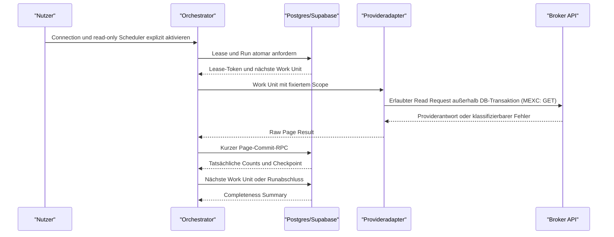
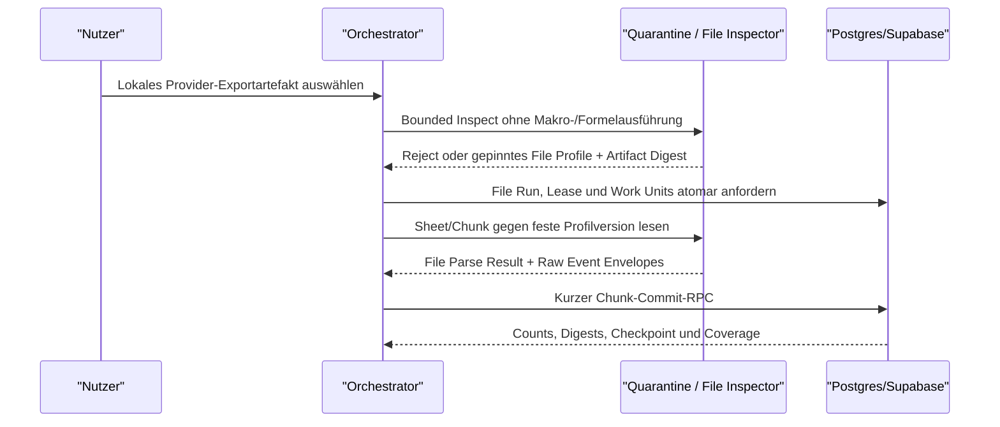

# Equora v57.61.0 – Brokerimport Transaktions-, Betriebs- und Migrationsdesign

## 0. Dokumentkontrolle

| Feld | Wert |
|---|---|
| Designstatus | `DESIGN_ACCEPTED v16 – G1 Egress/permit-expiry/cross-layer/v1-core hardening incorporated; G0 DESIGN ONLY` |
| Implementierungsstatus | `G1 IN PROGRESS – NO-GO`; begrenzte lokale Implementierung vorhanden und lokal validiert, aber nicht aktiviert, nicht deployed und nicht auf ein verbundenes Supabase-Projekt angewendet; maßgeblich ist `docs/gates/EQUORA_v57.61.0_G1_IMPLEMENTATION_STATUS.md` |
| Providerevidenzstatus | über Providervertrag; globale Vollständigkeit unbelegt, prospektive Coverage wird scopegenau und fail-closed betrieben |
| Gate G0 | `GO – DESIGN ONLY`; Code-/SQL-/DB-Evidenz folgt G1–G6 |
| Stand | 2026-08-08, Europe/Berlin |
| Scope | Providerneutraler Importkern; MEXC prospektiver API-Read-Sync; Excel-Export als separat gegatete Recovery-/Backfillquelle |
| Owner | A2 |
| Pflichtreviews | A3, A4, A5 |
| Produktionswirkung | Keine; Produktions-SQL, Push und Deployment bleiben gesperrt |

## 1. Architekturprinzipien

1. Kein externer HTTP-Aufruf innerhalb einer offenen DB-Transaktion.
2. Ein aktives Lease je Brokerkonto und Syncart.
3. Begrenzte, resumable Work Units statt unzuverlässiger Hintergrundarbeit nach
   einer Serverless-Response.
4. Kurze, atomare Page-/Chunk-Commits.
5. Raw Events sind innerhalb ihrer aktiven Retention append-only/immutable;
   erneute Beobachtungen werden separat erfasst. Nur der freigegebene
   Erasure-Pfad darf Payloads kontrolliert entfernen und einen Tombstone
   erzeugen.
6. Zähler werden aus tatsächlichen DB-Operationen abgeleitet, nicht vom Client
   behauptet.
7. Service Role ersetzt keine Ownership- und Parentprüfung.
8. Human Approval und Import sind getrennte Transaktionen.
9. Ein Approval ist immutable und single-use.
10. Wirtschaftliche Importkeys wirken über Batch- und Requestgrenzen.
11. Fehler und Unvollständigkeit sind sichtbare Zustände, keine leeren
    Erfolgsantworten.
12. Migrationen sind additiv und bevorzugen Roll-forward Recovery.
13. Gegenüber Brokern existieren ausschließlich allowlisted, nachweislich
    nichtmutierende Lesezugriffe; für MEXC ausschließlich `GET`. Keine Order-,
    Positions-, Transfer- oder sonstige Broker-Mutation ist Teil des Systems.
14. Automatisches Scheduling darf nur Raw-/Normalisierungs-/Reconciliationdaten
    aktualisieren. Journal-Trades benötigen weiterhin single-use Human
    Approval; Scheduler und Import teilen keinen Ausführungspfad.
15. API- und File-Sources besitzen getrennte Profile, Results, Limits und
    Provenienz, speisen aber nach erfolgreicher Quellvalidierung dieselben
    kanonischen Raw-/Normalisierungsgrains.

## 2. Orchestrierungsmodell



Nach der expliziten Aktivierung darf ein Scheduler denselben Vertrag mit Trigger
`scheduler` verwenden. Der Dispatcher prüft alle fünf Minuten auf fällige
Arbeit; sechs Stunden sind das fachliche Fast-Lane-Zielintervall. Eine Fast Lane liest
als `incremental_fast_6h` mit mindestens 72 Stunden Overlap;
`rolling_audit_7d_daily` liest täglich sieben vollständige UTC-Tage und
`rolling_audit_28d_weekly` mindestens alle sieben Tage das gesamte 28-Tage-
Onboardingprofil. Ein Startup-Catch-up verwendet dieselben disjunkten Lane-
Verträge und kann keinen fremden Lanezustand zurücksetzen.

`activation_cutover_at` dokumentiert die Aktivierungsabsicht, nicht erfolgreiche
Coverage. Capture bleibt `pending`, bis der erste vollständige Pflichtscope
`first_successful_capture_at` setzt. Letzter erfolgreicher Pflichtscope,
lane-spezifischer Healthstatus und die Lücke zwischen Cutover und erster
erfolgreicher Erfassung bleiben sichtbar. Sechs Stunden sind ein Zielintervall,
kein SLA.

Automatischer Journalimport wird dadurch nicht eingeführt. Scheduling eines
read-only Syncs, explizite Sammelauswahl importfähiger Candidates und finaler
Journalimport sind drei getrennte Capabilities. Nur die ersten beiden dürfen
Daten vorbereiten; ausschließlich die letzte benötigt ein aktuelles,
single-use Human Approval und schreibt lokale Journal-Trades.

### 2.1 Manueller File-Source-Ablauf



`mexc_account_export_excel` bleibt bis zu eigenem File-Profile-Gate
`unverified`; der Ablauf ist Architekturreservierung, keine
Implementierungsfreigabe. PDF, manuell konvertiertes CSV und unbekannte
Workbookvarianten sind für dieses Profil nicht importfähig.

## 3. Lease-Vertrag

### 3.1 Ziel

Zwei parallele Serverless-Aufrufe dürfen nicht gleichzeitig denselben
Brokerkonto-/Sync-Scope fortschreiben oder sich gegenseitig den Checkpoint
überschreiben.

### 3.2 Durable Lease

Das Lease wird dauerhaft in Postgres abgebildet und enthält logisch:

- `broker_account_id`, `user_id`, Syncart;
- Hash eines kryptografisch zufälligen Lease-Tokens sowie Tokenformatversion;
- `acquired_at`, `heartbeat_at`, `expires_at`;
- Owner/Worker-Referenz ohne Secret;
- Run-ID und Version;
- Status `active`, `released`, `expired`, `revoked`.

Acquire, Renew und Release erfolgen über eng begrenzte RPCs. Das Lease-Token ist
für Page-Commit und Checkpoint erforderlich, wird aber nicht im Browser oder in
Logs offengelegt. In der Datenbank liegt nur ein gegen Timingangriffe sicher
vergleichbarer Tokenhash; ein Datenbankabzug darf kein aktives Worker-Token
offenlegen.

### 3.3 Advisory-Lock-Einsatz

Ein transaktionsgebundener Advisory Lock kann Acquire/Renew/Release und
Page-Commit kurz serialisieren. Er endet automatisch mit Commit/Rollback.

Ein sessiongebundener Advisory Lock ist für die gesamte HTTP-/Serverless-
Laufzeit ungeeignet: Pooling, Prozessabbruch und Verbindungswechsel machen seine
Lebensdauer unzuverlässig. Das dauerhafte Lease bleibt deshalb die fachliche
Wahrheit.

Jeder Lock-/RPC-Pfad erhält explizite lokale `lock_timeout`- und
`statement_timeout`-Grenzen. Für den Page-Commit sind die G1-Startwerte
`lock_timeout = 2s` und `statement_timeout = 15s`; zusätzlich beendet eine
fachliche `clock_timestamp()`-Deadline nach 12 Sekunden den Pfad kontrolliert.
Ein Timeout erzeugt einen sichtbaren resumable Fehler und wird nicht durch
unbeschränkte Wiederholung verdeckt.

Der produktive Aufrufvertrag ist die Supabase Data API/PostgREST-RPC. PostgREST
muss das Funktionsattribut `statement_timeout` über
`db-hoisted-tx-settings` vor die Main Query heben. Ein direkter
`SELECT function(...)` setzt den Timer innerhalb des bereits begonnenen
Statements zu spät und ist deshalb kein freigegebener Runtimepfad. Das
PostgREST-Hoisting ist vor Deployment als harte Runtime-Precondition durch
Konfigurationsnachweis und einen echten RPC-Abbruchtest mit SQLSTATE `57014`
zu belegen. `lock_timeout` gilt ab Funktionseintritt für nachfolgende
Sperrversuche; SQLSTATE `55P03`, `57014` und die 12-Sekunden-Deadline werden als
geschlossene resumable Fehler abgebildet. Die Werte sind vor Produktion gegen
die maximal zulässigen Pagebudgets zu vermessen; eine Änderung benötigt ein
neues Gate und darf nicht still erfolgen.

### 3.4 Ablauf und Übernahme

- Ein nicht abgelaufenes fremdes Lease führt zu `already_running`.
- Ein abgelaufenes Lease darf erst nach atomarer Status-/Tokenprüfung übernommen
  werden.
- Der alte Token verliert sofort seine Commitberechtigung.
- Ein Heartbeat verlängert nur ein aktives Lease mit passendem Token.
- Page-Commit prüft Lease und Run nochmals in derselben Transaktion.
- Lease-Dauern und Heartbeatintervalle werden vor G1 als explizite
  Betriebskonstanten beschlossen; es gibt keinen stillen Default.

### 3.5 Lokal implementierter G1-Claimvertrag

Das additive lokale Artefakt
`schema-patch-v57.61.0-g1-capture-control.sql` implementiert ausschließlich
den atomaren Work-Unit-Claim, noch nicht den vollständigen Lease-Lifecycle:

- feste Claimdauer `45 Sekunden`, maximal acht Attempts pro Work Unit;
- eindeutige `claim_request_id`, Work-Unit-Row-Version als CAS und
  timing-sicher verglichener SHA-256-Hash eines UUID-Lease-Tokens;
- exaktes Replay derselben Claim-Request-ID mit demselben Token liefert
  dasselbe Lease ohne Counter- oder Row-Version-Fortschreibung;
- eine andere Claim-Request-ID gegen dieselbe erwartete Row-Version verliert
  mit `CONTROL_WORK_UNIT_CAS_MISMATCH`; Tokenabweichung beim Replay endet mit
  `CONTROL_CLAIM_REPLAY_MISMATCH`;
- der immutable Sync-Scope-Digest und der kanonische MEXC-Page-Scope-Digest
  bleiben als `scopeDigest` und `pageScopeDigest` getrennte Domains; SQL und
  TypeScript binden den Page-Digest zusätzlich an Capability, Symbol,
  Requestzeitfenster, Page, Page Size, Position Type und Budgetprofil;
- feste globale Lockreihenfolge Work Unit → Run → Activation Series →
  Activation → Connection Account → Connection → Credentialgeneration →
  privater Integritätsschlüssel → Brokerkonto → Provider → Scope; nur in
  einzelnen Pfaden vorkommende Account-Identity-Zeilen liegen unmittelbar vor
  dem Brokerkonto;
- `lock_timeout=2s`, `statement_timeout=10s` und erneutes
  `clock_timestamp()` nach potenziellen Lock-Wartezeiten;
- Claimresultate geben nur opaque Credential- und Integritätsschlüsselreferenzen
  aus, kein Credential-, Key- oder Lease-Token-Material.

Der Claim setzt eine bereits immutable angelegte, aktuelle Aktivierung voraus.
Aktivierungserstellung, Supersession, Work-Unit-Erzeugung, Renew, Release,
Heartbeat und Scheduler bleiben offen. Die Konstanten sind lokal race-getestete
G1-Startwerte, aber noch keine Produktionsfreigabe oder Lastkalibrierung.

## 4. Bounded Work Units

Eine Work Unit verarbeitet genau einen fixierten Bereich:

```text
Providerkonto × Source Channel × Capability/File Profile × Instrument/Scope ×
UTC-Zeitfenster × Page/Cursor oder Sheet/Chunk
```

Jede Providervertragsrevision legt harte Obergrenzen fest für:

- Providerpages;
- Raw Events;
- Responsebytes;
- externe Laufzeit;
- DB-Commitgröße;
- Retries und Gesamtbackoff;
- Symbole/Instrumente;
- Gesamtzahl Work Units pro Nutzeraktion.

Die konkreten API-Page-/Event-/Byte-/Zeitwerte werden in G1 bounded und durch
Last-/Rate-Limit-Tests geprüft. Dokumentierte Providermaxima sind keine
automatisch sicheren Equora-Work-Unit-Maxima. File Work Units besitzen
zusätzlich feste Container-, Sheet-, Row-, Column-, Cell-, String- und
Decompressionbudgets; ein Workbook darf diese Grenzen nicht über mehrere
Chunks umgehen.

Beim Erreichen einer Grenze wird die Work Unit mit atomarem Checkpoint als
`yielded` beendet. Ein Folgelauf setzt deterministisch fort. Ein Limit ist kein
Fehler und kein Vollständigkeitsnachweis.

## 5. External-Source-Vertrag

### 5.1 Provider-API

Der Provideradapter erhält nur:

- versionierten Providervertrag;
- erlaubten Endpoint-Identifier;
- fixierten Scope;
- eine opaque Credentialreferenz; niemals Klartext-Credentials;
- Page-/Cursorzustand;
- Deadline und Rate-Limit-Budget.

Er erhält keine HTTP-Methode und keine frei zusammensetzbare URL. Die
Capability-ID wird serverseitig über die versionierte Providervertragsrevision
auf einen konstanten HTTPS-Host, eine konstante nichtmutierende Methode und ein
erlaubtes Pfadtemplate abgebildet; für MEXC ist die Methode ausschließlich
`GET`. Parameterwerte dürfen weder Schema, Methode, Host noch Pfad verändern.

Er liefert ein typisiertes `PageResult`:

- `request_status`;
- Endpoint, Instrument und Zeitfenster;
- Provider-Page-/Cursorwerte;
- Raw Event Envelopes;
- Provider-Count-/Page-Metadaten als untrusted Evidence;
- Responsebytezahl und Zeit;
- sanitiserte Fehlerklasse;
- Contract-/Adapterversion.

Der Adapter schreibt nicht direkt in die Datenbank. Er verändert keine
Verbindung, Rechte oder Brokerdaten. Dynamische URLs aus Providerpayloads sind
verboten.

Genau ein serverseitiges Broker-Egress-Modul darf Netzwerkzugriff ausführen.
Adapter dürfen weder `fetch`, `undici`, `node:http`, `node:https`, Axios,
Broker-SDKs noch eigene WebSocketverbindungen importieren. Eine AST-/Lint- und
Dependency-Regel erzwingt diese Grenze repo-weit für alle registrierten
Adapter; ein unbekannter Adapter ist standardmäßig nicht releasefähig.

Die zwingende Requestreihenfolge für MEXC v57.61.0 lautet:

**Normative Activation-Invariante**

1. Eine konkrete Aktivierung nur bei versionierter offizieller View-/Read-
   Permissionzuordnung jeder Pflichtcapability, aktueller Nutzerattestierung und
   keiner technisch erkennbaren Broker-Schreibpermission zulassen; andernfalls
   `blocked_permission_evidence`. Ein Lesetest ersetzt diese Prüfung nicht.
2. Die erste Aktivierung erzeugt unter Series-Row-Lock eine
   `activation_series_id`, eine neue Zeile mit ID/Generation `1` und den Current-
   Pointer. Nach `inactive`/`revoked` oder Änderung gepinnter Identitäten/
   Versionen unter demselben Lock eine neue Zeile mit neuer ID und
   `max(generation)+1` anlegen, eine zuvor current/arbeitsfähige Vorgängerzeile
   auf `inactive` setzen und deren Jobs/Leases im selben Commit invalidieren.
   Diese sofortige Invalidierung ist eine logische Autoritätswirkung des
   atomaren Current-Pointer-/Lifecycle-Fence: alte Work Units verlieren ohne
   inversen `Series -> Work Unit`-Lock jede Claim-, Renew-, Commit- und Request-
   Autorität. Physische Status-/Tokenbereinigung ist nachgelagert, idempotent und
   niemals Autoritätsvoraussetzung; ein `revoked`er Vorgänger bleibt `revoked`.
   Der Current-Pointer wechselt
   atomar. Zwei parallele Wechsel serialisieren über `series_row_version`; der
   Verlierer liest neu und erzeugt keine Work Unit. Historische Series-/
   Generations-/Pinwerte bleiben unveränderlich. Nur Resume aus `paused` mit
   unveränderten Pins und weiterhin aktuellem Pointer behält dieselbe Zeile/
   Generation und sämtliche Gaps/Lane States.
3. Vor Enqueue sowie hier erneut atomar Connection-/Account-/Tenantbindung,
   exakte Übereinstimmung von Job-`sync_activation_id`/
   `activation_generation` mit dem gesperrten Series-Current-Pointer, aktive
   Credentialgeneration, Aktivierungsstatus, erlaubten Trigger und
   gepinnte nicht suspendierte Provider-/Adapter-/Profil-/Capabilityversionen
   prüfen. Pause, Widerruf, Permissionblocker, Credentialentfernung oder
   Suspension invalidieren Job, Retry, Startup-Catch-up und Lease. Ein bereits
   entschlüsselnder Worker sendet nach erkannter Invalidierung keinen weiteren
   Request; `degraded` erlaubt nur explizite Recovery-/Auditläufe.
4. Provider und gepinnte Vertragsversion auflösen.
5. Capability aus einem geschlossenen Read-Capability-Typ auflösen.
6. HTTPS-Origin, leeres Userinfo, erlaubten Port, konstantes Pfadtemplate und
   typisierte, eindeutige Querykeys kanonisch validieren.
7. Unsigned Request mit intern festem `GET` und `redirect: 'error'` erzeugen.
8. Erst jetzt die Credentialreferenz laden und das Credential kurzzeitig
   serverseitig entschlüsseln.
9. Signatur und Header erzeugen, unmittelbar senden und Klartextmaterial aus
   allen Rückgabe-, Persistenz- und Logpfaden ausschließen.

Unbekannte Capability, Methode, URL, Pfad- oder Queryinjektion wird abgelehnt,
ohne dass der Credential-Store aufgerufen wird. Der Transport besitzt keine
generische exportierte `request(method, url)`-Funktion und exponiert weder
Broker-SDK-Tradingclients noch WebSocket-Sendefunktionen.

Redirecttests müssen `301`, `302`, `303`, `307` und `308` für Same-Host-
Fremdpfad, Subdomain, Fremdhost, anderen Port und HTTP-Downgrade abdecken. Der
jeweilige Zielserver muss null Requests und null Credentialheader sehen. Die
Fehlerklassifikation berücksichtigt, ob die eingesetzte Node-/Next-Runtime bei
`redirect: 'error'` eine Response oder unmittelbar einen Transportfehler
liefert.

### 5.2 Provider-Exportdatei

Ein File-Adapter erhält nur:

- opaque Source-Artifact-Referenz aus privatem ownergebundenem Storage;
- gepinnte Provider-/File-Profile-Version;
- Sheet-/Chunk-Work-Unit und harte Ressourcenbudgets;
- erwarteten Artifact-/Header-/Checkpoint-Digest.

Er erhält keinen frei ausführbaren Officepfad, kein Workbookpasswort und keine
Netzwerkfähigkeit. Er darf Excel, LibreOffice, COM, Makros, Formeln, OLE,
externe Links oder Datenverbindungen weder starten noch auswerten. Vor XML-
oder Zellzugriff gelten gepinnte Grenzen für Archivbytezahl, Entry-Anzahl,
Einzelentrygröße, kumulierte dekomprimierte Größe, Kompressionsverhältnis und
Verschachtelungstiefe. Absolute Pfade, Traversal, Symlinks, doppelte oder nach
Kanonisierung kollidierende Entry-Namen, rekursive Archive und
Budgetüberschreitung werden abgelehnt. Die Limits gelten workbookweit und
können nicht durch Sheets, Chunks oder verschachtelte Container umgangen
werden.

Das Vorhandensein irgendeiner Formelzelle oder eines Formula Records führt zu
`source_artifact_rejected`; auch gecachte Formelwerte sind keine Importwerte.
Fail-closed abgelehnt werden VBA/XLM-Makros, ActiveX, OLE, eingebettete
Packages/Archive, DDE, externe Relationships und Datenverbindungen,
verschlüsselte oder unbekannte Containerteile, `DOCTYPE`/DTD und externe XML-
Entities.

Der Parser liest ausschließlich Nicht-Formel-Zellwerte gegen eine exakte
Header-/Typ-Allowlist. Große numerische IDs, UTC-Zeitwerte und Decimalwerte
werden aus dem ursprünglichen Zelltyp beziehungsweise kanonischen Zelltext lossless
normalisiert; wissenschaftliche Darstellung, Datumsseriale und gerundete
Displaywerte dürfen nicht still als Originalwert gelten.

Vor `JSON.parse` gelten pro Capability harte Roh- und dekomprimierte
Bodygrenzen. `Content-Length` ist nur eine frühe Kontrolle; begrenztes
Streaming, Abort, Timeout und Gesamtdeadline schützen auch bei fehlender oder
falscher Länge, Chunked Transfer und komprimierter Übergröße. Übergröße wird
sanitisiert als `response_too_large` klassifiziert.

Ein Versuch, eine schreibende Methode oder Capability zu verwenden, ist kein
normaler Providerfehler. Er wird lokal vor dem Netzwerkzugriff blockiert und
als Security-/Contract-Incident ohne Secrets protokolliert.

## 6. Page-Commit-RPC

### 6.1 Autorität

Der Page-Commit-RPC ist server-only. Der Browser kann weder Raw Events noch
Zähler, Ownership oder Checkpoints direkt schreiben. Der RPC vertraut keinem
Client-`user_id` und keinen clientberechneten Finanzwerten.

### 6.2 Logische Eingaben

- Run-ID, Work-Unit-ID und Lease-Token;
- Endpoint-/Scope-Digest;
- Providervertrags- und Adapterversion;
- genau ein sanitisiertes Provider Request Result oder File Parse Result;
- Raw Event Envelopes mit Provider-ID, Eventtyp, Occurred-At, Payload und
  Payloadhash;
- erwarteter vorheriger Checkpoint als Optimistic-Concurrency-Guard.

### 6.3 Transaktionsablauf

In genau einer kurzen DB-Transaktion:

1. Auth-/Workerkontext ermitteln.
2. Run, Work Unit, Nutzer, Providerkonto und Connection gemeinsam prüfen.
3. Aktives Lease und Token prüfen; bei Mismatch abbrechen.
4. Erwarteten vorherigen Checkpoint sperren und vergleichen.
5. Provider Request Result oder File Parse Result immutable einfügen; ein XOR-
   Constraint erlaubt genau eine Quellresultatart.
6. Raw Events über einen belegten Unique Key mit
   `INSERT ... ON CONFLICT DO NOTHING` einfügen.
7. Für Konfliktzeilen die bestehende Raw-Event-ID über denselben vollständigen
   Unique Key laden und Payloadhash, Tenant, Providerkonto und Eventtyp
   vergleichen. Ein Hash-/Scope-Mismatch erzeugt `identity_collision`; er wird
   nicht als bekanntes Event akzeptiert.
8. Für jedes validierte beobachtete Event eine Run-/Source-Observation anlegen,
   auch wenn das Raw Event bereits bekannt war.
9. Neue, bekannte, blockierte und fehlerhafte Counts aus `RETURNING` und
   tatsächlich angelegten Observations ableiten.
10. Work-Unit-Checkpoint atomar fortschreiben.
11. Run-/Scope-Completeness serverseitig aktualisieren.
12. Commit; bei jedem Fehler vollständiger Rollback.

Die Transaktion ruft MEXC nicht auf und entschlüsselt keine Credentials.

### 6.4 Deduplizierung

Verboten ist das aktuelle Check-then-Insert-Muster als alleinige
Parallelitätskontrolle. Der Unique Constraint ist die letzte atomare
Wahrheit. `ON CONFLICT DO NOTHING` verändert ein bereits gespeichertes Raw Event
nicht.

Ein bekannter Provider-ID-/Revision-Key mit abweichendem Payloadhash wird nicht
still ignoriert. Je Providervertrag entsteht entweder eine neue
Providerrevision oder ein `identity_collision`-Finding.

Die Konfliktauflösung darf kein fachliches Feld des bestehenden Raw Events
aktualisieren. Ein künstliches `DO UPDATE` nur zum Erzwingen von `RETURNING`
wäre unnötige Mutation und ist für immutable Raw Events unzulässig.

### 6.5 Fehlerzustand

Ein Page-/Symbol-/Endpoint- oder File-Chunk-Fehler wird als typisiertes Source
Result persistiert. Der Run ist mindestens `partial`, wenn andere
Pflichtscopes erfolgreich waren, sonst `failed`. Kandidaten, deren beobachtete
Coverage von dem fehlgeschlagenen Scope abhängt, sind technisch nicht
approvable.

Der lokale G1-Capture-Control-Plane konkretisiert dafür einen begrenzten
Failurepfad. `equora_record_broker_capture_failure_v1` akzeptiert die
geschlossene Transportfehler-Union, den vor dem Request authentifizierten
Checkpoint-MAC, die erwartete Capability und den erwarteten
`pageScopeDigest` sowie begrenzte Transportmetriken. Capability und Page-Digest
sind ausschließlich CAS-/Replay-Preconditions; sie verleihen keine Daten-,
Import- oder Finanzautorität. SQL bindet beide vor jeder Mutation an den
gespeicherten Work-Unit-Checkpoint und an ein vorhandenes Outcome-Replay.
Claim und Failure verwenden zusätzlich dieselbe geschlossene SQL-
Checkpointinvariante: Versions- und Budgetpins, requestfähige Status-/
Reasonkombination, capabilitybezogene `pageSize`, capabilitykohärentes
`positionType`, Scopefelder, Cursor-/Digestform und sämtliche Work-Unit-/
Scopebudgets müssen vor dem Commit kanonisch sein. Erst danach prüft SQL den
Checkpoint-HMAC mit dem privaten Integritätsschlüssel, leitet Zähler, Retry oder
Terminalzustand aus dem festen `mexc-history-page-budget-v1` ab, signiert den
Folgecheckpoint neu und schreibt Checkpoint, Work Unit, Run, Scope und Outcome
atomar fort.

Automatisch retrybar sind nur `rate_limited`, `provider_busy`,
`provider_unavailable` und `timeout`, mit den fest versionierten Backoffs eine
und fünf Sekunden sowie höchstens zwei Retries je Work Unit. `maintenance`
endet dagegen als `provider_retry_deferred`; es startet keinen automatischen
Retry. Erreicht der aktuelle Claim das Work-Unit-Attemptlimit, wird der
tatsächliche Fehler noch genau einmal persistiert und mit dem getrennten
Terminalgrund `claim_attempt_budget_reached` abgeschlossen. Ein vorhandenes
erfolgreiches Request Result und ein Failure Outcome für dieselbe
Work-Unit-/Requestsequenz schließen sich aus.

Ein terminaler Fehler setzt die Work Unit auf `partial_failed`. Der betroffene
Scope wird nur dann `partial`, wenn genau für diesen Scope mindestens ein
gültiges `broker_provider_request_result` existiert; ohne solche
Scope-Evidenz wird er `failed`. Erfolgreiche Evidenz eines anderen Scopes darf
diese Aussage nicht aufwerten. Ein Run mit verbleibenden zulässigen Work Units
oder bereits gültiger Run-Evidenz wird resumable `partial`, behält
`completed_at=null` und wechselt beim nächsten zulässigen Claim wieder auf
`running`. Nur ein Run ohne offene Work Unit und ohne gültiges Request Result
wird in diesem Failurepfad `failed` abgeschlossen.

Scope- und Run-Wahrheit werden bewusst unabhängig abgeleitet. Besitzt ein
weiterverwendeter Scope gültige Evidenz aus einem früheren Run, während der
aktuelle Run weder eigenes Resultat noch offene Work Unit besitzt, ist deshalb
`outcome_status=partial_failed` zusammen mit `run_status=failed` korrekt. Der
Serveradapter muss diese bereits atomar persistierte Kombination akzeptieren;
eine nachträgliche lokale Ablehnung wäre kein Rollback und daher unzulässig.

`broker_capture_attempt_outcomes` speichert nur owner-/account-/activation-/
run-/scope-/work-unit-gebundene IDs, CAS-Versionen, Attempt, Requestsequenz,
Lease-Tokenhash, Fehlercode/-klasse, Outcome, optionalen HTTP-Status,
Bytecount, begrenzte Requestdauer und optionalen Terminalgrund sowie den
authentifizierten Checkpoint vor und nach der Transition.
Providertext, Raw Body, Raw Payload, API Key, Secret, Ciphertext und
Credential-/Integritätsschlüsselmaterial besitzen bewusst weder Outcome-
Spalten noch RPC-Parameter. Direkte
Tabellenrechte sind auch für `service_role` entzogen. Exaktes Outcome-Replay ist
idempotent; eine abweichende Bindung endet fail-closed.

Dieser in Abschnitt 6 beschriebene Zwischenstand wurde durch die späteren
Activation- und Scheduler-/Lease-Control-Deltas ergänzt: Restart-Recovery,
Renew/Release, serverseitige Recovery-Zuordnung, laneübergreifende Health-
Ableitung und atomare Aktivierungssupersession sind lokal implementiert. Diese
Control-Plane aktiviert weiterhin keine Runtime und autorisiert keinen
Brokerrequest.

### 6.6 Stabilität, Sync Health und Gap Ledger

- Die Supportaussage „neueste Records zuerst“ wird als versioniertes aktuelles
  Verhalten behandelt. Jede Page muss je Capability auf nichtzunehmende belegte
  Zeitfelder und jeder Pageübergang auf konsistente Reverse-Chronology geprüft
  werden. Abweichung, fehlendes Sortierfeld oder widersprüchliche Grenzen
  erzeugen `partial`/`contradicted`. Providerreihenfolge wird nie als
  wirtschaftliche Same-Timestamp-Reihenfolge verwendet.
- Stabilität wird ausschließlich für unveränderliche geschlossene UTC-
  Tagesbuckets berechnet. Die kanonische Digestdomain
  `stability_bucket_identity` bindet exakt Provider-ID, tenantgebundenes
  Account-HMAC, `sync_activation_id` und `activation_generation`,
  `capability_id`, typisierten Instrument-/Accountscope,
  `provider_contract_version`, `adapter_version`, `profile_id`,
  `profile_version`, `boundary_policy_version`, `bucket_start`, `bucket_end`
  und `digest_version`. Cross-Activation-, Cross-Profile- oder sonstige
  Cross-Version-Wiederverwendung als zweite Stabilitätsbeobachtung ist
  verboten. Disjunkte 7-/28-Tage-Lanes orchestrieren nur die Menge dieser
  Buckets; der laufende UTC-Tag kann nicht stabil werden.
- Zwei identische Beobachtungen derselben Bucketidentität in
  aufeinanderfolgenden, mindestens einen Schedulerlauf getrennten Auditläufen
  ergeben `observed_stable`. `partial`, offene Pages, unbekannte Shapes,
  Capabilityfehler oder Digestabweichungen zählen nicht und invalidieren die
  Stabilitätsgeneration.
- `observed_stable` ist kein Providervollständigkeitsclaim. Die UI nennt immer
  Capability, Scope, Profilversion, Beobachtungsgrenze und
  `silent_omission_risk`.
- `SYNC_LANE_REQUIREMENT` ist die eigenständige Soll-Autorität je
  Aktivierungsgeneration, Capability und typisiertem Instrument-/Accountscope.
  Sie bindet Provider-/Adapter-/Profil-/Capabilityversion,
  `policy_generation` und eine versionierte Requirement-Quelle. Die Health-
  Ableitung zählt aktuelle Requirements, nicht vorhandene Lane States, als
  Soll-Grains. Fehlt für eine Profil-Capability jede Requirement, bleiben drei
  fehlende Pflichtlanes als Capability-Platzhalter sichtbar.
- `SYNC_LANE_STATE.health` ist die persistierte Health-Autorität je Requirement.
  Der Unique Grain bindet `lane_requirement_id`, `sync_activation_id`,
  `activation_generation`, Brokerkonto, Capability, Instrument-/Accountscope,
  disjunkte `lane_id`, `profile_id`, `profile_version` und
  `policy_generation`. Für den MEXC-API-Scope sind
  `incremental_fast_6h`, `rolling_audit_7d_daily` und
  `rolling_audit_28d_weekly` getrennte Pflichtlanes. Jede führt
  `last_complete_at`, `next_due_at`, letzten vollständigen Scope-Digest, letzten
  Fehler und eine kanonisch gebundene High-Watermark getrennt. `not_observed`
  verbietet eine Watermark; `healthy` verlangt Zeit, Tie-Breaker,
  Contractversion und einen reproduzierbaren Digest über den vollständigen
  Authority-Grain. Monotone CAS-Fortschreibung bleibt bis zu einem geschlossenen
  Server-RPC außerhalb dieses G1-Foundation-Patches. Der Last-Complete-Scope-
  Digest ist per Composite-FK an den echten Scope-Digest gebunden. Die read-only
  Ableitung akzeptiert `healthy` nur bei exact-scoped, geschlossenem,
  `complete_for_profile`, stability-/source-/coverage-kompatiblem Scope und
  `last_complete_at >= closed_at`; ungültige Complete-Scope-Evidenz wird separat
  gezählt und ergibt fail-closed `degraded`. Activation Health wird nur daraus
  aggregiert; ein abgeschlossener Scope enthält höchstens einen unveränderlichen
  Health-Snapshot. Eine überfällige Pflichtlane setzt das Aggregat `degraded`;
  nur ein vollständiger Erfolg genau dieser Lane stellt ihren Zustand wieder
  her.
- `derive_capture_health_v1` ist deterministisch:

  ```text
  revoked lifecycle -> revoked
  paused lifecycle -> paused
  inactive/blocked_permission_evidence/pending lifecycle -> pending
  else active and any effective requires-export/unsupported/invalid-reconciliation gap
       in this activation generation or current lane gap_requires_export -> gap_requires_export
  else active and any required lane missing/not_observed -> pending
  else active and (any required lane degraded/overdue/open non-export gap
       or any persisted-healthy lane has invalid Complete-Scope evidence) -> degraded
  else active and every current required lane is persisted healthy
       and has valid Complete-Scope evidence -> healthy
  else -> pending
  ```

  Bei aktiver Aktivierung maskiert ein gleichzeitig fehlender Lane Key keine
  bereits bekannte Export-Recoverylage als bloßes `pending`. Lifecycle-Stopp
  löscht keine Lane-/Gap-Evidenz. Ein Gap bleibt innerhalb derselben
  Aktivierungsgeneration auch nach Supersession seiner früheren Policy-
  Requirement/Lane wirksam. Nach Resume wird aus aktuellen Requirements, den
  dazugehörigen Lane States und allen Gaps derselben Aktivierungsgeneration neu
  abgeleitet. `requiresExportGapCount`, `invalidReconciliationCount` und
  `exportBlockedLaneCount` bleiben getrennte Zähler. Run-/Scope-Snapshots sind immutable
  Audit-/Anzeigeevidenz und niemals Authority für Candidate, Approval, Import,
  Recovery oder Lane-Healing.
- Jede bekannte unbelegte oder unprüfbare Candidateüberlappung erzeugt sofort
  einen offenen `SYNC_GAP` mit Reason `gap_unproven` und sperrt Candidate,
  Auswahl, Approval und Import. Sieben beziehungsweise 28 Tage sind lediglich
  Eskalations-/Recoveryfristen. Bei mehr als 28 Tagen, unbekannter Grenze oder
  nicht resumable Sourcefehler wird `requires_export`/`unsupported` gesetzt.
  Ein erfolgreicher späterer Einzelrequest schließt den Gap nicht. Der Status
  `reconciled` wird nur effektiv, wenn ein exakt tenant-/account-/activation-/
  capability-/instrument-/lane-/profilgebundener Scope geschlossen,
  `complete_for_profile`, grenzdeckend und source-kompatibel ist und ein
  kanonischer Resolution-Digest den echten Scope-Digest sowie den vollständigen
  Gap-Grain bindet. Unbekannte Grenzen und Export-Recoverylagen verlangen eine
  Provider-Exportquelle. Widersprüchliche Reconciliation bleibt fail-closed
  `invalid_reconciliation`; der autoritative Schreibübergang erfordert einen
  späteren geschlossenen Server-RPC.
- Eine bewusste Nutzerpause stoppt neue Schedulerläufe, löscht aber weder
  Checkpoints noch Gap-/Health-Evidenz. Beim Resume wird zuerst der mögliche
  Gap ermittelt, bevor neue Candidates approvable werden.

Normative Statusachsen:

```text
coverage_basis = provider_observed | provider_export_observed
scope_completeness = complete_for_profile | partial | failed | unverified
stability_status = not_observed | observed_once | observed_stable | invalidated
lane_health = healthy | degraded | gap_requires_export | paused
capture_health = pending | healthy | degraded | gap_requires_export | paused | revoked
gap_status = open | degraded | requires_export | reconciled | unsupported
coverage_policy = strict_export_verified | provider_observed_best_effort | pending_user_policy
```

Für MEXC gilt gemäß DEC-5761-024
`coverage_policy=provider_observed_best_effort`. Nach vollständig erfülltem
Eligibility Predicate dürfen API-Candidates `reviewable` werden; Candidate,
Approval, Journal-Trade und Auswertungen behalten
`export_verification_status=not_export_verified` sowie den sichtbaren
`silent_omission_risk`. `pending_user_policy` bleibt nur ein generischer
Pre-Decision-Zustand.

## 7. Normalisierungs- und Reconciliation-Pipeline

Normalisierung und Reconciliation verwenden ebenfalls bounded, idempotente
Work Units. Sie lesen immutable Raw Events und schreiben versionierte Ergebnisse.

### 7.1 Normalisierung

- exakte Decimalwerte, kein unkontrolliertes JavaScript-Float;
- UTC-`timestamptz` plus dokumentierte Providerzeiteinheit;
- getrennte Order-, Execution-, Position- und Funding-Grains;
- versionierte Instrumentmetadaten;
- expliziter Authority Mode. MEXC v57.61.0 erlaubt für importfähige
  Finanzkomponenten nur `provider_booked`; `local_valuation` bleibt ohne
  Contract-Multiplier, historische Formel und Rundung `unsupported`;
- native Contractmenge bleibt erhalten; Contract Size/Basismenge und lokale
  Vergleichsrechnung sind optionale, getrennt evidenzierte Felder;
- MEXC-Import nur für lineare stablecoin-margined Contracts, deren
  `contract_family_at_event`, `settlement_asset_at_event` und
  `instrument_identity_at_event` durch ereigniseingebettete Daten, belegte
  Provider-Valid-Time/-Version oder eine versionierte offizielle
  Unveränderlichkeitsregel autoritativ sind und Settlement `USDT` oder `USDC`
  ergeben; Authority-Typ/-Version werden persistiert. Fehlt dies, gelten
  `contract_classification=unverified`, `import_eligibility=blocked`; Coin-M,
  inverse, Quanto, USD1-M und unknown bleiben typisiert `unsupported`;
- Settlementasset niemals als stiller Ersatz für fehlende PnL-/Fee-/Funding-
  Currency;
- PnL, Fee und Funding jeweils mit `currency_value | currency_unknown`,
  `currency_source`, `currency_rule_version` und `currency_authority_status`;
  Execution-`profit` ohne eigenes Currencyfeld bleibt bis zu einer
  eventzeitlich autoritativen versionierten Regel `currency_unknown`;
- At-Event-Authority wird als immutable `EVENT_CONTRACT_AUTHORITY` je konkretem
  Economic Event mit Event-ID/-zeit, Account/Instrument, Valid-Time-Intervall
  oder exakt gepinnter Immutable Rule persistiert; aktuelle Metadata Observation
  und `non_authoritative_same_bracket` sind nicht autoritativ. Candidate-/Approval-
  Digests binden das vollständige sortierte Evidence-Set;
- kanonischer Equity-Effekt bei Fees/Funding/PnL plus unverändertes
  Providervorzeichen;
- unbekannte Enums/Pflichtfelder erzeugen Blocker;
- ein Normalizerlauf schreibt keine Raw Events um.

### 7.2 Reconciliation

- getrennte technische Paginationordnung und wirtschaftliche
  Reconciliationordnung;
- Same-Timestamp-Events zunächst als Sequenzgruppe; stabile IDs ordnen nur bei
  belegter Provider-Sequenzsemantik wirtschaftlich;
- keine unbeschränkte oder faktorielle Permutationsenumeration. Ohne belegte
  Providersequenz darf der versionierte Bounded Analyzer
  Reihenfolgeunabhängigkeit nur analytisch beweisen: innerhalb einer
  Account-/Instrument-/Mode-/Side-Lane haben alle Deltas dasselbe Vorzeichen
  und das Gruppenintervall überschreitet null nicht; Start oder Ende bei null
  ist zulässig. Gemischte Deltavorzeichen, möglicher Nulldurchgang/Reversal,
  fehlender Beweis oder Überschreitung harter Group-/CPU-/State-Budgets erzeugt
  unmittelbar `ambiguous_sequence`; es gibt keinen Timeout-/ID-Sortierfallback;
- Order-Execution-Kontext ohne Order-Doppelzählung;
- Position-Cycle-State-Machine je Providerkonto, Instrument, Mode und Side;
- belegte linke und rechte Cycle-Grenze; bei Aktivierung bereits offene
  Carry-in-Positionen und am linken Activation-/Gap-Rand beginnende Cycles
  bleiben `blocked_left_boundary`; innerhalb einer offenen Position endende
  Fenster bleiben `blocked_boundary`;
- getrennte Entry-/Exit-Gesamtmenge, Peak- und End-Inventar sowie signed
  Inventory vor/nach jeder Allocation; Long positiv, Short negativ,
  `inventory_after = inventory_before + signed_execution_delta`;
- mengenanteilige Reversal-Allocations, deren Close-/Open-Summe exakt die
  Executionmenge ergibt;
- typisierte Execution-, Funding-, Account-Finanz-, Order-, Position- und
  Metadatarelationen innerhalb derselben Candidate Revision;
- genau eine versionierte Authority Rule je Finanzkomponente.
  `provider_booked` Sources werden über exakte Betrags-/Currency-/Coverage-
  Allocations gebucht;
  lokale Valuation nutzt vollständige typisierte Calculation Inputs;
- transaktional gesperrte Summenprüfung je atomarer Source/Providerfeld/
  Currency über alle aktuellen Candidate Revisions. Execution-Fee/PnL-
  Reversal-Splits und Funding-/Accountbuchungssplits müssen den Quellbetrag
  exakt erhalten; unzuordenbarer Rest blockiert, Überschreitung ist Fehler;
- überlappende Order-/Positionaggregate ausschließlich als `reference_only`,
  niemals zusätzlich addiert;
- Fees/Funding/PnL getrennt je Währung;
- jede kanonische `FINANCIAL_COMPONENT` trägt selbst `currency_value |
  currency_unknown`, Source, Rule Version und Authoritystatus; Provider-Source-
  Links müssen dieselbe autoritative Currency tragen, sonst `mismatch`;
- für jeden nach providerbelegter Boundary Rule potenziellen Funding-
  Settlementzeitpunkt genau eine `FUNDING_SETTLEMENT_EXPECTATION_EVIDENCE` mit
  gebuchtem Event, autoritativer Null, autoritativem Nichtanwendungsbeleg oder
  blockierendem `expectation_unverified | missing_booking |
  ambiguous_attribution`; leere Fundingpage ist niemals Nullbeleg;
- Kandidatenrevision mit Input-Digest und Algorithmusversion;
- neue Inputs erzeugen neue Revision statt Mutation.

### 7.3 Digestberechnung und Transaktionsgrenze

Alle Page-, Raw-, Normalized-, Candidate-, Approval-, Allocation- und
Importdigests folgen dem versionierten Kanonisierungsvertrag des Logical ERD.
Die Transaktion akzeptiert keinen vom Client autoritativ gelieferten Digest.
Sie rekonstruiert ihn serverseitig aus den gesperrten Datensätzen und vergleicht
Algorithmus, Domain und Vertragsversion.

Raw-Response-Bytes werden vor JSON-Parsing separat gehasht. Semantische Digests
entstehen erst nach verlustfreiem Parsen und kanonischer Typisierung. Volatile
Fetch-/Worker-/Observationmetadaten dürfen einen Candidate-Snapshot nicht
ändern, fachlich relevante neue Source-, Metadata-, Boundary-, Sequence-,
Valuation- oder Toleranceevidenz dagegen zwingend.

Vor Schema-/RPC-Implementierung sind versionierte Golden Vectors für jede
Digestdomain festzulegen. Node/TypeScript und Postgres müssen dieselben
kanonischen Bytes und SHA-256-Hexwerte erzeugen. Ein Digestversionswechsel ist
additiv; bestehende Approvals werden nach expliziter Policy invalidiert oder
bleiben an ihre alte Version gebunden, niemals still neu interpretiert.

## 8. Approval-Transaktion

### 8.1 Erstellung

Es gibt keine Vorauswahl. Der Nutzer wählt einzelne `reviewable`
Kandidatenrevisionen oder löst ausdrücklich „Alle aktuell importierbaren
auswählen“ aus. Die Sammelaktion berechnet serverseitig die aktuelle Eligibility
neu, selektiert nur unveränderliche eligible Revisionen und lässt Blocker,
offene, ausgeschlossene und nicht zugeordnete Kandidaten unselektiert sichtbar.
Der Nutzer kann vor der finalen Bestätigung jede Revision im Drill-down prüfen
und einzelne ausgewählte Candidates wieder abwählen.
Vor der davon getrennten finalen Bestätigung zeigt die Anwendung:

- Anzahl;
- Entry-/Exit-/Mengeninformationen;
- Brutto-PnL, Fees, Funding und Netto-PnL je Währung;
- Abweichungsstatus;
- Providerkonto und Provenienzzusammenfassung;
- Coverage Basis/Policy und den sichtbaren `silent_omission_risk`;
- exakten UTC-Scope, abgedeckte Capabilities und Pflichtlanes, letzte
  erfolgreiche Pflichtscopes sowie bekannte Gaps und Carry-in-Grenzen;
- Counts für ausgewählt, blockiert, ausgeschlossen, offen und nicht zugeordnet.

Erst die gesonderte Human-Approval-Bestätigung erzeugt ein single-use Approval.
Der Scheduler besitzt keine Auswahl-, Approval- oder Importfähigkeit.

Der Approval-RPC lädt serverseitig alle Revisionen, prüft Nutzer,
Providerkonto, Status, Watermark und Digests und berechnet denselben Eligibility
Predicate wie Candidatebildung und Auswahl erneut. Er verlangt alle den Cycle
schneidenden Pflichtbuckets `observed_stable`, alle Pflichtcapabilities
`complete_for_profile`, `activation_state=active`, alle abhängigen Pflichtlanes
aktuell `healthy`, keinen offenen
Gap oder Partial-/Failed-/Unverified-Source, belegte linke und rechte Grenzen,
die gewählte Coverage Policy, eventzeitlich autoritative Contractfamilie,
Instrumentidentität und Settlementzuordnung, komponentenspezifisch autoritative
PnL-/Fee-/Fundingcurrency, eine aufgelöste Funding-Expectation-Evidence für
jeden potenziellen Settlementzeitpunkt sowie erfüllte Allocation und
Reconciliation. Die revalidierten Scope-/Lane-/Gap-/Coverage-/Authority-/
Funding-Expectation-Snapshots werden unveränderlich im Approval gebunden. Der
Import prüft diesen
Predicate unmittelbar vor dem ersten Write erneut.

Zusätzlich sperrt und prüft er die atomaren Financial Source Keys aller
ausgewählten Revisionen. Eine Source mit Doppelallocation, Summenüberschreitung,
unzugeordnetem Rest, widersprüchlicher Currency, nicht aktueller Candidate
Revision oder `ambiguous`/`not_comparable` kann kein Approval Item erzeugen.

`observed_stable` ist dabei nur eine notwendige Beobachtungsbedingung, niemals
ein hinreichender Completeness-Beweis. Unter
`provider_observed_best_effort` ist Auswahl nach erfülltem Gesamtpredicate
zulässig; Bestätigungsansicht und Snapshot zeigen dauerhaft „providerbeobachtet,
nicht exportverifiziert“ und das Risiko eines vollständig ausgelassenen matched
Cycles.

### 8.2 Invalidierung

Neue Raw Events, neue Observations mit relevanter Revision sowie jede Änderung
des serverseitig gebundenen Candidate-/Approval-Input-Digests invalidieren
betroffene pending Approvals. Dazu gehören insbesondere Coverage Basis/Policy
oder Omissionrisiko, aktuelle Scope-/Lane-Health, Gaps, Event-Contract-Authority,
Financial-Currency-Authority, Funding-Expectation/-Resolution, Contract-
Metadaten, Candidate-/Reconciliation-Algorithmus- oder Providervertragsversion.
Status wird `invalidated` oder der Candidate `needs_review`.

Eine wiederholte Observation eines in Inhalt und fachlicher Revision identischen
Raw Events invalidiert nicht allein. Die Invalidierungsentscheidung wird aus
dem serverseitigen Input-Digest abgeleitet, nicht aus einem bloßen neuen
Observation-Zeitstempel.

## 9. Import-Transaktion

Der Client übergibt ausschließlich Approval-ID, erwarteten Snapshot-Digest und
eine nicht autoritative Request-ID. Er übergibt keine Finanzwerte.

In einer atomaren Importtransaktion:

1. Authentifizierten Nutzer bestimmen.
2. Approval, Providerkonto, Snapshot-Digest und Single-Use-Status sperren.
3. Alle Approval Items und Candidate Revisions serverseitig laden.
4. Erneut Status, Ownership, Digests und fehlende neue Quellen prüfen.
5. Financial-Source-Summen über alle aktuellen Candidate Revisions erneut
   sperren und auf exakte, nicht doppelte Allokation prüfen.
6. Wirtschaftliche Importkeys für die gesamte Auswahl sperren/beanspruchen.
7. Journal-Trades mit serverseitig abgeleiteten Werten erzeugen oder
   existierende identische Imports deterministisch referenzieren.
8. Import Items, Allocations und Trade Provenance vollständig anlegen.
9. Approval atomar als `consumed` markieren.
10. Importcounts serverseitig ableiten.
11. Commit; jeder Fehler rollt alle Operationen zurück.

Diese Transaktion schreibt ausschließlich lokale Equora-Tabellen. Sie ruft
keinen Broker auf und kann keine Order oder Position beim Broker erzeugen,
ändern oder schließen.

Ein Unique Constraint auf dem wirtschaftlichen Broker-Importkey verhindert
Duplikate auch bei parallelen Requests, neuer Batch-ID oder wiederholtem
Approval-Submit.

## 10. Revert-, Disconnect- und Erasure-Vertrag

Die Vorgänge sind getrennt:

### 10.1 Credential entfernen

- Aktivierung atomar auf `revoked` setzen und Credentialgeneration
  invalidieren;
- alle noch nicht begonnenen Jobs, Retries und Startup-Catch-ups invalidieren,
  Leases widerrufen und nach erkannter Invalidierung null weitere
  Credentialzugriffe/Brokerrequests zulassen;
- verschlüsseltes Credential kontrolliert löschen;
- Nutzer darauf hinweisen, dass der Key separat beim Provider widerrufen werden
  muss;
- Raw Events und Journal-Trades nicht automatisch löschen.

### 10.2 Journalimport revertieren

- nur brokerimportierte Beziehungen entfernen oder entkoppeln;
- einen ausschließlich brokererzeugten Trade nur löschen, wenn keine manuellen
  Anreicherungen oder nichtbrokerbezogenen Referenzen bestehen und die
  freigegebene Policy dies erlaubt;
- bei manuellen Notizen, Tags, Bildern oder weiteren Nutzeranreicherungen diese
  Nutzerfelder bewahren und den Datensatz nach der freigegebenen Feld-
  Ownership-Matrix atomar in `detached_manual_draft` überführen;
- Provenienz-/Importtombstone erhalten, damit kein stiller Reimport erfolgt;
- vorab Counts und Folgen anzeigen.

Normativ gilt die Feld-Ownership-/Postcondition-Matrix aus DEC-5761-012. Ein
wegen Nutzerfeldern erhaltener Datensatz wird atomar zu
`detached_manual_draft`: alle brokerabgeleiteten Finanz-, Markt-, Zeit-,
Providerkonto- und aktiven Provenienzfelder werden entfernt beziehungsweise in
den geschützten `reverted`-Auditpfad entkoppelt; Notizen, Tags, Bilder,
Bewertung und Setup-Zuordnung bleiben. Der Draft ist aus allen Finanz-, PnL-,
Equity-, Win-Rate-, Kalender-, Haltezeit-, Tradeanzahl- und Steuer-/Finanzexport-
Berechnungen ausgeschlossen. Ein Revert darf keinen teilentkoppelten aktiven
Journal-Trade committen.

Vor Submit liefert der Server getrennte autoritative Counts für `delete`,
`detach_to_manual_draft`, `preserve_manual`, `mark_reverted` und `blocked` sowie
die Statistik- und Reimportfolge. Der Client kann diese Counts oder die
Wirkungsklasse nicht überschreiben. Es gibt keine vorausgewählte Kombination
mit Credential-Löschung, Connection-Deaktivierung oder Raw-Erasure.

### 10.3 Raw History erasen

- nur nach festgelegter Retention-/Export-/Rechtsentscheidung;
- sicherstellen, dass verbleibende Journal-Trades ihre erforderliche Provenienz
  nicht verlieren;
- Payload löschen/anonymisieren und nur einen zulässigen, zweckgebundenen
  HMAC-Reimporttombstone ohne rohe Provider-ID erhalten;
- Tombstone-Retention und HMAC-Key-Rotation getrennt festlegen;
- ausschließlich den festen Purpose `broker_erasure_reimport_tombstone_v1`
  und den zugeordneten Keyring `broker_erasure_tombstone_hmac` verwenden;
  Account-Identity-, Credential-Verschlüsselungs- oder frei gewählte Keys sind
  fail-closed ausgeschlossen;
- Vorgang atomar und ownergebunden durchführen;
- keine breite Browser-DELETE-Policy.

DEC-5761-013 ist als Produktpolicy angenommen. Automatische oder manuelle Raw-
Erasure bleibt dennoch bis zur ownergebundenen G5/G6-Implementierung samt
Policyversion, Dry-Run-Counts, Exportfolge, idempotentem Batch, Referenzprüfung,
Legal-Hold-Sperre und Negativtests deaktiviert.

## 11. Fehler- und Recovery-Matrix

| Fehlerfall | Persistierter Zustand | Retry/Recovery | Approval/Import |
|---|---|---|---|
| Provider-Timeout vor Response | Request Result `timeout` | begrenzt, resumable | gesperrt bis vollständig |
| 401/402/602 | `invalid_credential` | Credential korrigieren | gesperrt |
| 406 | `ip_not_allowed` | Whitelist korrigieren | gesperrt |
| 511/701–704 | `permission_missing` | Rechte korrigieren | gesperrt |
| 510 Rate Limit | `rate_limited` | Backoff innerhalb Budgets | gesperrt bis vollständig |
| 500/501/604/801 | Providerfehler/Maintenance | später fortsetzen | gesperrt |
| Unbekannte Responseform | `malformed_response` | Contract/Fixture aktualisieren | gesperrt |
| MEXC-Transport erhält Nicht-GET oder beliebiger Transport eine unbekannte Methode/URL/Capability | lokal `transport_contract_violation`; Credential-Store und Requestzahl null | Securityreview, kein automatischer Retry | vollständig gesperrt |
| Provider antwortet mit Redirect | keine Weiterleitung; Ziel erhält keine Credentials | Contract/Allowlist prüfen | vollständig gesperrt |
| Serverzeit fehlt/ist malformed oder unplausibel | `invalid_provider_time`; keine Signatur/kein privater Request | Contract/Provider prüfen; kein Local-Time-Fallback | vollständig gesperrt |
| Body überschreitet Raw-/Dekompressionslimit | `response_too_large`; Abort vor JSON-Parsing | Capability-/Providerreview; Retry streng begrenzt | vollständig gesperrt |
| Einzelnes Symbol/Seite fehlschlägt | Run `partial` | gezielt fortsetzen | betroffene/all abhängige Kandidaten gesperrt |
| Irgendeine Pflichtlane ist überfällig | lane-spezifisch `degraded`, offener `SYNC_GAP` | vollständiger Erfolg genau der ausgefallenen Lane | neue/geänderte Kandidaten gesperrt |
| Bekannte unbelegte/unprüfbare Überlappung unabhängig von Dauer | Gap `open`, Reason `gap_unproven` | belegte Source-Reconciliation | betroffene Cycles sofort gesperrt |
| Unbelegtes Intervall über 28 Tage oder unbekannte linke Grenze | `gap_requires_export` | separat gegateter Export-Recovery oder `unsupported`; UI: „Recovery erforderlich; MEXC-Excel-Import noch nicht verfügbar“ | betroffene Cycles gesperrt |
| Nicht resumierbarer Sourcefehler | betroffene Lane `gap_requires_export`, persistierter `SYNC_GAP` mit Fehler-/Scope-/Boundaryreferenz | nur separat gegatete autoritative Recoveryquelle; falls nicht verfügbar `unsupported`; kein erfolgreicher Einzelrequest schließt den Gap | betroffener Scope/Cycle vollständig gesperrt |
| Funding-Expectation-Oracle fehlt oder Fundingpage ist leer | `expectation_unverified`; niemals Nullbeleg | providerbelegte Boundary-/Schedule-Regel und gebuchtes Event oder autoritative Null-/Completeness-Evidenz | Netto-PnL, Candidate, Approval und Import gesperrt |
| Erwartetes Funding ohne Buchung oder mit Hedge-Ambiguität | `missing_booking` oder `ambiguous_attribution` | konkrete Fundingbuchung/autoritative Null und eindeutige Position-/Side-Attribution | vollständig gesperrt |
| Carry-in-Position bei Aktivierung | `blocked_left_boundary` plus Activation Inventory Evidence | Exportvorlauf oder vollständig beobachtete Flat-Grenze und danach neuer Cycle | Carry-in-Cycle gesperrt |
| Workbook unbekannt, verschlüsselt, mit Formel/Formula Record, Makro/ActiveX/OLE/DDE/Package, extern verlinkt, DTD/Entity, kollidierendem Entry oder Budgetüberschreitung | `source_artifact_rejected`; null Raw Events | nur unterstütztes originales Profil lokal neu auswählen | vollständig gesperrt |
| Workbook-Header/Typ/Sheet weicht vom gepinnten Profil ab | File Run `partial/failed`, Schema Finding | neues File-Profile-Gate; kein heuristisches Mapping | vollständig gesperrt |
| DB-Fehler vor Commit | keine Page-Teilwirkung | gleiche Work Unit wiederholen | unverändert |
| DB-Fehler nach Raw-Insert innerhalb Transaktion | vollständiger Rollback | wiederholen | unverändert |
| Rowlock überschreitet 2 Sekunden | `CAPTURE_LOCK_TIMEOUT`, null Teilwirkung | nur begrenzt und nach neuer Authorityprüfung resumieren | unverändert |
| Claim-Rowlock überschreitet 2 Sekunden | `CONTROL_LOCK_TIMEOUT`, null Claim-/Run-Teilwirkung | neuer Claim nur nach frischer Authorityprüfung | unverändert |
| Integritätsschlüssel läuft während spätem Claim-Lockwait ab | `CONTROL_INTEGRITY_KEY_INACTIVE`, null Claim-/Run-Teilwirkung | neue Aktivierung/Keygeneration erforderlich | unverändert |
| Zwei Claims verwenden dieselbe Work-Unit-Row-Version | exakt ein Lease; Verlierer `CONTROL_WORK_UNIT_CAS_MISMATCH` | aktuellen Work-Unit-Zustand neu laden | unverändert |
| Retry vor `retry_not_before` | `CONTROL_RETRY_NOT_DUE`, null Claimwirkung | erst nach fälligem Zeitpunkt und frischer Authorityprüfung | unverändert |
| Page-Commit überschreitet 12 Sekunden fachlich oder 15 Sekunden hart | `CAPTURE_RPC_DEADLINE_EXCEEDED` oder `CAPTURE_STATEMENT_TIMEOUT`, vollständiger Rollback | Work Unit, Lease, Aktivierung, Credential und Key neu laden; kein Blind-Retry | unverändert |
| Lease läuft nach HTTP ab | Response nicht blind committen | Lease neu erwerben; Scope/Digest prüfen | unverändert |
| Alter Lease-Token committen | RPC lehnt ab | neue Work Unit laden | unverändert |
| Paralleler identischer Page-Commit | Unique/Checkpoint-Guard | deterministisches Ergebnis | unverändert |
| Late Execution nach Candidate | neue Revision, `needs_review` | neu reconciliieren | altes Approval invalid |
| Contract-Metadata-Änderung | neue Metadataversion | betroffene Revisionen prüfen | gegebenenfalls invalid |
| Importfehler in Teiloperation | kompletter Rollback | Approval bleibt pending oder klar failed | kein Teiljournal |
| Doppelter Importrequest | bestehender wirtschaftlicher Key | bestehendes Resultat/Konflikt | kein Duplikat |
| Revertfehler | kompletter Rollback | erneut nach Diagnose | keine Teillöschung |
| Deployment während Backfill | Checkpoint/Lease überlebt Prozess | neue Instanz setzt fort | unverändert |

## 12. Observability und Datenschutz

### 12.1 Zulässige Metriken

- Runs/Work Units nach Status;
- Events fetched/new/known/blocked;
- Pages, Bytes, Laufzeiten und Retries;
- Fehlerklasse und sanitiserte Supportreferenz;
- `scope_completeness` je Endpoint/Scope ohne Providergarantie;
- Sync Health je Pflichtlane, Stabilitätsgeneration unveränderlicher Buckets
  und offene Gap-Dauer/-klasse;
- Coverage Basis/Policy und aggregierter Best-effort-/Export-Verified-Status;
- Source Channel, File-Profile-Version sowie Artifact-/Sheet-/Row-Counts ohne
  Filename, Pfad oder Finanzwerte;
- Kandidaten reviewable/blocked/stale/imported;
- Import-/Revert-Counts;
- Lease-Konflikte und abgelaufene Leases.

Best-effort- und exportverifizierte Trades dürfen gemeinsam auswertbar sein,
aber nicht still vermischt werden. Jede Statistik-/Dashboardantwort liefert
Coverage-Counts/-Anteile und einen Filter; Account- oder Steuervollständigkeit
wird daraus nicht behauptet. Der read-only Querypfad folgt zwingend
`JOURNAL_TRADE -> TRADE_PROVENANCE -> immutable CANDIDATE_REVISION` und liest
dort Coverage Basis/Policy, Export-Verifikationsstatus und Omissionrisiko. Die
Accountprojektion liest zusätzlich den Connection-Policyzustand; der sichtbare
Hinweis `not_export_verified` / `provider_may_omit_complete_matched_cycle`
bleibt deshalb auch bei null Candidates und null Trades bestehen.

### 12.2 Verbotene Logdaten

- API-Key, Secret oder Master-Key;
- Signatur und Signaturziel;
- vollständige Querystrings privater Requests;
- Raw Brokerpayload;
- direkte Konto-/Credential-ID in externen Logs;
- nicht anonymisierte Nutzer- oder Connection-ID;
- vollständige Finanzhistorie.
- lokale Dateipfade, Originalfilenamen, Workbookpasswörter oder ungefilterte
  Zellinhalte.

Credentialformular und zugehörige Server Action sind zusätzlich von Session
Replay, Analytics-Inhaltsaufnahme, Requestbody-/Actionargument-Logging sowie
unredigierten APM-/Error-Breadcrumbs auszunehmen und `no-store` zu behandeln.
Secret-Canary-Tests durchsuchen Anwendung, Plattform, Browserkonsole,
Testreports und Errorreporting; synthetischer Key/Secret dürfen null Treffer
erzeugen.

Supportreferenzen werden zufällig oder serverseitig abgeleitet und erlauben
internen Lookup ohne Offenlegung sensibler Payloads.

## 13. Additives Migrationsdesign

Dieses Kapitel legt nur Reihenfolge und Gates fest. Es enthält kein
ausführbares SQL.

### Phase M0 – Inventar und Preflight

- aktuelle Tabellen, Constraints, Indizes, Policies, Grants und RPC-Signaturen
  inventarisieren;
- Mismatch-Queries für Credential/Connection, Run/Connection,
  Raw/Run/Connection und Raw/Trade;
- erwartete Mismatchzahl jeweils 0;
- dokumentierte 93 Raw Events als Referenz, aber aktuellen Count unmittelbar
  vor Migration neu ermitteln;
- Backup, Hashes, Write Freeze und Recoveryverantwortung festlegen.

### Phase M1 – Parentkeys und additive Strukturen

- erforderliche Composite Unique Constraints auf Parenttabellen;
- neue providerneutrale Tabellen und additive Spalten einschließlich
  Brokerkonto, versionierter Account-Identity-Aliases und zeitlicher
  Connection-Account-Assoziation;
- Sync Activation, Scheduler-/Auditpolicy, Sync Gap, Source Artifact und File
  Parse Result als additive, zunächst ungenutzte Strukturen;
- passende FK-/RLS-/Queryindizes;
- keine bestehende Spalte destruktiv umdeuten;
- kein Drop des vorhandenen `trade_id` in dieser Phase.

Constraints werden idempotent über Katalogprüfung angelegt; PostgreSQL besitzt
kein allgemeines `ADD CONSTRAINT IF NOT EXISTS`.

### Phase M2 – Kontrollierter Backfill

- v57.60.1-Verbindungen in Connection/Account-Scope überführen;
- vorhandene Runs, Raw Events und Deduplizierungsidentitäten erhalten;
- First Observation für historische Raw Events nur mit klarer
  Herkunftsmarkierung anlegen;
- keine Events fachlich zu Trades normalisieren, solange Providervertrag und
  G1–G3 fehlen;
- Backfillcounts und Hash-/ID-Abstimmung dokumentieren.

### Phase M3 – Composite FKs

- neue Parent-/Tenant-FKs zunächst `NOT VALID`;
- Mismatch erneut prüfen;
- Constraints einzeln validieren;
- alle FK-Spaltenfolgen indexieren;
- Fehler führt zu Stop und Datenbereinigung, nicht zu Disable/Ignore.

### Phase M4 – RLS, Grants und RPCs

- RLS auf allen neuen benutzerbezogenen Tabellen aktivieren;
- breite DML für `anon` und `authenticated` widerrufen;
- implizites `EXECUTE` für `PUBLIC` auf sicherheitskritischen Funktionen
  widerrufen und nur den vorgesehenen Rollen explizit gewähren;
- nur benötigte SELECT-Projektionen und eng begrenzte RPCs gewähren;
- `security definer` mit leerem `search_path`, expliziten Schemas und
  Ownershipchecks;
- Zwei-Nutzer-Negativtests und Service-Role-Mismatchtests;
- Browser kann Raw/Run/Observation/Provenienz nicht direkt manipulieren.

### Phase M5 – Kompatibilitätsfenster

- v57.60.1-Preview darf während des definierten Fensters weiter lesen;
- neue Anwendung liest neue Strukturen nur nach Featureflag/Gate;
- duale Writes nur, wenn atomar und explizit entworfen; kein informelles
  Best-effort-Dual-Write;
- Rückkehr zur alten App darf neue Rawdaten nicht beschädigen;
- veraltete Claims/Flags werden erst nach Daten-/UI-Kompatibilitätsplan
  migriert.

### Phase M6 – Postflight und Roll-forward

- Counts je Alt-/Neutabelle;
- eindeutige IDs/Fingerprints;
- Composite-FK- und RLS-Status;
- Grants/RPC-Signaturen;
- orphaned Rows = 0;
- Raw Payload Hashes unverändert;
- keine Journal-Trades durch Migration erzeugt;
- Roll-forward-Skripte für unvollständige Backfills oder Policyumschaltung;
- Restore-Test außerhalb Produktion vor Pilot/Kundenbetrieb.

## 14. Migrations- und Releasegates

| Aktion | Mindestvoraussetzung |
|---|---|
| SQL-Entwurf erstellen | G0 reviewt und ausdrückliche Nutzerfreigabe |
| Lokale/ephemere Postgres-Tests | SQL-Review und sichere Testumgebung |
| Reale Supabase-Migration außerhalb Produktion | Backup-/Recoveryplan, A3/A4/A5-Testmatrix |
| Produktions-SQL | G6 GO plus ausdrückliche Nutzerfreigabe |
| Merge nach `main` | vollständige Reviews und Releaseevidenz |
| Deployment | G6 GO plus ausdrückliche Nutzerfreigabe |

Zusätzlich ist für jeden Release ein fail-closed Nachweis erforderlich, dass
der Brokertransport ausschließlich die gegateten Read-Capabilities enthält und
MEXC nur `GET` verwendet. Ein Broker-Mutationspfad ist kein freigabefähiger
Finding-Rest, sondern unmittelbares NO-GO.

Ein grüner Typecheck, Unit-Test oder lokaler Build ersetzt keine reale
Postgres-/Supabase-Migration, RLS-/Grant-/RPC-Negativtests, Fault Injection,
Rollback oder Restore.

## 15. Multi-Broker-Betriebsmodell

Jeder Adapter erhält eigene:

- Host-/Methoden-/Pfad-Allowlist;
- Rate-Limit-Buckets;
- Providervertrags- und Adapterversion;
- Work-Unit-Grenzen;
- Capability-/Completeness-Regeln;
- Fehlerklassifikation;
- Fixture- und Contract-Probe-Suite;
- Change-Log-Monitoring und Revalidierungsdatum.

Ein Providerfehler oder Rate Limit darf keine anderen Providerkonten blockieren.
Gemeinsam bleiben nur Kern-Reconciliation, Approval, Import, Provenienz und
Securityregeln.

Das Hinzufügen eines Adapters ist keine reine Konfigurationsänderung. Es ist
eine neue, gatepflichtige Datenintegration.

Für jeden neuen Broker gilt DEC-5761-019 unverändert. Eine technisch von `GET`
abweichende, aber nachweislich nichtmutierende Abfrage ist zunächst
`unsupported`. Sie kann nur als konstante Capability eines separat reviewten
Providervertrags mit eigenem Security-/QA-Gate unterstützt werden; die Methode
ist niemals Laufzeitkonfiguration. Diese engere technische Prüfung ändert die
permanente fachliche Grenze „keine Brokermutation“ nicht und öffnet keine
Order-, Positions- oder Geldbewegungsfähigkeit. MEXC bleibt ausnahmslos
GET-only.

## 16. Review- und Gatekriterien

Der G0-Designstatus dieses Artefakts kann `REVIEWED` werden, wenn:

1. Lease-/Checkpoint-/Page-Commit-Invarianten durch A2/A3 freigegeben sind.
2. A4 die Ownership-, RLS-, Grant-, Logging-, Erasure- und Key-Rotation-Grenzen
   freigibt.
3. A5 bestätigt, dass Normalisierung/Reconciliation keine fachlichen
   Teilzustände als importierbar behandelt.
4. Alle Failure Cases auf spezifizierte Fixtures und spätere Testfälle
   abgebildet sind; deren Ausführung folgt G1–G6.
5. MEXC Host/Pfade gepinnt sind und unbekannte Paging-/Retentionsemantik keinen
   globalen Claim erzeugt, sondern in prospektiven Scope-, Stabilitäts- und
   Gapzuständen fail-closed abgebildet ist.
6. Die additive Migration im Design alle vorhandenen Raw Events erhält und
   dafür spätere Pre-/Postflight-Akzeptanzkriterien definiert.
7. Keine Produktionsaktion durch dieses Dokument impliziert wird.
8. Statischer Scan, Mocktransport und Negativtests als ausführbarer Vertrag
   jeden MEXC-Nicht-GET-, Redirect-, dynamischen URL-, Order-, Cancel-, Reverse-,
   Close-, Transfer- und Withdrawal-Pfad vor Credentialzugriff abbilden; die
   Testausführung gehört G1/G6.
9. Scheduleraktivierung, sechs-Stunden-Ziel, Fast-/Audit-Lanes, immutable UTC-
   Buckets, lane-spezifische Healthnachweise, sofortige Gap-Sperre und 7-/28-
   Tage-Eskalationsfristen in Decision Set, Providervertrag, ERD und diesem
   Betriebsdesign identisch sind.
10. Das File-Source-Design Makro-/Formel-/External-Link-/Zip-/Schemaangriffe
     fail-closed behandelt; das konkrete MEXC-Excel-Profil bleibt bis eigenem
     Gate nicht importfähig.
11. Derselbe Eligibility Predicate bei Candidatebildung, Einzel-/Sammelauswahl,
    Approval und Import gilt und Coverage Policy/Basis samt Omission-Risiko
    snapshotgebunden ist.
12. `derive_capture_health_v1` in allen Artefakten identisch arbeitet,
    Reaktivierung neue Generation erzeugt und Run-/Scope-Snapshots keine
    Health-Autorität sind.
13. Event-Contract-Authority für jedes Economic Event exact-scoped ist und
    aktuelle/`non_authoritative_same_bracket`-Metadaten weder Candidate noch Approval
    autorisieren.
14. Funding-Expectation für jeden potenziellen Settlementzeitpunkt aufgelöst
    und Currency-Authority bis zur Financial Component sourcegleich ist; leere
    Fundingpage und `currency_unknown` blockieren.

`implementation_status = verified` verlangt später die tatsächlich
bestandenen Code-, Mock-, SQL-, RLS-, Fault-Injection- und Recoverytests. Diese
Evidenz ist kein G0-Designkriterium.

**Designstatus dieses Artefakts: `v13 DESIGN_ACCEPTED / G1 required-grain,
policy-durable gap, reconciliation and watermark remediation incorporated;
G0 bleibt DESIGN ONLY`. Implementierungsstatus:
`G1 IN PROGRESS – NO-GO`; begrenzte lokale Implementierung vorhanden und lokal
validiert, jedoch nicht aktiviert, nicht deployed und nicht auf ein verbundenes
Supabase-Projekt angewendet. Maßgeblich ist
`docs/gates/EQUORA_v57.61.0_G1_IMPLEMENTATION_STATUS.md`.**

## Lokales G1-Operationsdelta: Activation, Mutation und Request-Fence

Für die neue lokale Implementierung gilt verbindlich diese Lockreihenfolge:

```text
Workerpfad:
Work Unit -> Run -> Series -> Activation -> Connection Account -> Connection
-> Credential -> Integrity Key -> Broker Account -> Provider -> Scope
-> Requirement -> Lane -> Gap

Control-Plane-Mutation:
Series -> Activation -> [Scope] -> Requirement -> Lane -> Gap
```

Activation-Create ohne vorhandene Series wird ausnahmsweise über den
Connection-Account-Parent serialisiert und wechselt danach in dieselbe
Series-Reihenfolge. Activation-Mutationen sperren niemals nachträglich Work
Unit oder Run. Der atomare Pointer-/Lifecyclewechsel entmachtet alte Jobs
logisch; physische Bereinigung ist keine Autoritätsvoraussetzung.

Eine aktuelle Legacy-/ungebundene Activation darf nicht in-place pausiert,
resumed oder revoked werden. Diese Kommandos scheitern fail-closed. Nur
`activate` als explizite Supersession erzeugt eine neue vollständig gebundene
ID/Generation und setzt die ungebundene Vorgängerzeile historisch `inactive`,
ohne ihr rückwirkend Authority-Pins zuzuschreiben.

Alle Mutations-RPCs verwenden `search_path=''`, kurze Lock-/Statement-
Timeouts, serverseitig berechnete Digests, CAS und dauerhafte Receipts. Ein
exaktes Replay gibt das gespeicherte Ergebnis ohne Version-, Zeit- oder
Counteränderung zurück; dieselbe Request-ID mit anderem Input scheitert.
Semantisch identische ungelöste Gaps werden auch mit neuer Request-ID
idempotent wiederverwendet.

Direkte Browser-DML-Rechte bleiben entzogen. Der dedizierte Funktionsowner
erhält pro Tabelle nur die tatsächlich benötigten `SELECT`-/`INSERT`-/`UPDATE`-
Rechte und kein `DELETE`. Die Migration entfernt vor der Sollvergabe jede
zusätzliche Function- oder Authoritytabellenberechtigung, auch aus früheren
Default Privileges. Der Postflight vergleicht mittels `aclexplode` alle
tatsächlichen Grantees und Rechte symmetrisch mit der vollständigen Allowlist;
das umfasst auch die intern delegierten v1-Claim-/Page-/Failure-Kern-RPCs.
Bestehender Ownerdrift der drei Authoritytabellen scheitert vor jeder
Tabellen-DDL; gesunde Fresh-/Re-Run-Pfade pinnen vor der ACL-Normalisierung
`postgres` als Owner und prüfen ihn separat. Für Function-Eigentümer-,
`SECURITY DEFINER`-, `search_path`-, Lock-/Statement-Timeout- und Execute-
Prüfungen verwendet der Postflight ausschließlich vollständig qualifizierte
`regprocedure`-Signaturen. Die drei v1-Kern-RPCs sind gesondert auf
`owner=postgres`, `SECURITY DEFINER`, `search_path=''` und 10/15/10 Sekunden
festgeschrieben. Ein isolierter Capture-Control-Re-Run nach Activation
Authority ist downstream-aware: v1 Claim/Failure bleiben für `service_role`
geschlossen und nur für den `NOLOGIN`-Funktionsowner intern aufrufbar. Die
Claim-Receipt- und Fehlergruppen der Work Unit
sind boolean-total all-null/all-filled. Zusätzlich erzwingt die boolean-totale
Outcome-Constraint `terminal_reason IS NULL` für `retry_pending` und einen
nichtleeren Allowlistwert für `partial_failed|terminal_failed`. Alle drei
CHECKs werden auf jedem Capture-Control-Re-Run neu erzeugt, kanonisch
fingerprinted und durch dynamische Negativorakel belegt.

Der Request-Permit ist der Credential-/Egress-Linearisation Point. Erst nach
seiner erfolgreichen Prüfung darf der öffentliche Serverzeit-GET starten;
danach folgen Providerzeitvalidierung, erneute Permitfristprüfung,
Credentialload und privater GET. Commit vor Permit-Verbrauch bedeutet null
Credentialzugriff und null Broker-GET; Permit vor Transition bedeutet nur einen
zulässigen in-flight GET. Läuft die Frist während des öffentlichen Serverzeit-
GET ab, kann dieser bereits begonnene GET nicht zurückgenommen werden; danach
bleiben Credentialload und privater GET jedoch gesperrt. Page und Failure
prüfen Current Pointer, Lifecycle, Health, Policy, Permit und Versionen erneut
und hinterlassen bei Fencefehlern keine Raw-, Event-, Outcome-, Checkpoint-
oder Counterwirkung.

Die Permit-Health- und Fälligkeitsprüfung verwendet erst nach Abschluss der
gesamten Work-Unit-bis-Lane-Lockkette ein neu gelesenes `clock_timestamp()`.
Wird `next_due_at` während einer Series-Lockwartezeit überschritten, entsteht
keine Request-Freigabe. Der erste erfolgreiche v2-Page-Commit schreibt atomar
mit allen v1-Page-Wirkungen ein append-once Receipt auf die Request-
Autorisierung; sein Digest bindet sämtliche Page-Eingaben. Exakter Replay gibt
selbst nach einem späteren Lifecyclewechsel nur das gespeicherte Ergebnis
zurück, während Eingabedrift ohne Teilwirkung scheitert.

Hat ein paralleler Erstschreiber das Receipt während der Wartezeit auf den
Work-Unit-Lock committet, liest der Verlierer es unmittelbar nach Erwerb dieses
Locks und noch vor Run-, Parent-, Scope-, Health- oder Lease-Prüfungen erneut.
Dieser Read ist bewusst nicht sperrend: Der Work-Unit-Lock hat den Page-Schreiber
bereits serialisiert, während die globale Reihenfolge `Work Unit -> Run ->
Series -> Activation -> ...` unverändert bleibt. Nur der echte First-Writer-
Pfad sperrt die Request-Autorisierung später für Vollvalidierung und
append-once Receipt-Commit.

Frischer konsolidierter Bootstrap, unmittelbarer Re-Run, serielle SQL-
Integration und echte Zwei-Sitzungs-Races sind lokal bestanden. Das ist keine
Ausführungsanweisung für ein verbundenes Supabase-Projekt; Backup/Restore,
Produktionsmigration und Rollout bleiben separate gesperrte Gates.

## Lokales G1-Operationsdelta: inaktive Scheduler-/Lease-Control-Plane

### Materialisierung

`equora_materialize_next_due_broker_capture_v1(request_id)` ist service-only,
verarbeitet höchstens eine due Lane und akzeptiert keine Tenant-, Account-,
Activation-, Lane-, Zeitfenster-, Digest-, Checkpoint- oder Credentialparameter.
Ein bounded Keyset-Scan liefert nur einen Kandidaten. Autorität entsteht erst
unter folgender Sperrfolge:

```text
Series -> Activation -> Connection Account -> Connection
-> Credential-Metadaten -> Integrity Key -> Broker Account -> Provider
-> Requirement -> Lane
```

Requirement und Lane werden stabil nach UUID sortiert. Nach `Series` sperrt
der Materialisierer keine existierenden Runs oder Work Units. Nach dem letzten
möglichen Lockwait wird `clock_timestamp()` neu gelesen und Current Pointer,
Lifecycle, Generation, Policy, Pins, Source, Lane-Zustand, `due_generation` und
`next_due_at <= now` werden vollständig revalidiert.

Der RPC schreibt atomar:

```text
Materialization Command Receipt
+ Schedule Occurrence
+ Capture Run
+ Run Lane Input
+ Request Scope Header
+ Scope Bucket Children: Fast Lane 1 bis 31 geschlossene UTC-Tage;
  Audits exakt 7 beziehungsweise 28 Tage
+ initiale pending Work Unit mit serverseitigem Checkpoint und MAC
```

Der Unique-Grain der Occurrence lautet
`lane_state_id + policy_generation + due_generation + schedule_contract_version`.
`trigger_kind` ist nur Auditinformation; Scheduler und Startup-Catch-up teilen
denselben Slot. Gleiches Request-ID-/Inputdigest-Replay liefert unverändert die
gespeicherten IDs. Inputdrift scheitert. Eine andere Request-ID für denselben
Slot überspringt die bereits materialisierte Occurrence und bearbeitet, falls
vorhanden, den nächsten gültigen Due-Kandidaten; andernfalls lautet das
geschlossene Resultat `no_due`. Sie erzeugt nie ein zweites Trio. Jede Exception
und jeder Lock-/Statement-Timeout rollt alle genannten Zeilen zurück.

Initiale API-Lanes erhalten bei Activation-/Policyerzeugung
`next_due_at=activation_cutover_at` und `due_generation=1`. Nur ein
erfolgreicher, exact-scoped Lane-Finalizer setzt den nächsten Termin und erhöht
die Due-Generation. Retry, Recovery, Crash und Yield tun dies nicht.

### Scope-/Bucket-Raster

`BROKER_SYNC_SCOPE` ist der Request-/Coverage-Parent. Der v2-Vertrag ergänzt
`bucket_count`, `bucket_set_contract_version` und
`stability_bucket_set_digest`; seine alten singulären Bucketfelder sind für
v2 keine Bucketautorität, sondern nur die Rasterhülle. Autoritativ sind die
1:N-Childrows `BROKER_SYNC_SCOPE_BUCKET`.

Jeder Childbucket ist halb-offen, exakt 86.400.000 Millisekunden lang und an
UTC-Mitternacht ausgerichtet. Ordinale beginnen bei null, sind lückenlos und
decken das Parentfenster ohne Überlappung. Eine 7-/28-Tage-Planerzeugung
schreibt genau sieben/28 Rows. Die Creator-RPC berechnet Childdigests,
geordneten Set-Digest und Parent-Scope-Digest serverseitig und prüft die
vollständige Matrix vor Commit. Positive Scope-Completeness oder Lane-
Stability ist ohne exakt vollständige Childmenge verboten.

### Durable Lease, Renew und Release

Zwei Ebenen gelten gleichzeitig:

1. Das Work-Unit-Lease ist exact-scoped an Work Unit, Run, Scope, Tenant,
   Account, Activation/Generation, Requirement, Lane/Policy, Row-Version,
   `lease_epoch` und Token-Digest.
2. `BROKER_CAPTURE_ACCOUNT_LEASE` besitzt den eindeutigen Slot
   `(broker_account_id, sync_kind)`. V1 erlaubt ausschließlich
   `provider_api_observation` und serialisiert damit konservativ alle
   API-Lanes eines Brokerkontos.

`lease-control-v1` verwendet 45 Sekunden Initiallease, maximal drei Renewals
und `lease_max_expires_at = lease_acquired_at + 180 seconds`. Renew-Eingaben
sind Work-Unit-ID, erwartete Row-Version, Lease-Token und Request-ID. Der
Server setzt die neue Frist auf höchstens `min(now + 45 seconds,
lease_max_expires_at)`. Erfolg erhöht Row-Version, Lease-Epoch und Renew-Count,
verändert aber keine Attempts, Requests, Checkpoints oder Capturecounter.

Release besitzt eine geschlossene Reason-Allowlist
`cooperative_shutdown|worker_budget_yield|authority_invalidated|recovery_handoff`.
Es leert Work-Unit- und Account-Leasegruppe atomar, erhöht Version/Epoch und
schreibt ein append-only Lease Event. Ein noch gültiger Permit ohne Outcome
führt nicht in den claimbaren Pool, sondern in `recovery_pending` mit
`uncertain_egress`. Terminale/yielded Work Units besitzen keine aktiven
Leasefelder. Alle Lease-/Recoverygruppen sind boolean-total.

### Yield und Restart-Recovery

`work_unit_budget_reached` beendet die alte Work Unit als `yielded`, erhält
Checkpoint/MAC und Scope, räumt das Lease atomar und erlaubt genau eine
Successor-Work-Unit desselben Runs mit `sequence + 1` und
`predecessor_work_unit_id`. Ein Unique Key auf dem Predecessor und ein Partial
Unique Key auf den offenen Cursorpfad verhindern Doppel-Continuation.
`scope_budget_reached` erzeugt keinen Successor und bleibt partial/blockierend.
Der geschlossene v1-Vertrag erlaubt höchstens 20 Work Units und 100 Pages je
Request-Scope. Sequenz 19 darf genau Sequenz 20 erzeugen; eine bei Sequenz 20
erneut erforderliche Continuation markiert den Vorgänger `partial_failed` mit
`scope_budget_exhausted`, persistiert genau ein replaybares Outcome und erzeugt
keinen Nachfolger.

`equora_recover_expired_broker_capture_leases_v1(request_id, batch_limit)` ist
service-only, begrenzt, `SKIP LOCKED` und nach `(lease_expires_at,id)` sortiert.
Nach vollständigem Worker-Lockpfad und neuer Serverzeit unterscheidet es:

- abgelaufen ohne Permit der Epoch: sicher `pending`/requeuebar;
- Permit plus persistierter Page-Receipt beziehungsweise Failure-Outcome:
  Status aus der dauerhaften Evidenz ableiten;
- Permit ohne Outcome: `recovery_pending/uncertain_egress`, nicht claimbar;
- paralleles Renew/Page/Failure: exakt ein CAS-Gewinner, null Teilwirkung beim
  Verlierer.

Kein Permit, Lease-Token, Credential oder Request wird über Restart,
Continuation oder Recovery vererbt. Ein späterer Versuch benötigt Claim und
einen neuen Single-use-Permit.

### Gemeinsamer Lane-Execution-Predicate

Claim, Renew, Permit, Page und Failure verwenden dieselbe
`lane_execution_allowed_v1`-Ableitung. Sie erlaubt ausschließlich die exakt
gebundene due/`not_observed`/API-recoverable degradierte Ziel-Lane zum Sammeln
von Read-Evidenz. Current-/Lifecycle-/Policy-/Permission-/Credential-/Provider-
und Exportfences bleiben fail-closed. Ein dadurch zulässiger Capturelauf
verleiht keine Eligibility für Candidate, Approval oder Import.

### Ausdrücklich nicht enthalten

Das Delta enthält keine Timer, Cronjobs, Trigger, Background Worker, Startup-
Verdrahtung, automatische RPC-Aufrufe, Broker-`fetch`-Aufrufe,
Credentialentschlüsselung, Candidate-/Approval-/Importlogik oder Journalwrites.
Es exponiert keine Order-, Cancel-, Transfer- oder Withdrawaloperation. Ein
Migrationserfolg erzeugt allein keine Runs oder Work Units. Verbundenes
Supabase, Produktions-SQL, Push und Deployment bleiben gesperrt.

### Deploymentpaket und Operatorreihenfolge

Der neue psql-Treiber `supabase/deploy-v57.61.0.sql` bindet die sechs additiven
Migrationen in der einzig unterstützten Reihenfolge: Persistence, Capture
Control, Lane Authority, Activation Authority, Scheduler Control und Runtime
Deployment Authority. `ON_ERROR_STOP` ist verpflichtend; der Treiber enthält
weder Backup noch Runtimeaktivierung.

`preflight-v57.61.0.sql` ist read-only und akzeptiert ausschließlich eine
saubere v57.60.1-Baseline ohne v57.61-Marker oder einen bereits vollständigen,
exakt sechsteiligen v57.61-Vertrag. Ein Teilstand mit ein bis fünf Markern ist
kein Resumezustand, sondern erzwingt Restore der geprüften Baseline. Der
Preflight verlangt außerdem geschlossene Connection-Credential-Referenzen.
`postflight-v57.61.0.sql` verlangt sechs Marker,
RLS-/Owner-Evidenz und die enge RPC-/Secret-ACL. Baseline-/Postflight-
Tradecounts müssen identisch sein; keine Migration erzeugt Journalzeilen.

Der Runtimepatch installiert nur Tabellen und `SECURITY DEFINER`-RPCs. Er
installiert keinen Trigger, HTTP-Aufruf oder Cron. Die ausgelieferte
`vercel.json` lässt Cron absichtlich weg und setzt nur die Funktionsdauer. Erst
ein späterer Operator aktiviert bewusst den geprüften Fünf-Minuten-Dispatcher;
die fällige Lane und ihr Sechs-Stunden-/Tages-/Wochenintervall bestimmt SQL.

Der Rollback ist primär ein Runtime-Stopp (`off` plus Cron deaktivieren) und
Roll-forward. Bei nachgewiesenem Daten-/Schemadrift erfolgt Restore des zuvor in
einem getrennten Projekt getesteten Backups; ein destruktives Ad-hoc-Down-SQL
ist nicht Teil des Releases. Storageobjekte benötigen ein separates Inventar,
weil ein Datenbankbackup nur deren Metadaten enthält.

### Hosted-Supabase-Request-Identity

Die fachliche Nutzeridentität bleibt `auth.uid()`; Equora implementiert keine
eigene Interpretation von `request.jwt.claim.*`. Weil Hosted Supabase dem
non-super Migrationsexecutor keine Grant Options auf dem plattformverwalteten
`auth`-Schema geben muss, erhalten die komplexen
`equora_broker_capture_owner`-RPCs keinen direkten `auth`-Zugriff.

Die einzige Brücke ist
`equora_private.equora_request_context_uid_v1() returns uuid`: SQL, `STABLE`,
`SECURITY DEFINER`, Owner exakt `postgres`, `search_path=""`, Body exakt
`select auth.uid()`. Ihre explizite EXECUTE-ACL enthält ausschließlich die
NOLOGIN-Authority und ist nicht grantable. Anonyme, authentifizierte und
Service-Runtime-Rollen können den privaten Adapter nicht direkt aufrufen.
Activation-, MEXC-Setup- und Revocation-Request-RPCs beziehen ihre
Nutzeridentität nur über diese Brücke; RLS-Policies behalten die offizielle
direkte `(select auth.uid())`-Semantik.

Der Preflight validiert vor DDL die geschlossene Hosted-Owner-/ACL-Topologie,
gewöhnliche Executor-Rechte auf `auth`, `auth.uid()` und `auth.users(id)` sowie
die Abwesenheit fremder oder grantable Einträge. Er speichert kanonische
Digests der Auth-Schema- und Auth-UID-ACL in der aktuellen `psql`-Sitzung. Der
Postflight verlangt identische Digests, einen exakten Adaptervertrag, null
direkte Auth-ACL für die Equora-Authority und null direkte `auth.uid()`-
Referenzen in deren `SECURITY DEFINER`-Funktionen.

### Restaurierter v57.60.1-Ausgangsvertrag

Der markerfreie Baselinevertrag ist eine geschlossene Zwei-Profil-Union, kein
Toleranzfenster. Profil A ist die kanonische Neuinstallation; Profil B ist die
exakt verifizierte Restoreform. Beide werden vor jeder v57.61.0-DDL über
Spalten, Constraints, Indizes, Relationen/RLS/ACL, Funktionen, Trigger und
Policies gehasht. Physische `attnum`-Reihenfolgen sowie CRLF/LF in
Funktionsdefinitionen sind keine Fachsemantik und werden kanonisch
normalisiert.

Nur Profil B durchläuft im ersten Layer eine geschlossene Upgrade-
Normalisierung. Datenverlust ist nicht erlaubt: ownerlose Trades und
nichtleere obsolete Setupspalten stoppen die Transaktion. Die bekannten
fehlenden Submission-Spalten und Indizes werden ergänzt, alte Policyvarianten
auf die kanonische Menge reduziert und der Trade-Import-FK exakt revalidiert.
Danach müssen Profil A und Profil B dieselben acht globalen Vertragshashes
erreichen.

Da `pgcrypto` je Zielprojekt in `public` oder `extensions` installiert sein
kann, wird sein Katalognamespace beim Apply ermittelt. Die öffentlichen
Equora-Digest-/HMAC-Adapter sind einfache `postgres`-eigene,
`SECURITY DEFINER`-Funktionen mit leerem `search_path`, festem Body und
geschlossener ACL. Komplexe Capture-RPCs erhalten nur EXECUTE auf diese
Adapter. Der Namespace selbst ist ein eigener Authority-Grain: nur `public`
oder `extensions`, enger Plattformowner/-grantee-Vertrag, keine Grant Options
und kein effektives Schema-`CREATE` für `PUBLIC`, `anon`, `authenticated` oder
`service_role`. Bei `extensions` ist `PUBLIC USAGE` unzulässig und die
Capture-Ownerrolle besitzt auch über vererbte Rechte kein effektives Schema-
`USAGE`; bei `public` bleibt das bereits für die Equora-RPC-Oberfläche benötigte
`USAGE` zulässig, ohne expliziten direkten Grant auf `digest` oder `hmac`.

Der Default-ACL-Preflight bewertet nicht nur den Grantee, sondern die exakte
Kombination aus Objektart, Privileg und Grantoption. Der Scope umfasst globale
Defaults, `public`, `equora_private` und den prospektiven `extensions`-
Namespace, auch wenn `pgcrypto` dort noch fehlt. Insbesondere kann eine bekannte
API-Rolle niemals durch `CREATE ON SCHEMAS` als unkritisch gelten.

### Exakter Restore-ACL-Reparaturgrain

Ein Restore mit dem Baselinehash
`47cbc3bd6d4be8ccccf8543a1f1be554610fe20b5746478e6ca94664525daffb`
ist kein drittes akzeptiertes Migrationsprofil. Er beschreibt genau einen
belegten Vorzustand: den vollständigen kanonischen Restorevertrag plus 16
explizite, nicht-grantable Rechte von `anon` und `authenticated` auf
`public.broker_credentials`. Die normale Preflight-Union bleibt deshalb auf
die zwei sauberen Hashes begrenzt.

Die Reparatur ist eine eigene, kurze Transaktion vor dem normalen Preflight.
Sie sperrt ausschließlich `broker_credentials`, revalidiert den vollständigen
Dirty-Hash über eine separate, rein read-only Reparaturquellen-Assertion,
widerruft ausschließlich die beiden belegten ACLs und bindet danach wieder den
gesamten sauberen Restorevertrag. Trade- und Credentialcounts müssen identisch
bleiben. Ein partieller ACL-Zustand, ein weiterer Drift oder eine abweichende
Nachbedingung führt zum vollständigen Rollback.

Der allgemeine Baselineverifier enthält ausschließlich die zwei sauberen
Hashes. Weder er noch der normale Preflight lesen einen Reparatur-GUC oder
anderen ambienten Sessionzustand. Der v57.61.0-Treiber darf erst nach
erfolgreicher Reparatur und erneutem read-only Preflight in einer separaten
Freigabestufe folgen. Damit bleiben Baselinebereinigung, Migration,
Runtimeaktivierung und Brokerzugriff vier getrennte Autoritätsgrenzen.

Die Baseline-Funktionsdefinitionen werden vor dem Hashen semantisch
kanonisiert; der Transport von SQL an `psql` muss zusätzlich UTF-8 explizit
festlegen. Diese Trennung verhindert, dass eine Windows-Codepage-Verfälschung
des Zeichens `ü` als realer Datenbank- oder Funktionsdrift behandelt wird.
