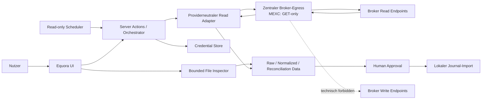

# Equora v57.61.0 – Read-only Broker Boundary & Threat Model

## 0. Dokumentkontrolle

| Feld | Wert |
|---|---|
| Designstatus | `DESIGN_ACCEPTED v9 – A4-v14 OWNER PASS; G0 GO` |
| Implementierungsstatus | `NOT STARTED`; Negativ-/Canaryevidenz gehört G1/G4/G6 |
| Gate G0 | `GO – DESIGN ONLY`; A4-v14 Owner PASS, Negativ-/Canaryevidenz folgt G1/G4/G6 |
| Stand | 2026-08-05, Europe/Berlin |
| Owner | A4 – Security, Privacy & Compliance |
| Pflichtreviews | A2, A3, A6 |
| Nutzerentscheidung | Brokerzugriff ausschließlich lesend; Equora darf niemals Orders oder Trades beim Broker eröffnen |
| Scope | Alle heutigen und künftigen Brokeradapter |
| Wirkung | Architektur- und Testvertrag; keine Code-, Credential-, Broker- oder Produktionsfreigabe |

## 1. Ergebnis vor Detail

Equora ist ein Trading Journal, kein Execution- oder Trading-System. Es liest
historische Brokerdaten und kann nach explizitem Human Approval lokale
Journal-Datensätze erzeugen. Es sendet niemals Handels- oder
Vermögensbewegungsanweisungen an einen Broker.

Nach einer späteren expliziten Nutzeraktivierung darf ein Scheduler diese
read-only Datenerfassung prospektiv wiederholen. Der Scheduler besitzt keine
Import-, Approval- oder Broker-Schreibfähigkeit. Eine manuell ausgewählte
Provider-Exportdatei ist eine zweite, rein eingehende Quelle und darf keinerlei
Officecode, Makro, Formel oder externe Verbindung ausführen.

Diese Grenze ist keine Featureflag- oder Gatefrage. Sie ist eine permanente
Produktinvariante:

```text
BROKER EGRESS = HTTPS + versionierte semantische Read-Capability-Allowlist
MEXC v57.61.0 = ausschließlich GET
```

Jede Brokerzustandsmutation und jeder nicht exakt registrierte Request wird
lokal vor Credentialverwendung und vor Netzwerkzugriff abgelehnt.

## 2. Begriffe

### 2.1 Historische Brokerorder

Ein beim Broker bereits vorhandener Datensatz über eine vergangene oder
aktuelle Order. Equora darf diesen Datensatz lesen.

### 2.2 Brokerexecution / Fill

Ein beim Broker bereits ausgeführtes Ereignis. Equora darf es lesen und für
Reconciliation verwenden.

### 2.3 Journal-Trade

Ein lokaler Equora-Datensatz, der einen vergangenen wirtschaftlichen Position
Cycle dokumentiert. Er entsteht ausschließlich in der Equora-Datenbank nach
Human Approval. Er besitzt keine ausgehende Brokerwirkung.

### 2.4 Broker-Schreiboperation

Jede Operation, die Brokerzustand verändert, insbesondere Order Placement,
Modify, Cancel, Position Open/Close/Reverse, Leverage/Margin/Mode-Änderung,
Transfer, Deposit oder Withdrawal. Jede solche Operation ist forbidden.

## 3. Verbindliche Invarianten

| ID | Invariante |
|---|---|
| ROB-001 | Das providerneutrale Adapterinterface exponiert ausschließlich fachlich benannte Leseoperationen. |
| ROB-002 | Für MEXC v57.61.0 setzt der Brokertransport intern ausschließlich `GET`; die Methode ist kein Aufrufparameter. |
| ROB-003 | Jede Capability mappt auf einen konstanten, versionierten HTTPS-Host und ein konstantes Pfadtemplate. |
| ROB-004 | Freie URLs, dynamische Hosts, Ports oder Pfade aus Nutzer-/Providerdaten sind verboten. |
| ROB-005 | Queryparameter sind pro Capability typisiert und dürfen Host/Pfad nicht beeinflussen. |
| ROB-006 | Redirects werden nicht verfolgt. `3xx` ist ein Contractfehler. |
| ROB-007 | Capability und vollständiger unsigned Request werden validiert, bevor der Credential-Store aufgerufen, Klartext entschlüsselt oder Credentialheader erzeugt werden. |
| ROB-008 | Jede fachliche Brokermutation ist methodenunabhängig verboten. Für MEXC v57.61.0 sind zusätzlich `POST`, `PUT`, `PATCH` und `DELETE` ausnahmslos verboten. |
| ROB-009 | Es gibt keinen Broker-SDK-Tradingclient und keine WebSocket-Sendefunktion. |
| ROB-010 | Nutzer müssen providerseitig Trading-, Transfer- und Auszahlungsrechte deaktivieren und dies bestätigen. |
| ROB-011 | Lesetest und Nutzerattestierung sind getrennte Evidenz; Equora behauptet keine technische Gesamtrechteprüfung ohne Permission-Endpoint. |
| ROB-012 | Ein lokaler Brokerimport-RPC schreibt nur Equora-Tabellen und darf keinen Brokerclient referenzieren. |
| ROB-013 | Ein neuer Brokeradapter durchläuft ein eigenes Gate für nachweislich nichtmutierende Capabilities. Eine technisch abweichende, aber lesende Methode wäre nur als konstante Capability in einem separat reviewten Providervertrag zulässig; sie ist keine Laufzeitoption und kein Präzedenzfall für MEXC. |
| ROB-014 | Jeder Versuch einer Broker-Schreiboperation ist Release-NO-GO und Security Incident, kein akzeptierbares Restrisiko. |
| ROB-015 | Genau ein serverseitiges Egress-Modul darf Brokernetzwerkzugriff ausführen; Adapter dürfen keine eigenen Netzwerkprimitiven, Broker-SDKs oder sendefähigen WebSockets importieren. |
| ROB-016 | Automatische Schedulertrigger dürfen ausschließlich versionierte Read-Sync-Profile starten. Sie können keine Candidate-Auswahl, kein Approval und keinen Journalimport auslösen. |
| ROB-017 | Versäumte Audits und unbekannte Zeitgrenzen erzeugen persistente Health-/Gap-Zustände; ein späterer erfolgreicher Request darf eine mögliche Lücke nicht still schließen. |
| ROB-018 | Provider-Exportdateien werden vor Parserzugriff quarantänisiert und bounded geprüft. Makros, Formeln als Code, OLE, externe Links, verschlüsselte/unklare Container und Zip-/Decompression-Angriffe sind forbidden. |
| ROB-019 | Originale Exportdateien und deren Inhalte sind private Finanzdaten, niemals Repository-, Telemetrie- oder Supportpayload. File- und Row-Provenienz verwendet Digests und ownergebundenen Storage. |
| ROB-020 | Konkrete unbeaufsichtigte Sync-Aktivierung erfordert je Pflichtcapability versionierte offizielle View-/Read-Permissionevidenz, aktuelle Nutzerattestierung und keine technisch erkennbare Schreibpermission; Lesetest allein genügt nicht. |
| ROB-021 | Aktivierung, Tenant-/Account-/Connectionbindung, Credentialgeneration, Trigger sowie gepinnte nicht suspendierte Versionen werden vor Enqueue und unmittelbar vor Credentialzugriff atomar revalidiert. Pause, Widerruf, Permissionblocker, Credentialentfernung oder Suspension invalidieren Jobs und Leases; danach gelten null weitere Credentialzugriffe und Brokerrequests. |
| ROB-022 | `degraded` gestattet ausschließlich explizite Recovery-/Auditläufe. Scheduler, Recovery und Audit besitzen niemals Auswahl-, Approval- oder Importfähigkeit; Approval bleibt gesperrt. |
| ROB-023 | Jede Formelzelle und jeder Formula Record – einschließlich gecachtem Wert – verwirft das Workbook. Gepinnte Container-/XML-/Entry-/Dekompressionsgrenzen gelten vor Zellzugriff workbookweit. |
| ROB-024 | MEXC v57.61.0 importiert nur belegte lineare USDT-/USDC-M-Contracts. Coin-M/inverse/Quanto/USD1-M/unknown bleiben unsupported. Settlementkontext darf fehlende PnL-/Fee-/Fundingwährung niemals still ersetzen. |

## 4. Evidenzstand

### 4.1 Aktuelle offizielle MEXC-Evidenz

Die am 2026-08-04 geprüfte offizielle Futures API unterstützt als
Gesamtplattform sowohl lesende als auch schreibende Funktionen:

- Integration Guide: REST unterstützt GET, POST und DELETE und nennt Order
  Placement/Cancellation;
- historische Orders: `GET /api/v1/private/order/list/history_orders`,
  Permission `View Order Details`;
- historische Executions:
  `GET /api/v1/private/order/list/order_deals/v3`, Permission
  `View Order Details`;
- Order Placement: `POST /api/v1/private/order/create`, Permission
  `Order Placing`;
- Cancel: `POST /api/v1/private/order/cancel`;
- Reverse: `POST /api/v1/private/position/reverse`;
- Close All: `POST /api/v1/private/position/close_all`.

Offizielle Quellen sind im MEXC Provider Contract versioniert verlinkt.

Die am 2026-08-05 vom Nutzer bereitgestellten Ticketantworten nennen den
jüngsten Monat als operative Futures-API-Reichweite und bestätigen nach
Fachbereichsrückfrage `View Order Details` für relevante History-Endpoints;
`Order Placing` ist nicht erforderlich. Das aktuelle Resultatverhalten wird als
reverse chronological, neueste Records zuerst beschrieben. Telegram-Support
nennt keine feste Retention. Öffentliche Endpointdokumentation und Supportclaim
schließen damit die Permission-Mappingfrage des gepinnten History-Profils auf
Designebene, beweisen aber weder garantierte Sortierung/Retention/
Vollständigkeit noch die Gesamtrechte eines konkreten Keys. Die Equora-Grenze
bleibt statisch GET-only und mutationsfrei; konkrete Keyrechte bleiben
Nutzerattestierung beziehungsweise technische Introspection, falls verfügbar.

Folgerung: Die Brokerplattform bietet Schreibfähigkeiten, Equora aber nicht.
Die Trennung muss sowohl über providerseitige Key-Rechte als auch über einen
technisch engen Equora-Transport erzwungen werden.

### 4.2 Lokale Source-Evidenz

Read-only geprüft am 2026-08-04:

- `lib/server/mexc-readonly.ts` enthält ausschließlich drei Brokerrequests:
  Serverzeit, historische Orders und historische Executions;
- der private Requesthelper setzt `method: 'GET'`;
- der öffentliche Zeitrequest verwendet den GET-Default;
- im MEXC-/Broker-Scope existiert kein Place-/Modify-/Cancel-/Reverse-/Close-,
  Transfer- oder Withdrawal-Pfad;
- der Connector exportiert nur `readMexcFuturesPreview` und keine
  Tradingfunktion.

Offene Source-Lücken:

- `fetchJson(url, init)` ist intern generisch und akzeptiert ein freies
  `RequestInit`;
- Redirects sind nicht ausdrücklich deaktiviert;
- Host und Execution-Pfad sind veraltet (BRI-018);
- es gibt keine MEXC-Transport-/Methoden-/Redirect-Negativtests;
- persistierte Flags und Erfolgstexte sind teilweise präziser zu trennen
  (BRI-013/017).

Der aktuelle Stand ruft nur GET auf. Eine strukturelle Garantie gegen spätere
Regressionen ist noch nicht implementiert.

## 5. Schutzgüter

- Brokervermögen und offene Positionen;
- Order- und Kontozustand;
- API-Key und Secret;
- Nutzervertrauen in die Read-only-Zusage;
- historische Finanzdaten und Journalintegrität;
- Nachweis, dass Equora niemals Brokerzustand mutiert;
- Release- und Auditnachvollziehbarkeit.

## 6. Vertrauensgrenzen



`J` besitzt keine Verbindung zurück zu `A`, `T` oder dem Broker. Import ist
eine lokale, atomare Journaldatenmutation.

## 7. Threat Matrix

| ID | Bedrohung | Auswirkung | Präventive Kontrolle | Detektion / Test | Restrisiko |
|---|---|---|---|---|---|
| ROB-T01 | Nutzer hinterlegt Key mit `Order Placing` | Serverkompromittierung könnte Key außerhalb normaler Apppfade missbrauchen | Nutzerattestierung, providerseitig nur Read/View, eigener Key, optional IP-Bindung | Permission-Endpoint ablehnen, falls verfügbar; UI-/Flagtests | Ohne technische Permissionübersicht bleibt Nutzer-/Betriebsfehler möglich |
| ROB-T02 | Entwickler ergänzt versehentlich MEXC-POST oder andere Mutation | Reale Order/Positionsänderung | Adapterinterface ohne Schreiboperation; MEXC-Methode intern konstant GET; Codeowner/Gate | AST-/Dependencyregel, Compile-/Unit-Negativtest | Supply-Chain-/Serverkompromittierung außerhalb normalen Codes |
| ROB-T03 | Freie URL oder Path Injection | Credentials an falschen Host/Pfad | Capability-ID statt URL; URL-Objektvalidierung; keine dynamischen Hosts/Pfade | Fuzztests für Schema, Host, Port, Traversal, Encodings | Provider-DNS/TLS-Infrastruktur |
| ROB-T04 | HTTP Redirect | Credentialweitergabe oder Allowlistumgehung | Redirects `error`; `3xx` Contractfehler | Same-/Cross-Host-Redirecttests, Zielserver sieht keinen Request | fehlerhafte Runtimeimplementierung |
| ROB-T05 | Provider ändert GET in schreibende Semantik | unerwartete Brokerzustandsänderung | nur dokumentierte lesende Capability; Change-Log-Revalidierung; Contract-Version pinnen | Contract-Probe nach ausdrücklicher Freigabe; Providerreview | Providerfehlverhalten |
| ROB-T06 | Adapter oder Helper umgeht zentralen Egress; Broker-SDK bringt Tradingmethoden transitiv mit | versehentliche Nutzung/breitere Supply Chain | genau ein Egress-Modul; Adapterimportgrenze; kein Broker-SDK | AST-, Dependency-, Export- und absichtliche Bypass-Tests | kompromittierte Runtime/Dependency |
| ROB-T07 | WebSocket-Client sendet Tradingnachricht | Order-/Positionsmutation | keine Broker-WS-Sendefunktion; nur erforderliche Read-Subscriptions | Interface-/Mocktests | künftige Adapterregression |
| ROB-T08 | UI behauptet technisch verifiziertes Read-only | falsches Sicherheitsgefühl | Claims nur Lesetest plus Nutzerbestätigung | Copy-/Snapshot-/State-Tests | Nutzer missversteht Providerkonfiguration |
| ROB-T09 | Journalimport ruft Broker zurück | lokale Freigabe erzeugt reale Aktion | Importmodul ohne Brokerdependency; Netzwerk im Importpfad verboten | Architektur-/Dependencytest, Mock-Netzwerk muss 0 Calls sehen | bösartige Codeänderung |
| ROB-T10 | Secret erscheint in Logs, Redirectfehlern, APM, Session Replay oder Action-Argumenten | Kontokompromittierung | Sanitization, keine Header/Signaturen/Queries/Raw Payloads; Credentialroute `no-store`; Analytics-/Replay-Ausschluss | Secret-Canary über App-, Plattform-, Browser- und Errorreporting-Artefakte | externe Plattform-/Runtimeleaks |
| ROB-T11 | Späterer Broker nutzt für eine rein lesende Abfrage technisch POST | unkontrollierte Methodenausnahme oder unnötiger Coverageverlust | zunächst `unsupported`; nur separat gegateter, konstanter, nachweislich nichtmutierender Providervertrag kann Support ergänzen | Provider-Onboarding-, Threat- und Negativreview | Providerfehlsemantik; zusätzliche Reviewkosten |
| ROB-T12 | Begriff „Journal-Trade“ wird als Brokertrade interpretiert | Fehlentscheidung/Support-/Vertrauensrisiko | konsequente Copy: lokaler Journaleintrag versus Brokerorder | UX-/Dokumentationsreview | sprachliches Missverständnis |
| ROB-T13 | Übergröße wird vor Begrenzung vollständig als JSON gelesen | Speicher-/CPU-Erschöpfung | capabilitybezogene Raw-/Dekompressionsgrenze, begrenztes Streaming, Abort und Deadline vor Parse | Tests ohne/falsches `Content-Length`, Chunked und komprimiert | Provider-/Runtime-DoS innerhalb harter Limits |
| ROB-T14 | Scheduler oder einzelne Pflichtlane fällt aus; Cross-Activation/-Profile-Bucket wird wiederverwendet; UI behauptet weiter vollständige Erfassung | stille Trade-Lücke und falsche Statistik | disjunkte Fast-/7d-/28d-Lane-Keys; `SYNC_LANE_STATE.health` als Autorität; kanonische `stability_bucket_identity` bindet Activationgeneration und alle Profil-/Contract-/Boundaryversionen; sofortiger Gap bei unbelegter Candidateüberlappung; Approval-Sperre | Clock-/Scheduler-/Startup-/Lane-/Gap-Fixtures sowie identische Events mit anderer Activationgeneration, Profil- oder Grenzpolicyversion dürfen nie `observed_stable` ergeben | Provider kann Records trotz Audit vollständig auslassen |
| ROB-T15 | Schedulertrigger erreicht Import- oder Approvalpfad | unbeaufsichtigte lokale Journalmutation | getrennte Capabilitytypen/Queues; Scheduler darf nur Sync Runs erzeugen | Dependency-/Authorizationtest: null Approval-/Importwrites | bösartige Codeänderung |
| ROB-T16 | Präpariertes Excel führt Makro, Formel, OLE oder externe Verbindung aus | Codeausführung, Exfiltration, Credential-/Dateileak | kein Office/COM; Quarantine; feste File-Profile; jede Formel/Cache, Makro/ActiveX/OLE/DDE/Package, externe Relationship, DTD/Entity, Encryption und unbekannter Teil wird abgelehnt | Container-, Duplicate-Entry-, Zip-Slip-, Formula-/Cached-Formula-, Macro-, XXE-/External-Relationship- und Resource-Bomb-Fixtures | Parser-/Library-Supply-Chain |
| ROB-T17 | Exportdatei, Filename oder Finanzzellen gelangen in Repository/Logs/Support | Datenschutz- und Finanzdatenleck | private ownergebundene Ablage, no-store Upload/Selection, Digest-/Count-Telemetrie, Retention | Secret-/PII-/Artifact-Canary und Packaging-Scan | Plattform-/Runtimeleak |
| ROB-T18 | Pause/Widerruf/Credentialentfernung erreicht bereits geplanten Job nicht | unbeaufsichtigter Brokerrequest nach Entzug | atomare Revalidierung vor Enqueue und Credentialzugriff; Jobs/Leases/Retry/Catch-up invalidieren | Race-, Lease-, Retry- und decrypt-then-revoke-Tests: null weitere Requests | bereits vollständig abgesendeter Request kann nicht zurückgerufen werden |
| ROB-T19 | Best-effort-Coverage wird als vollständig oder exportverifiziert angezeigt | falsches Nutzervertrauen und fehlerhafte Statistik | getrennte Coverage Policy/Basis, sichtbarer `silent_omission_risk`, snapshotgebundenes Approval, keine Statusvermischung | Copy-, State-, Approval-Invalidierungs- und Statistiksegregationstests | Provideromission bleibt bei Best-effort bewusstes Restrisiko |
| ROB-T20 | aktuelle oder `non_authoritative_same_bracket`-Metadaten werden rückwirkend als Contract-/Settlement-Authority verwendet | falsche Contractklasse/Currency und finanziell falscher Import | immutable `EVENT_CONTRACT_AUTHORITY` je Economic Event mit Valid-Time-/Immutable-Rule-Constraint; vollständiges Evidence-Digestset in Candidate/Approval | aktuelle Observation rückwirkend, A→B→A, Symbolwiederverwendung, gültige Immutable-Rule-Variante | fehlerhafte Provider-Rule-Evidenz bleibt Folgegate-Risiko |
| ROB-T21 | leere Fundingantwort wird als null Funding behandelt oder erwartete Buchung still ausgelassen | falscher Netto-PnL und Statistik | typisierte `FUNDING_SETTLEMENT_EXPECTATION_EVIDENCE` je potenziellem Settlement; keine Null ohne Authority; Currency-/Hedge-Attribution fail-closed | leere Page, fehlender Oracle, autoritative Null, Debit/Credit, beide Cyclegrenzen, Hedge-Ambiguität | Provider kann bei Best-effort einen gesamten unsichtbaren Cycle auslassen; sichtbarer Cycle bleibt bei Fundinglücke blockiert |

## 8. Technischer Zielvertrag

### 8.1 Capability Registry

Eine Capability enthält mindestens:

- stabile `capability_id`;
- Provider und Providervertragsversion;
- konstanten HTTPS-Origin;
- konstantes Pfadtemplate;
- konstante, nicht vom Aufrufer wählbare Methode; für MEXC ausschließlich
  `GET`;
- versionierten Nachweis, dass die Capability nur Daten liest und keinen
  Brokerzustand mutiert;
- typisiertes Queryschema;
- Authklasse `public` oder `signed_read`;
- Response-Schemafamilie;
- Rate-Limit-/Timeoutklasse;
- Datenklassifikation;
- getrennte Dokumentations-, Fixture-, Providerbeobachtungs- und
  Import-Evidenzzustände; ein synthetisches Fixture kann Providerverhalten
  nicht verifizieren;
- Supportstatus `candidate`, `unsupported`, `forbidden` oder `suspended`.

Die Registry enthält keine Order-Placement-/Cancel-/Position-/Funds-Mutation.

### 8.2 Requestaufbau

Reihenfolge vor jedem externen Request:

1. Capability-ID gegen gepinnte Vertragsversion auflösen.
2. Status muss lesend und nicht `forbidden` sein.
3. Origin exakt vergleichen: Schema `https`, erlaubter Host, erlaubter Port.
4. Pfad aus konstantem Template und streng kodierten Parametern bilden.
5. Querykeys und Werte gegen Capabilityschema validieren.
6. Unsigned Request mit der konstanten Capabilitymethode erzeugen; für MEXC
   intern ausschließlich `GET`.
7. Redirectmodus auf `error` setzen.
8. Erst jetzt Credentialreferenz laden und kurzzeitig entschlüsseln.
9. Signieren, Credentialheader erzeugen und unmittelbar senden.
10. `3xx` beziehungsweise Redirect-Transportfehler und finale URL-Abweichung
    fail-closed behandeln.
11. Body vor JSON-Parsing begrenzt streamen und Roh-/Dekompressionslimit,
    Timeout sowie Gesamtdeadline erzwingen.
12. Nur sanitisiertes Resultat/Fehlerobjekt zurückgeben; keine
    Klartext-Credentials persistieren, zurückgeben oder loggen.

### 8.3 Importgrenze

Der lokale Import erhält ausschließlich approvierte Candidate-Revisionen aus
der Equora-Datenbank. Er kennt keine Brokercredentials, keinen Adapter und
keinen Brokertransport. Ein Dependencytest muss diese Einbahnstruktur
erzwingen.

### 8.4 Scheduler- und File-Source-Grenze

**Normative Activation-Invariante**

Fehlende oder widersprüchliche Permissionevidenz blockiert nicht das
secretfreie G0-Architekturreview oder synthetische Fixtures. Eine konkrete
MEXC-Sync-Aktivierung ist jedoch nur zulässig, wenn für jede Pflichtcapability
des gepinnten Profils eine versionierte offizielle View-/Read-
Permissionzuordnung vorliegt, die Nutzerattestierung aktuell ist und keine
technisch erkennbare Broker-Schreibpermission besteht. Eine ungeklärte
Pflichtcapability hält die Aktivierung in `blocked_permission_evidence`; ein
erfolgreicher Lesetest ersetzt weder diese Zuordnung noch eine
Gesamtrechteprüfung.

Vor dem Enqueue und erneut unmittelbar vor jedem Credential-Store-Zugriff
prüft der Worker atomar Connection-/Account-/Tenantbindung, dass Job-
`sync_activation_id`/`activation_generation` exakt dem gesperrten Series-
Current-Pointer entsprechen, eine aktive Credentialgeneration, den aktuellen
Aktivierungsstatus, die gepinnten und
nicht suspendierten Provider-/Adapter-/Profil-/Capabilityversionen sowie den
zulässigen Trigger. `paused`, `revoked`, `blocked_permission_evidence`,
Credentialentfernung oder Contract-/Capability-Suspension invalidieren alle
noch nicht begonnenen Jobs, Retries und Startup-Catch-ups, widerrufen
vorhandene Leases und ergeben null Credential-Store-Zugriffe und null
Brokerrequests. Ein bereits entschlüsselnder Worker darf nach erkannter
Invalidierung keinen weiteren Request senden. `degraded` erlaubt nur
explizite Recovery-/Auditläufe; Approval bleibt gesperrt.

Die erste Aktivierung erzeugt unter Series-Row-Lock eine
`activation_series_id`, eine neue Zeile mit ID/Generation `1` und den Current-
Pointer. Nach `inactive`/`revoked` oder Änderung gepinnter Identitäten/Versionen
wird unter demselben Lock eine neue Zeile mit neuer ID/nächster Generation
erzeugt, eine zuvor current/arbeitsfähige Vorgängerzeile deaktiviert und deren
Jobs/Leases im selben Commit invalidiert; ein `revoked`er Vorgänger bleibt
`revoked`. Zwei parallele Wechsel serialisieren über die Series-Version; der
Verlierer liest neu und erzeugt null Work Units, Credentialzugriffe oder
Brokerrequests. Historische Series-/Generations-/Pinwerte bleiben
unveränderlich. Nur Resume aus `paused` mit unveränderten Pins und weiterhin
aktuellem Pointer behält dieselbe Zeile/Generation, Gaps und Lane States.


Der Scheduler kennt nur `activation_series_id`, `sync_activation_id`,
`activation_generation`, Triggerzeit und ein festes Read-Sync-Profil. Er kann
keine Candidate-IDs, Auswahl, Approval-ID oder
Importparameter übergeben. Queue-/Jobtypen für Sync und Import sind disjunkt;
ein unbekannter Jobtyp wird abgelehnt. Die Pflichtlanes
`incremental_fast_6h`, `rolling_audit_7d_daily` und
`rolling_audit_28d_weekly` besitzen disjunkte Lane-State-Keys;
`SYNC_LANE_STATE.health` ist die persistierte Autorität, Activation Health nur
das Aggregat. Keine erfolgreiche kurze Lane darf den Zustand einer anderen
Lane zurücksetzen oder maskieren.

`derive_capture_health_v1` verwendet `revoked`, dann `paused`, dann
`pending` bei inaktiver/blockierter/noch unvollständiger Aktivierung, danach
`gap_requires_export` vor `degraded` und nur bei aktiver Aktivierung plus
durchgehend aktuellen gesunden Pflichtlanes `healthy`. Der Lebenszyklus-Stopp
löscht darunterliegende Gaps nicht; Resume berechnet aus aktuellen Lane States
neu. Run-/Scope-Snapshots bleiben nichtautoritative Auditevidenz. Candidate,
Approval, Import, Recovery und Lane-Healing lesen sie nie als Health-Wahrheit.

Der File Inspector läuft ohne Brokernetzwerk-, Credential- oder Office-
Capability. Er erhält eine opaque Referenz auf ein privates Source Artifact und
ein gepinntes File Profile. Er darf weder lokale freie Pfade zurückgeben noch
externe Links öffnen. Vor dem ersten XML-/Zellzugriff gelten gepinnte
workbookweite Limits für Archivbytes, Entryzahl, Einzelentry, kumulierte
Dekompression, Ratio und Verschachtelung. Traversal, absolute Pfade, Symlinks,
doppelte/kanonisch kollidierende Namen, rekursive Archive, Formula Records und
gecachte Formelwerte, VBA/XLM, ActiveX, OLE, DDE, Packages, externe
Relationships, `DOCTYPE`/DTD/Entities, Verschlüsselung und unbekannte Teile
führen fail-closed zur Ablehnung.
Alle Fehlerausgaben enthalten nur eine sanitiserte Referenz, Profilversion und
Counts, niemals Filename, Pfad oder Zellwerte.

## 9. Verbindlicher Negativtestvertrag

### 9.1 Transport

1. Jede MEXC-Methode außer GET wird vor Fetch abgelehnt.
2. Unbekannte Capability wird vor Credentialzugriff abgelehnt.
3. Unbekannter Host, Subdomain, Port oder HTTP statt HTTPS wird abgelehnt.
4. Benutzer-/Providerwert kann Host oder Pfad nicht überschreiben.
5. Encoded Slash, Backslash, `..`, `@`, Unicode-/Punycode-Hosttricks werden
   abgelehnt beziehungsweise kanonisch sicher verglichen.
6. Redirect auf anderen Host wird nicht verfolgt.
7. Redirect auf denselben Host/anderen Pfad wird nicht verfolgt.
8. Redirectziel erhält bei 301/302/303/307/308, Same-/Cross-Host, anderem Port
   und HTTP-Downgrade nachweislich keinen Request und keine Credentialheader.
9. Order-Create-/Cancel-/Reverse-/Close-Pfade sind nicht registrierbar.
10. Transfer-/Withdrawal-Pfade sind nicht registrierbar.
11. Credential-Store-Aufrufzahl bleibt bei Capability-, Methoden-, Host-,
    Pfad- und Queryfehlern null.
12. Übergrößenbody wird vor JSON-Parsing abgebrochen; Tests decken fehlende und
    falsche Länge, Chunked Transfer und komprimierte Übergröße ab.

### 9.2 Adapterinterface

13. Exporte enthalten keine `place`, `createOrder`, `modify`, `cancel`,
    `close`, `reverse`, `transfer`, `withdraw` oder generische Requestoperation.
14. `fetchHistoricalOrders` kann nur die registrierte Read-Capability nutzen.
15. Mockcredential mit simulierten Zusatzrechten erzeugt bei MEXC trotzdem nur
    GETs.
16. Technisch erkennbare positive Broker-Schreibpermission blockiert die
    Connection.
17. Ohne Permissionintrospection lautet der Zustand Lesetest plus
    Nutzerattestierung, niemals `read_only_verified`.
18. Adapterimports von `fetch`, `undici`, `node:http`, `node:https`, Axios,
    Broker-SDK oder WebSocket-Sendefunktion stoppen Build/Release.
19. Absichtliche direkte und indirekte Netzwerk-Bypässe werden von AST-/
    Dependencytests erkannt.

### 9.3 Journalimport

20. Approval und Import verursachen in einem Netzwerk-Mock genau null
    Brokerrequests.
21. Importcode besitzt keine Dependency auf Credentialstore oder
    Brokertransport.
22. Wiederholter Import bleibt lokal idempotent und erzeugt keine externe
    Wirkung.

### 9.4 Statischer und Release-Scan

23. Quellscan aller MEXC-Adapter findet keine Nicht-GET-Methode.
24. Quellscan findet keine bekannte schreibende Providerpfadfamilie.
25. Build-/Release-Allowlist enthält kein Broker-SDK oder unbekannten
    Brokeradapter.
26. Neue Adapter-/Capability-Dateien sind fail-closed reviewpflichtig.
27. Ein absichtlich eingefügter verbotener Fixturepfad lässt den Releasecheck
    fehlschlagen.
28. Secret-Canary findet synthetischen Key und Secret weder in App-/
    Plattformlogs, Testreports, Browserkonsole, Analytics/Session Replay noch
    Errorreporting; temporäre Testartefakte werden dokumentiert gelöscht.

## 10. Claims und UX

Zulässig:

- „Historische MEXC-Orders konnten für den gewählten Scope gelesen werden.“
- „Das benannte MEXC-Leseprofil `<Profilname>/<Version>` wurde vollständig
  ausgeführt.“ – nur wenn jede fest definierte Pflichtcapability erfolgreich
  war;
- „Read-only vom Nutzer bestätigt.“
- „Equora verwendet ausschließlich dokumentierte Leseendpunkte.“ – erst nach
  bestandener Transport-/Allowlist-Evidenz.
- „Historische Orderdaten“ beziehungsweise „historische Ausführungen“.
- „Als lokalen Journaleintrag übernehmen.“

Unzulässig:

- „Read-only technisch vollständig verifiziert“, solange keine vollständige
  Provider-Permissionintrospection existiert;
- „sicher verbunden“ als pauschaler Gesamtclaim;
- „Trade ausführen“, „Order senden“ oder „Position übernehmen“, wenn ein
  lokaler Journalimport gemeint ist;
- jede Formulierung, die eine Brokerwirkung des Human Approval nahelegt.

Persistierte Evidenz wird mindestens getrennt als:

- `read_only_user_attested_at`;
- `historical_orders_read_succeeded_at`;
- `historical_executions_read_succeeded_at`;
- `positions_read_succeeded_at`;
- `funding_read_succeeded_at`;
- `permission_introspection_status = unavailable | passed | failed`;
- `coverage_basis = provider_observed | provider_export_observed`;
- `coverage_policy = strict_export_verified | provider_observed_best_effort |
  pending_user_policy`;
- `scope_completeness = complete_for_profile | partial | failed | unverified`;
- `stability_status = not_observed | observed_once | observed_stable |
  invalidated`;
- `lane_health = healthy | degraded | gap_requires_export | paused` je
  Pflichtlane als aktuelle autoritative Zustandsquelle;
- `capture_health = pending | healthy | degraded | gap_requires_export |
  paused | revoked`, ausschließlich deterministisch durch
  `derive_capture_health_v1` aus Lifecycle, erforderlichen aktuellen Lanes und
  offenen Gaps abgeleitet;
- `gap_status = open | degraded | requires_export | reconciled | unsupported`;
- je Activation/Capability/Instrument/Pflichtlane/Scopegeneration
  `last_complete_at`, `next_due_at`, Profil-/Policyversion, letzter vollständiger
  Scope-Digest, letzter Fehler und offene Gap-Referenz;
- `silent_omission_risk` und offene Gap-Klasse/-Dauer;
- `file_profile_status = unsupported | unverified | verified | suspended`.

Für MEXC ist `provider_observed_best_effort` durch DEC-5761-024 gewählt.
`pending_user_policy` bleibt nur ein generischer Zustand vor einer
Providerentscheidung. Erfolgreich importierte API-Candidates behalten
`not_export_verified` und den sichtbaren `silent_omission_risk`; bekannte Gaps
oder Integrityblocker werden dadurch nicht akzeptiert.

Ein Endpointfehler wird nicht in eine leere Liste umgewandelt und darf weder
`complete` noch einen pauschalen Bereitschaftsstatus erzeugen. Bestehende Flags
wie `futures_read_verified` und `read_only_confirmed` werden erst nach
Migrations-/Kompatibilitätsplan ersetzt; sie sind kein Beleg einer technischen
Gesamtrechteprüfung. Zulässige Copy benennt den tatsächlich erfolgreichen
Endpoint und die getrennte Nutzerbestätigung.

## 11. Incident- und Betriebsregeln

- Ein erkannter MEXC-Nicht-GET-Pfad oder irgendein Broker-Mutationspfad stoppt
  Build/Release.
- Ein Laufzeitversuch stoppt vor Netzwerkzugriff, erzeugt eine sanitiserte
  Incident-ID und deaktiviert die betroffene Capabilityversion.
- Keine automatische Wiederholung eines Contract-/Security-Verstoßes.
- Bei möglicher Credentialoffenlegung: Connection pausieren, Credential lokal
  löschen/rotieren und Nutzer zum sofortigen Providerwiderruf auffordern.
- Ein Server- oder Supply-Chain-Vorfall mit möglichem Secretzugriff erfordert
  providerseitigen Key-Widerruf; eine lokale Löschung allein genügt nicht.
- Provider-Change-Log und Capabilityvertrag werden vor jedem Release erneut
  geprüft.
- Jede überfällige Pflichtlane setzt ihren Healthzustand und die Verbindung
  sichtbar auf `degraded`. Jede bekannte unbelegte Candidateüberlappung sperrt
  sofort; sieben/28 Tage sind nur Eskalationsfristen. Mehr als 28 unbelegte Tage
  oder unbekannte Grenze erzeugen `gap_requires_export`. Ein einzelner späterer
  Erfolgsrequest löscht diesen Zustand nicht.
- Ein abgelehntes Source Artifact wird nicht heuristisch repariert oder in CSV
  konvertiert. Es wird nach Retentionpolicy erasen; Profilabweichungen benötigen
  ein neues A3/A4/A5-File-Gate.
- Ein originales Quarantine-Artefakt verbleibt höchstens sieben Kalendertage ab
  Auswahl und wird bei Ablehnung beziehungsweise nach terminal erfolgreichem
  Parse innerhalb von 24 Stunden erasen; Nutzerlöschung wirkt sofort.
  Sanitiserte File-Parse-/Artifact-Metadaten ohne Filename, Pfad oder Zellinhalt
  werden nach 180 Tagen gelöscht oder irreversibel aggregiert.
- Credentialformular und Credential-Server-Action sind `no-store` und von
  Session Replay, Analytics-Inhaltsaufnahme, Requestbody-/Actionargument-
  Logging sowie unredigierten APM-/Error-Breadcrumbs ausgeschlossen.

## 12. Gate- und Freigabestatus

Die Nutzerentscheidung zur dauerhaften Read-only-Grenze ist `ACCEPTED`.
Der abschließende A4-Re-Review hat die Designfindings F01 bis F07 geschlossen.
Insbesondere ist der generische Zustand `mexc_futures_data_read_succeeded` auch
als Alias verboten; Erfolg bleibt capabilitygenau oder an ein konkret
benanntes und versioniertes Leseprofil gebunden. Technische Umsetzung und
Negativtests sind getrennte Folgegate-Evidenz:

| Teil | Status |
|---|---|
| Produktgrenze | ACCEPTED |
| Threat-/Egress-/Claim-Design | A4 G0-Design PASS |
| Scheduler-/Gap-/File-Source-Delta | A3/A5-v13 PASS; A4-v13-P2 in v14 remediated; A3/A4-v14 und A6-v14 PASS |
| Aktueller lokaler Connector nutzt nur GET | read-only source-verified |
| Enger Capability-Transport | implementation_status = not_started; G1/G6 |
| Redirect-Sperre | implementation_status = not_started; G1 |
| Methoden-/Pfad-/Redirect-Negativtests | spezifiziert, noch nicht ausgeführt; G1/G6 |
| Provider-Key-Gesamtrechte technisch verifiziert | nicht möglich/belegt |
| Coverage-Assurance-Policy | `provider_observed_best_effort` am 2026-08-05 vom Nutzer gewählt; G0-Gesamtrouting bis v14 PASS |
| G0-Gesamtgate | GO – DESIGN ONLY; Implementierungs-/Laufzeitevidenz folgt G1–G6 |
| G1 | BLOCKED |

Dieses Dokument autorisiert keine Broker-, Credential-, Datenbank-, Git- oder
Deploymentaktion.
